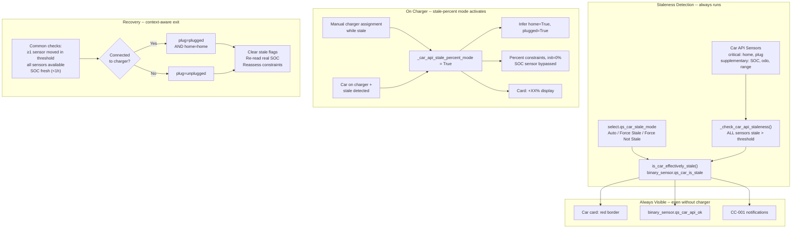

# Story 3.9: FM-008 — Car/EV Vendor API Resilience

Status: done
issue: 82
branch: "QS_82"

## Story

As TheAdmin,
I want the system to detect stale car API data, infer correct state from manual user actions, allow me to force stale mode when I know the API is unreliable, and handle the cascading impact across charging, prediction, and person tracking,
So that an unreliable car vendor API doesn't silently degrade the entire household optimization.

## Real-World Problem (Magali's Scenario)

The Renault Twingo APIs sometimes "stall" for hours or days — the car's HA sensors (home, plug, odometer, position, SOC) stop updating. When stalled:

1. Car shows `not_home` and `unplugged` even though Magali drove home and plugged it in
2. Charger detects power draw but can't match it to the Twingo (stale GPS/plug data) -> treated as guest car
3. Magali manually assigns the charger to the Twingo via the car card
4. **Problem**: SOC is stale/wrong, but the system doesn't know it — charges to wrong target
5. **Need**: When Magali manually assigns charger to a stale car, the system should (a) infer the car IS home and plugged, (b) enter "stale percent" mode (init at 0%, progress via charger energy only), (c) show a red border around the entire car card

## Two Complementary Detection Features

**Feature A — Automatic staleness detection**: Monitor all car API sensors (`car_tracker`, `car_plugged`, `car_charge_percent_sensor`, `car_odometer_sensor`). When *none* of them have updated within `CAR_API_STALE_THRESHOLD_S` (default 6 hours), mark the car as stale.

**Feature B — Manual assignment contradiction detection**: When a user manually assigns a car to a plugged charger, and the car's API reports `not_home` or `not_plugged`, the manual action itself is evidence the data is wrong. Flag the car as stale **immediately** — no need to wait for `CAR_API_STALE_THRESHOLD_S`.

Both features converge on the same outcome: `binary_sensor.qs_<car>_api_ok` turns off, the car enters **stale-percent mode**, and the card gets a red border with `+XX%` display.

## Key Design: Stale-Percent Mode

Instead of falling back to energy-based constraints (kWh), the car **stays in percent mode** but with critical differences:

- **Initial SOC forced to 0%** — the stale SOC sensor is bypassed entirely
- **Progress tracked by charger energy only** — `_compute_added_charge_update()` converts energy delivered to %, never reads the SOC sensor
- **Display shows `+XX%`** — the card converts `current_inputed_energy` to percent of battery capacity and prefixes with "+"
- **Target means "add this much"** — if user picks 30%, it means "deliver 30% of battery capacity worth of energy"
- **Target handler unchanged** — user can still set target SOC% normally via the card

This is better than energy mode because users think in battery percentages, and the solver keeps using percent-based planning.

## Architecture



**Two layers of impact:**

- **Visual** (always): Red border on card + `binary_sensor.qs_<car>_is_stale` ON + CC-001 notifications. Visible even when car is NOT on a charger. Tells the user "this car's data is unreliable."
- **Behavioral** (charger-only): Stale-percent mode (constraints at 0%, +XX%, SOC bypass). Only activates when the car is on a charger, because that's the only context where charging constraints exist.

## Acceptance Criteria

### AC1: Stale Car API Detection (Feature A)

**Given** a car entity's API data stops updating (all tracked sensors haven't changed for longer than `CAR_API_STALE_THRESHOLD_S`, default 6 hours)
**When** the system detects staleness
**Then** the car is flagged as stale, `binary_sensor.qs_<car>_api_ok` turns off
**And** the car card gets a red border around the entire card
**And** the SOC widget in the dashboard header shows an error/warning state
**And** the car enters stale-percent mode: percent constraints with initial SOC = 0%, display shows `+XX%`

### AC2: Contradiction Detection on Manual Assignment (Feature B)

**Given** Magali manually assigns a charger to a car, AND the car's API reports `not_home` or `not_plugged`
**When** the manual assignment is made
**Then** the system flags the car as stale **immediately** (contradiction = proof that API is wrong)
**And** the system infers: car IS home, car IS plugged (overriding stale sensor data)
**And** the car enters stale-percent mode with `+XX%` display and red card border
**And** the car's assigned person is notified (error-level): "Warning: {car_name} data is not available, check the car card"

### AC3: Stale Mode Select + Status Binary Sensor

**Given** TheAdmin wants to control how the system handles car API staleness
**When** TheAdmin uses `select.qs_<car>_stale_mode` (restore select, persists across restarts)
**Then** the select has three options:
  - **Auto** (default): staleness is detected automatically (Feature A + B). Auto-recovery when API resumes.
  - **Force Stale**: car is immediately forced into stale-percent mode regardless of API sensor freshness. Blocks auto-recovery. Useful when TheAdmin knows the API is unreliable (e.g., Renault servers down).
  - **Force Not Stale**: car is forced out of stale mode regardless of sensor freshness. Useful as an escape hatch if auto-detection is wrong. The system trusts whatever the API reports.

**And** `binary_sensor.qs_<car>_is_stale` shows the **effective stale status** the car is currently in:
  - ON when car is in stale-percent mode (whether auto-detected, contradiction-detected, or forced)
  - OFF when car is operating normally (whether healthy or force-not-stale)
  - This is the binary sensor the card reads for red border / `+XX%` display

**And** person forecast uses conservative defaults when effective stale status is ON

### AC4: Auto-Recovery When API Resumes (Context-Aware Exit)

**Given** the car API was stale and recovers
**When** the system detects recovery via context-aware exit logic
**Then** `binary_sensor.qs_<car>_api_ok` turns on, red border removed
**And** stale-percent mode is exited: real SOC is re-read, constraints reassessed with actual SOC as initial value
**And** the car's assigned person is notified (info-level): "Your {car_name}'s data is available again"
**And** if stale mode select is "Force Stale", recovery is blocked — stays stale until TheAdmin changes the select

**Recovery rules** — exit branches on charger connection state (`self.charger is not None`):

Common conditions (both paths):
1. At least one API sensor moved within `CAR_API_STALE_THRESHOLD_S` (`not is_car_api_stale(time)`)
2. All API sensors have valid readings (`_have_all_api_sensors_reported(time)`)
3. SOC sensor is fresh — not unavailable >1h (`not _is_soc_sensor_stale(time)`) — prevents enter/exit flip-flop since `CAR_SOC_STALE_THRESHOLD_S` (1h) < `CAR_API_STALE_THRESHOLD_S` (6h)

Connected to charger path: common + plug=plugged AND home=home
Not connected path: common + plug=unplugged

Missing sensors (`car_plugged=None`, `car_tracker=None`) are gracefully skipped — their checks default to True.

### AC5: Notifications — Person-Targeted

Notifications target the **person attached to the car** (via `person.on_device_state_change()`), not all mobile apps. User-initiated transitions (Force Stale) do not send notifications.

Three notification events:
1. **Car goes stale** (Feature A or SOC-only): Error-level to car's person: "Warning: {car_name} data is not available, check the car card"
2. **Stale car manually assigned** (Feature B, contradiction): Error-level to car's person: "Warning: {car_name} data is not available, check the car card"
3. **API recovers** (auto mode): Info-level to car's person: "Your {car_name}'s data is available again"

## Tasks / Subtasks

### Task 1: Constants and Sensor Classification (AC: #1, #2)

- [x]1.1 Add `CAR_API_STALE_THRESHOLD_S = 6 * 3600` to `const.py` — code-level tunable constant (per project rules: all constants in `const.py`)
- [x]1.2 Add to `const.py`: `BINARY_SENSOR_CAR_API_OK = "qs_car_api_ok"`, `BINARY_SENSOR_CAR_IS_STALE = "qs_car_is_stale"`, `SELECT_CAR_STALE_MODE = "qs_car_stale_mode"` + option constants
- [x]1.3 Classify sensors on QSCar into two tiers:
  - **Critical**: `car_tracker`, `car_plugged` — directly affect charger assignment
  - **Supplementary**: `car_charge_percent_sensor`, `car_odometer_sensor`, `car_estimated_range_sensor`
  - All are tracked for staleness entry (ALL must be stale) AND recovery exit (all must be available). The critical/supplementary distinction affects contradiction detection, not recovery.

### Task 2: Staleness Detection — Feature A (AC: #1)

- [x]2.1 Implement `is_car_api_stale(self, time) -> bool`:
  - For each API sensor (both tiers), get `last_updated` via `get_sensor_latest_possible_valid_time_value_attr()`
  - If ALL sensors have `last_updated` older than `CAR_API_STALE_THRESHOLD_S` -> return True
  - For invited/generic cars (no API) -> always return False
- [x]2.2 Add `is_car_api_ok(self, time) -> bool` (inverse)
- [x]2.3 Add `car_api_ok_sensor_state_getter()` following the pattern of `car_use_percent_mode_sensor_state_getter()` (car.py:536) — drives the binary sensor
- [x]2.4 Track `_was_car_api_stale` for transition detection (same pattern as solar `_was_stale`)
- [x]2.5 Track `_car_api_stale_since` timestamp for notification detail
- [x]2.6 Call staleness check from `update_current_metrics()` (every state cycle)
- [x]2.7 Implement `is_car_effectively_stale(self, time) -> bool` — the **main effective-state method** that all UI and behavioral logic reads. Combines raw detection with select override:
  ```python
  def is_car_effectively_stale(self, time):
      if self._car_stale_mode_override == "force_not_stale":
          return False
      if self._car_stale_mode_override == "force_stale":
          return True
      # auto mode: raw stale detection
      return self._car_api_stale
  ```
  This drives `binary_sensor.qs_<car>_is_stale`, the red card border, and the decision to enter stale-percent mode. All internal code reads `is_car_effectively_stale()`, never `_car_api_stale` directly.
- [x]2.8 Tests: fresh data, all stale, partial stale (should NOT trigger), threshold boundary, invited cars, effective stale with each select option

### Task 3: Contradiction Detection — Feature B (AC: #2)

- [x]3.1 Add `_car_api_inferred_home` and `_car_api_inferred_plugged` flags on QSCar
- [x]3.2 In the manual assignment path: when `set_user_originated("car_name", ...)` is called on a charger (or `set_user_originated("charger_name", ...)` on a car), AND the car's API reports `not_home` or `not_plugged`:
  - Set `_car_api_stale = True` **immediately** (contradiction = proof API is wrong)
  - Set `_car_api_inferred_home = True`, `_car_api_inferred_plugged = True`
  - Log info: "Car %s manually assigned to charger %s while API reports not home/plugged — flagging as stale"
- [x]3.3 Modify `is_car_home()` to return True when `_car_api_inferred_home` is True
- [x]3.4 Modify `is_car_plugged()` to return True when `_car_api_inferred_plugged` is True
- [x]3.5 Clear inferred flags when car is detached from charger (both car-side via `clear_inferred_flags()` and charger-side via `detach_car()`) or API recovers
- [x]3.6 Tests: manual assign with API contradicting → immediate stale + inferred flags; manual assign with API agreeing → no stale; detach → flags cleared

### Task 4: Stale-Percent Mode — Constraint Behavior (AC: #1, #2)

**CRITICAL**: In stale mode the SOC sensor is poisoned. The ONLY source of charge progress is energy delivered by the charger (via `_compute_added_charge_update()`). The target percent handler is unchanged — user still sets target %.

#### 4a: Mode flag, single-point SOC bypass, and percent mode override

- [x]4.1 Add `_car_api_stale_percent_mode: bool = False` flag on QSCar
- [x]4.2 Set `_car_api_stale_percent_mode = True` when car enters stale AND `can_use_charge_percent_constraints_static()` is True
- [x]4.3 **Single-point SOC bypass** — make `get_car_charge_percent()` (car.py:951) return None at source when `_car_api_stale_percent_mode` is True. This is the **primary bypass point** — all callers already handle None gracefully:
  ```python
  def get_car_charge_percent(self, time=None, tolerance_seconds=None):
      if self._car_api_stale_percent_mode:
          return None  # SOC sensor is poisoned in stale mode
      ret = self.get_sensor_latest_possible_valid_value(...)
      return ret
  ```
  This approach is cleaner than adding checks at each call site — one bypass at the source propagates through all consumers.
- [x]4.4 **Revised**: `can_use_charge_percent_constraints()` does NOT have a stale bypass — it checks only static conditions (not invited, has battery capacity, has SOC sensor). Stale-percent mode is activated via `_car_api_stale_percent_mode` flag checked elsewhere, not by overriding this method. The former `can_use_charge_percent_constraints_static()` was removed as redundant (identical body).
- [x]4.5 Modify `car_use_percent_mode_sensor_state_getter()` (car.py:536) to return `"on"` when `_car_api_stale_percent_mode` is True — ensures the card stays in percent mode

#### 4b: Constraint initialization (charger.py:3220-3239)

- [x]4.6 When `_car_api_stale_percent_mode` is True, `get_car_charge_percent()` returns None (Task 4.3). The existing fallback at charger.py:3227 already handles this: `if car_initial_value is None: car_initial_value = 0.0`. **No change needed here** — it happens naturally via the single-point bypass. Verify and add a log.
- [x]4.7 Alternatively, if the car just became stale (Feature B, contradiction), explicitly set `car_initial_value = 0.0` and `car_current_charge_value = 0` for clarity.

#### 4c: Constraint update callback — NEVER read SOC sensor in stale mode (charger.py:4521-4680)

- [x]4.8 In `constraint_update_value_callback_soc()` line 4550: when `self.car._car_api_stale_percent_mode` is True, explicitly skip the SOC sensor read (belt-and-suspenders with Task 4.3's None return):
  ```python
  if is_target_percent:
      if self.car._car_api_stale_percent_mode:
          sensor_result = None  # explicit bypass -- SOC sensor is poisoned
      else:
          sensor_result = self.car.get_car_charge_percent(time, tolerance_seconds=probe_charge_window)
  ```
  This forces fallback to `result = result_calculus` (line 4575) which uses `_compute_added_charge_update()` — energy-based delta from charger power sensor.
- [x]4.9 `is_car_charge_growing()` now has an explicit stale-percent guard: returns `None` when `car_api_stale_percent_mode` is True, preventing stale SOC history from producing false growth signals.
- [x]4.10 Guard the power-check block (lines 4622-4656): `is_car_charge_growing()` (line 4633) reads SOC history and may produce false warnings in stale mode. Add guard:
  ```python
  if (is_target_percent and result is not None
      and ct.target_value - result >= CHARGER_CHECK_REAL_POWER_MIN_SOC_DIFF_PERCENT
      and not self.car._car_api_stale_percent_mode):
  ```

#### 4d: All other SOC accessors — full bypass audit

| Location | Method | Stale Behavior | Change Needed? |
|----------|--------|----------------|----------------|
| charger.py:3226 | Constraint init | Returns None → init at 0.0 (existing fallback) | No (verify) |
| charger.py:4550 | Update callback SOC read | **Skip sensor, use calculus** | **YES** |
| charger.py:4633 | `is_car_charge_growing()` power check | May cause false warnings | **YES — guard** |
| charger.py:2573 | `get_stable_dynamic_charge_status` priority | Returns None → defaults to 0.0 (conservative) | No (add debug log) |
| car.py:536 | `car_use_percent_mode_sensor_state_getter` | Override to return "on" | **YES** |
| car.py:576 | Odometer/range estimation | Returns None → range learning suspended | No |
| car.py:595 | Person mileage/range forecast | Returns None → conservative defaults | No |
| car.py:568 | `car_efficiency_km_per_kwh_sensor_state_getter` | Returns None → efficiency learning suspended | No |
| car.py:951 | `get_car_charge_percent()` core accessor | **Returns None at source** (Task 4.3) | **YES — primary bypass point** |
| car.py:1284 | `is_car_charge_growing()` | Returns None when `car_api_stale_percent_mode` | **YES — early return None** |
| car.py:1034 | Car state checks | Returns None → handled | No |
| car.py:1129 | Autonomy to target SOC | Returns None → autonomy unknown | No |
| car.py:1431 | Dynamic charging priority | Returns None → 0.0 (conservative) | No |
| sensor.py:144-153 | HA `qs_car_soc_percent` sensor | Expose last known value + stale attribute | No (add attribute) |

- [x]4.11 Verify each "No change needed" row: confirm the caller handles None gracefully (the single-point bypass at Task 4.3 propagates through all of them)
- [x]4.12 Tests: stale API → percent constraints with initial=0 and calculus-only updates; SOC sensor never read during stale; non-stale → actual SOC used; recovery → real SOC re-read

### Task 5: Recovery Logic — Context-Aware Exit (AC: #4)

- [x]5.1 Implement `can_exit_stale_percent_mode(self, time) -> bool` — **context-aware exit** branching on charger connection state:
  ```python
  def can_exit_stale_percent_mode(self, time):
      if not self.car_api_stale_percent_mode:
          return False
      if self.car_stale_mode_override == CAR_STALE_MODE_FORCE_STALE:
          return False
      if self.car_stale_mode_override == CAR_STALE_MODE_FORCE_NOT_STALE:
          return True
      # Common: at least one sensor moved in CAR_API_STALE_THRESHOLD_S
      if self.is_car_api_stale(time):
          return False
      # Common: all sensors must have valid readings
      if not self._have_all_api_sensors_reported(time):
          return False
      # Common: SOC must be fresh (anti-flip-flop with 1h threshold)
      if self._is_soc_sensor_stale(time):
          return False
      # Branch on charger connection state
      if self.charger is not None:
          # Connected: plug=plugged AND home=home
          raw_plugged = self._get_raw_is_car_plugged(time)
          raw_home = self._get_raw_is_car_home(time)
          plugged_ok = raw_plugged is True if self.car_plugged is not None else True
          home_ok = raw_home is True if self.car_tracker is not None else True
          return plugged_ok and home_ok
      else:
          # Not connected: plug=unplugged
          raw_plugged = self._get_raw_is_car_plugged(time)
          if self.car_plugged is None:
              return True
          return raw_plugged is False
  ```
  **Key design decisions**:
  - Branches on `self.charger is not None` (system state), NOT `_car_api_inferred_plugged` (old approach)
  - Both paths require ALL sensors available + at least one fresh + SOC fresh
  - SOC freshness check prevents enter/exit flip-flop: `CAR_SOC_STALE_THRESHOLD_S` (1h) < `CAR_API_STALE_THRESHOLD_S` (6h)
  - Missing sensors (`car_plugged=None`, `car_tracker=None`) gracefully skipped
  - Uses `_get_raw_is_car_plugged()` / `_get_raw_is_car_home()` to read API directly, not inferred overrides
- [x]5.1b Implement `_have_all_api_sensors_reported(self, time) -> bool` — checks every sensor in `_car_api_all_sensors` has a valid reading (not None/never reported)
- [x]5.1c Add periodic contradiction check in `_update_car_api_staleness()` — for attached cars, calls `check_manual_assignment_contradiction()` on every cycle (guarded: only fires when not already stale and not force-not-stale)
- [x]5.1d Add early-return guard in `check_manual_assignment_contradiction()` — skips when `_car_api_stale` or `car_api_stale_percent_mode` already True, preventing duplicate notifications
- [x]5.1e `charger.detach_car()` now calls `car.clear_inferred_flags()` before clearing the reference — ensures inferred flags don't persist after charger-side detach
- [x]5.2 Call `can_exit_stale_percent_mode()` each cycle in `check_load_activity_and_constraints()`
- [x]5.3 On recovery:
  - Clear `_car_api_stale`, `_car_api_stale_percent_mode`, `_car_api_inferred_home`, `_car_api_inferred_plugged`
  - Re-read real SOC via `get_car_charge_percent()` — constraint continues as `MultiStepsPowerLoadConstraintChargePercent` but update callback now reads real sensor
  - Notify assigned person (CC-001)
- [x]5.4 Tests (103 total in `test_car_api_staleness.py`):
  - `TestContextAwareExit` (12 tests): connected/not-connected paths, SOC stale blocks, all-sensors-available, missing sensor fallbacks
  - `TestPeriodicContradiction` (4 tests): attached car triggers, not-attached skips, already-stale guard, force-not-stale skip
  - `TestAllApiSensorsAvailable` (3 tests): all valid, one missing, empty list
  - Contradiction early-return guard tests (already-stale, stale-percent-mode)
  - Charger detach clears inferred flags test

### Task 6: Stale Mode Select + Stale Binary Sensor (AC: #3)

- [x]6.1 Add constants to `const.py`:
  - `SELECT_CAR_STALE_MODE = "qs_car_stale_mode"`
  - `BINARY_SENSOR_CAR_IS_STALE = "qs_car_is_stale"`
  - `CAR_STALE_MODE_AUTO = "auto"`, `CAR_STALE_MODE_FORCE_STALE = "force_stale"`, `CAR_STALE_MODE_FORCE_NOT_STALE = "force_not_stale"`
- [x]6.2 Create `select.qs_<car>_stale_mode` as a **restore select** in `select.py`:
  - Options: `["auto", "force_stale", "force_not_stale"]`
  - Default: `"auto"`
  - Restore select: persists across HA restarts
  - On change: immediately re-evaluate stale state
- [x]6.3 The select value is stored in `_car_stale_mode_override` (one of `"auto"`, `"force_stale"`, `"force_not_stale"`). All internal code reads the effective state via `is_car_effectively_stale(time)` (Task 2.7), which combines raw detection with the select override. On select change: immediately re-evaluate stale state.
- [x]6.4 Create `binary_sensor.qs_<car>_is_stale` — shows the **effective** stale status via `is_car_effectively_stale()`:
  - ON when car is effectively stale (auto-detected, contradiction-detected, or forced)
  - OFF when operating normally (healthy or force-not-stale)
  - This is the entity the card reads for red border / `+XX%` display
- [x]6.5 When effective stale is ON: person forecast uses conservative defaults (full charge needed)
- [x]6.6 Tests: Auto mode with fresh/stale API; Force Stale overrides fresh API; Force Not Stale overrides stale API; select persists across restart; binary sensor reflects effective state

### Task 7: Dashboard Wiring (AC: #1, #4)

Note: `binary_sensor.qs_<car>_is_stale` is created in Task 6. `binary_sensor.qs_<car>_api_ok` (raw API health, inverse of `is_car_api_stale()`) is also useful for TheAdmin to distinguish auto-detected vs forced stale — register it too.

- [x]7.1 Register `binary_sensor.qs_<car>_api_ok` in `binary_sensor.py` (line 76-81 pattern):
  - State: `is_car_api_ok(time)` (raw API sensor health, ignores select override)
  - Device class: `connectivity`
  - Attributes: `stale_since`, `stale_sensors`
- [x]7.2 Wire **both** entities in dashboard template (`ui/quiet_solar_dashboard_template.yaml.j2`, lines 43-83):
  ```jinja2
  
  car_is_stale: {{ e.entity_id }}
  
  api_ok: {{ e.entity_id }}
  ```
  The card reads `car_is_stale` (effective stale status from Task 6) for red border / `+XX%` display. The `api_ok` is available for TheAdmin diagnostic but is NOT what drives the card visual.
- [x]7.3 Dashboard SOC badge: when `qs_car_is_stale` is ON, SOC sensor can expose a `stale` attribute or return `unavailable` for HA warning style
- [x]7.4 Tests: both binary sensors reflect correct states; dashboard template wiring

### Task 8: Car Card UI (AC: #1, #2)

- [x]8.1 Read `car_is_stale` entity (effective stale status) in JS entity discovery:
  ```javascript
  const sCarIsStale = this._entity(e.car_is_stale);
  const isStale = sCarIsStale?.state === 'on';
  ```
- [x]8.2 Red border on entire card when stale — add CSS class `stale` to `<ha-card>`:
  ```css
  .card.stale { border: 3px solid var(--error-color); }
  ```
- [x]8.3 `+XX%` display: add a third branch in the percent/energy display logic (lines 143-188):
  ```javascript
  const isStalePercentMode = isStale && !useEnergyMode;
  if (isStalePercentMode) {
      const energyWh = Number(sCurrentInputedEnergy?.state || 0);
      const batteryWh = (e.car_battery_capacity_kwh || 100) * 1000;
      const pctAdded = (energyWh / batteryWh) * 100;
      soc = Math.max(0, Math.min(100, pctAdded));
      displaySocValue = `+${this._fmt(pctAdded)}%`;
  } else if (useEnergyMode) {
      // ... existing energy mode ...
  } else {
      // ... existing percent mode ...
  }
  ```
- [x]8.4 Distinct ring gradient for stale mode (amber/warning, different from fault-red and disconnected-grey)
- [x]8.5 When `car_is_stale` returns to `off`: remove `stale` CSS class, revert to normal `XX%` display

### Task 9: Notifications — CC-001 (AC: #5)

- [x]9.1 On stale transition (Feature A): notify TheAdmin with stale sensor details; notify assigned person with plain-language message
- [x]9.2 On contradiction detection (Feature B): notify assigned person that car is in stale +% mode
- [x]9.3 On recovery (stale mode select is "Auto"): notify assigned person that data is fresh
- [x]9.4 ~~On recovery while select is "Force Stale": notify TheAdmin suggesting to switch back to Auto~~ — **Removed as dead code**: `can_exit_stale_percent_mode()` returns False when Force Stale, so the recovery branch is unreachable in this mode. The Force Stale override blocks recovery entirely by design.
- [x]9.5 Use existing `async_notify_all_mobile_apps()` pattern (per-app failure isolation, catch specific exceptions)
- [x]9.6 Tests: notification triggers for all four events

### Task 10: Translations

- [x]10.1 Add translation keys in `strings.json`: `BINARY_SENSOR_CAR_API_OK`, `BINARY_SENSOR_CAR_IS_STALE`, `SELECT_CAR_STALE_MODE` (with option labels for auto/force_stale/force_not_stale)
- [x]10.2 Run `bash scripts/generate-translations.sh` (never edit `translations/en.json` directly)

## Dev Notes

### Architecture Constraints

- **Two-layer boundary**: All staleness logic lives in `ha_model/car.py` (HA layer). If any pure-logic helper is needed, place it in `home_model/` with zero HA imports.
- **Async rules**: staleness check runs in the state polling cycle (~4s). Keep it lightweight — no blocking calls.
- **Logging**: Lazy `%s` format, no f-strings, no trailing periods in log messages.
- **Constants**: ALL new config keys go in `const.py`. Never hardcode strings.

### Existing Patterns to Reuse

| Pattern | Source | Reuse for |
|---------|--------|-----------|
| Solar stale detection | `solar.py:397-403` (`is_stale`, `_was_stale`) | Car API stale detection with transition tracking |
| Percent mode sensor getter | `car.py:536-566` (`car_use_percent_mode_sensor_state_getter`) | Follow pattern for `car_api_ok_sensor_state_getter()`; override to return "on" when stale |
| `can_use_charge_percent_constraints()` | `car.py:1646-1664` | Override with `_car_api_stale_percent_mode` to keep percent active |
| Sensor timestamp query | `device.py` (`get_sensor_latest_possible_valid_time_value_attr`) | Get last update time for each API sensor |
| Manual charger assignment | `charger.py:2695-2709` (`get_user_originated("car_name")`) | Detection point for contradiction (Feature B) |
| Energy-based delta calc | `charger.py:4465+` (`_compute_added_charge_update`) | Sole source of charge progress in stale mode |
| Notification pattern | `home.py` (`async_notify_all_mobile_apps`) | CC-001 notifications |
| Binary sensor registration | `binary_sensor.py:76-81` (existing car binary sensors) | New `api_ok` binary sensor |

### Key Code Locations

| File | Lines | What |
|------|-------|------|
| `ha_model/car.py` | ~562 | `_have_all_api_sensors_reported()` — checks every API sensor has a valid reading |
| `ha_model/car.py` | ~556 | `_is_soc_sensor_stale()` — SOC unavailable >1h entry + anti-flip-flop exit check |
| `ha_model/car.py` | ~649 | Periodic contradiction check in `_update_car_api_staleness()` |
| `ha_model/car.py` | ~768 | `can_exit_stale_percent_mode()` — context-aware exit branching on charger state |
| `ha_model/car.py` | 536-566 | `car_use_percent_mode_sensor_state_getter()` — override when stale |
| `ha_model/car.py` | 876 | `is_car_plugged()` — inferred flag check |
| `ha_model/car.py` | 927 | `is_car_home()` — inferred flag check |
| `ha_model/car.py` | 951 | `get_car_charge_percent()` — returns None when stale |
| `ha_model/car.py` | ~1646 | `can_use_charge_percent_constraints()` — static checks only, no stale bypass |
| `ha_model/car.py` | ~703 | `check_manual_assignment_contradiction()` — early-return guard when already stale |
| `ha_model/charger.py` | ~3778 | `detach_car()` — calls `clear_inferred_flags()` before clearing reference |
| `ha_model/charger.py` | 2695-2709 | Manual car assignment scoring — contradiction detection point |
| `ha_model/charger.py` | 3220-3239 | Constraint init — None→0.0 fallback already exists |
| `ha_model/charger.py` | 4550 | **Update callback SOC read — MUST skip in stale mode** |
| `ha_model/charger.py` | 4622-4656 | Power check block — **guard with `not _car_api_stale_percent_mode`** |
| `ha_model/charger.py` | 4465+ | `_compute_added_charge_update()` — sole progress source in stale mode |
| `sensor.py` | 144 | Uses `can_use_charge_percent_constraints()` (not the removed `_static()` variant) |

### Anti-Patterns to Avoid

1. **Do NOT activate stale-percent mode (constraints, SOC bypass, +XX%) when the car is NOT on a charger** — those are charging behaviors. The red border and `qs_<car>_is_stale` binary sensor ARE shown always (visual layer). Do NOT switch to energy mode for staleness — use "stale percent" (same percent constraint class, init=0%). Do NOT add staleness checks inside the solver — staleness is resolved before the solver runs.
2. **Do NOT read the car SOC sensor anywhere in stale mode** — the SOC sensor is poisoned. The ONLY source of charge progress is `_compute_added_charge_update()`. Every call to `get_car_charge_percent()` returns None when stale.
3. **Do NOT change the target percent handler** — user sets target % normally, even in stale mode.
4. **Do NOT modify `home_model/` imports** — staleness detection uses HA entity timestamps (HA-layer concern).
5. **Do NOT auto-exit stale when select is "Force Stale"** — the select holds stale mode. Do NOT auto-enter stale when select is "Force Not Stale" — the select overrides detection.
6. **Do NOT treat "some sensors stale" as "API stale"** — ALL sensors must be stale for Feature A. Feature B (contradiction) is the immediate trigger.
7. **Do NOT use inferred flags in recovery check** — `can_exit_stale_percent_mode()` must read raw sensor values (not the inferred overrides) to verify the API is actually reporting correctly.
8. **Do NOT modify the charger scoring algorithm** — manual assignment override already works. This story adds inference on top.
9. **Do NOT create new JS card files** — modify existing `qs-car-card.js`.
10. **Do NOT branch recovery on `_car_api_inferred_plugged`** — exit logic branches on `self.charger is not None` (system state). The old `_car_api_inferred_plugged`-based branching was replaced.
11. **Do NOT bypass static checks in `can_use_charge_percent_constraints()`** — this method checks only static conditions (not invited, has battery, has SOC sensor). Stale-percent mode is activated separately via `_car_api_stale_percent_mode` flag. The stale bypass was removed because it could force percent mode on invalid cars.
12. **Do NOT allow SOC-only recovery to exit stale** — `CAR_SOC_STALE_THRESHOLD_S` (1h) < `CAR_API_STALE_THRESHOLD_S` (6h). Without `_is_soc_sensor_stale()` in exit conditions, the car would exit then immediately re-enter stale mode every cycle (flip-flop).

### Previous Story Intelligence

From **Story 3.7** (Solar Forecast API Resilience):
- Stale detection pattern: track `_latest_successful_time`, `_was_stale` flag, transition detection
- Binary sensor for health: `binary_sensor.qs_solar_forecast_ok` pattern
- Notification on state transition (stale/recovery)

From **Story 3.3** (Grid Outage):
- `async_notify_all_mobile_apps()` notification pattern with per-app failure isolation
- Plain-language messages for Magali
- Hardened exception handling: catch specific exceptions, not bare `except`

### Testing Strategy

- **Unit tests** (`@pytest.mark.unit`): stale detection logic (Feature A + B), flag transitions, inferred state, recovery tiering, `can_exit_stale_percent_mode()`
- **Integration tests** (`@pytest.mark.integration`): binary sensor state, force-stale switch entity, notification triggers, dashboard template wiring
- **Scenario tests**: full Magali flow — car goes stale → detected as guest → Magali manually assigns → contradiction triggers stale-percent mode (init=0%, +XX%) → charger delivers energy → API recovers (plug sensor fresh) → normal percent mode resumes with real SOC
- Use `freezegun` for time-dependent staleness threshold tests
- Use FakeHass for domain logic tests, real HA fixtures for entity integration tests
- 100% coverage required — no exceptions

### Project Structure Notes

- New constants in `const.py` — follow `CONF_CAR_*` / `BINARY_SENSOR_*` naming pattern
- New entities in `select.py`, `binary_sensor.py` — follow existing car entity registration patterns
- Car card changes in `ui/resources/qs-car-card.js` — no new JS files
- Dashboard template changes in `ui/quiet_solar_dashboard_template.yaml.j2` — wire `car_is_stale` (effective) + `api_ok` (raw)
- Translations in `strings.json` — never edit `translations/en.json` directly
- No config flow changes — stale threshold is code-level constant
- Fixed `scripts/generate_translations.py` — `COMPONENT` was hardcoded to `"renault"` instead of `"quiet_solar"`

### References

- [Source: _bmad-output/planning-artifacts/epics.md#Story 3.9] — Original story definition
- [Source: _bmad-output/planning-artifacts/architecture.md#Decision 1] — Resilience fallback table
- [Source: _bmad-output/planning-artifacts/architecture.md#Architectural Gaps #3] — Failure mode gap
- [Source: _bmad-output/implementation-artifacts/3-7-fm-001-solar-forecast-api-resilience.md] — Solar stale detection pattern
- [Source: _bmad-output/implementation-artifacts/3-3-fm-005-grid-outage-verification.md] — Notification pattern
- [Source: _bmad-output/project-context.md] — 42-rule code quality set
- [Source: ~/.cursor/plans/fm-008_car_api_staleness_d22adccd.plan.md] — Cursor plan (merged insights)

## Dev Agent Record

### Agent Model Used

### Debug Log References

### Completion Notes List

- **Redesigned recovery exit (Task 5)**: Replaced `_car_api_inferred_plugged`-based branching with context-aware exit branching on `self.charger is not None`. Both paths now require all sensors available + at least one fresh + SOC fresh. Connected path requires plug=plugged AND home=home. Not-connected path requires plug=unplugged.
- **Added `_have_all_api_sensors_reported()`**: New method checks every tracked API sensor has a valid reading. Used as common exit condition in both recovery paths.
- **Added periodic contradiction check**: `_update_car_api_staleness()` now calls `check_manual_assignment_contradiction()` for attached cars on every cycle, catching contradictions that develop after initial assignment.
- **Added early-return guard in `check_manual_assignment_contradiction()`**: Prevents duplicate notifications when car is already stale or in stale-percent mode.
- **Charger `detach_car()` clears inferred flags**: Calls `car.clear_inferred_flags()` before clearing the car reference, preventing stale inferred flags from persisting after charger-side detach.
- **Removed `can_use_charge_percent_constraints_static()`**: After removing the stale bypass from `can_use_charge_percent_constraints()`, the two methods became identical. Kept only `can_use_charge_percent_constraints()`.
- **Anti-flip-flop mechanism**: SOC freshness (`_is_soc_sensor_stale()`) added as common exit condition. Without it, a car stale due to SOC would exit (sensors fresh, plug OK) then immediately re-enter (SOC still >1h).
- **103 tests in `test_car_api_staleness.py`**: Added `TestContextAwareExit` (12), `TestPeriodicContradiction` (4), `TestAllApiSensorsAvailable` (3), plus contradiction guard and charger detach tests.

### File List

- `custom_components/quiet_solar/ha_model/car.py` — staleness logic, recovery exit, periodic contradiction, `_have_all_api_sensors_reported()`
- `custom_components/quiet_solar/ha_model/charger.py` — `detach_car()` clears inferred flags
- `custom_components/quiet_solar/sensor.py` — uses `can_use_charge_percent_constraints()` (removed `_static()`)
- `tests/test_car_api_staleness.py` — 103 tests covering all staleness scenarios
