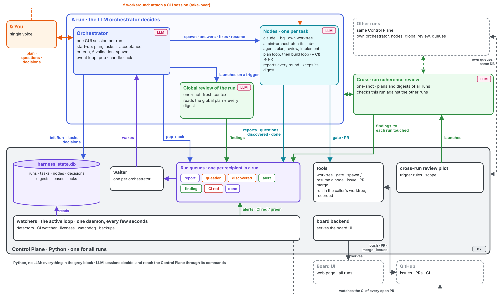
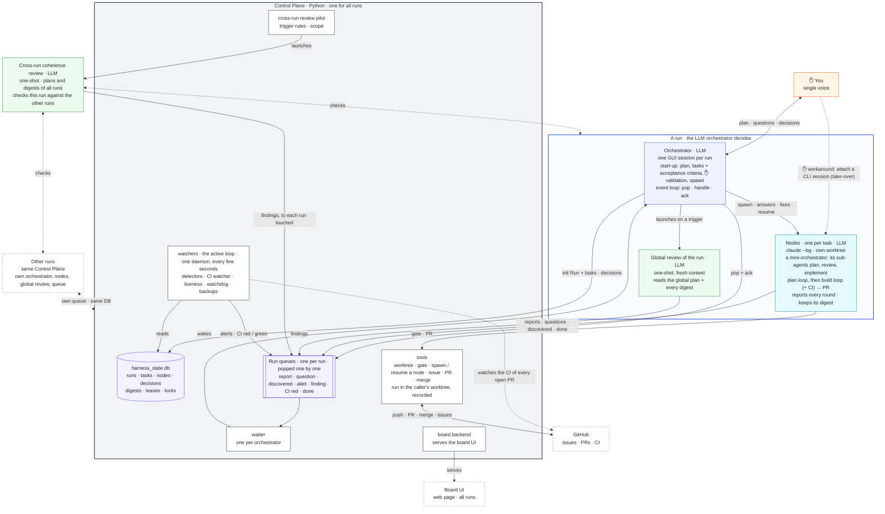
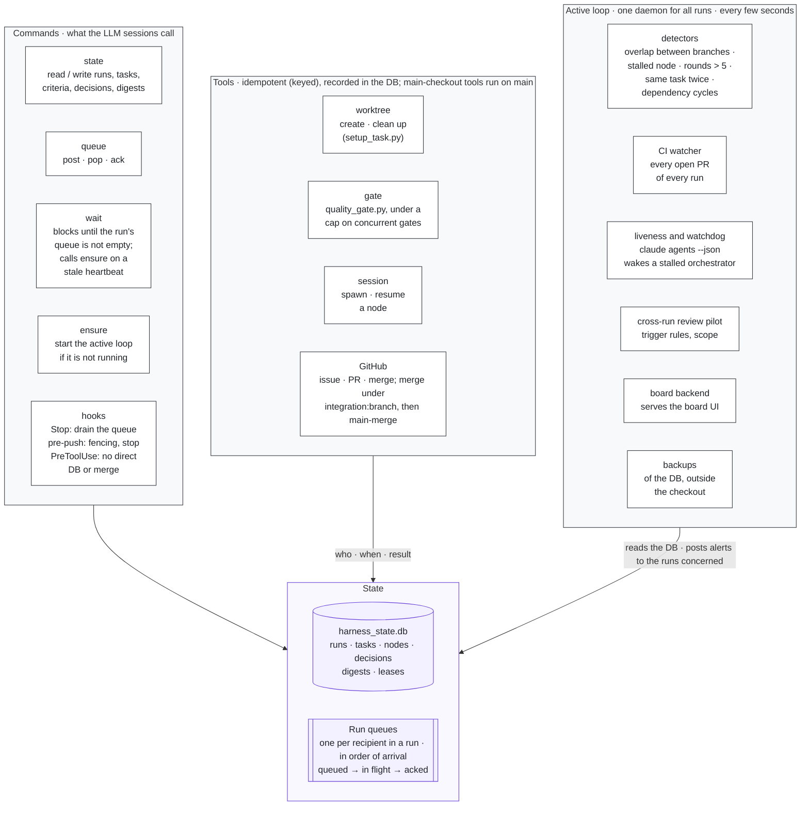
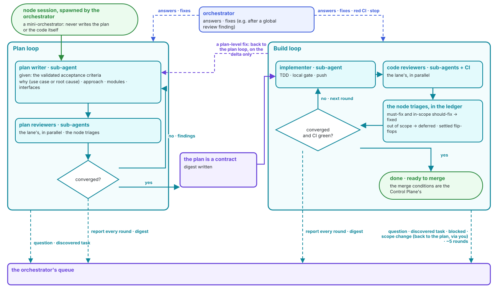
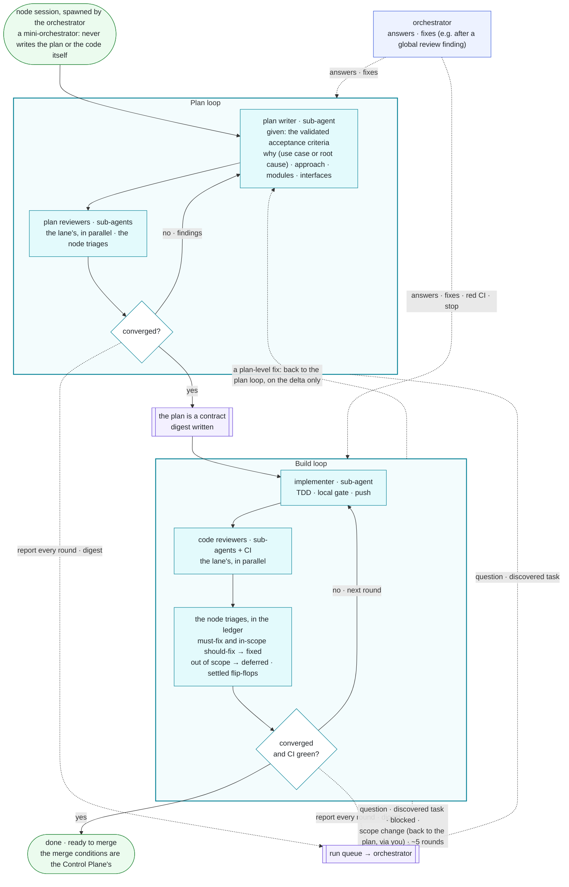
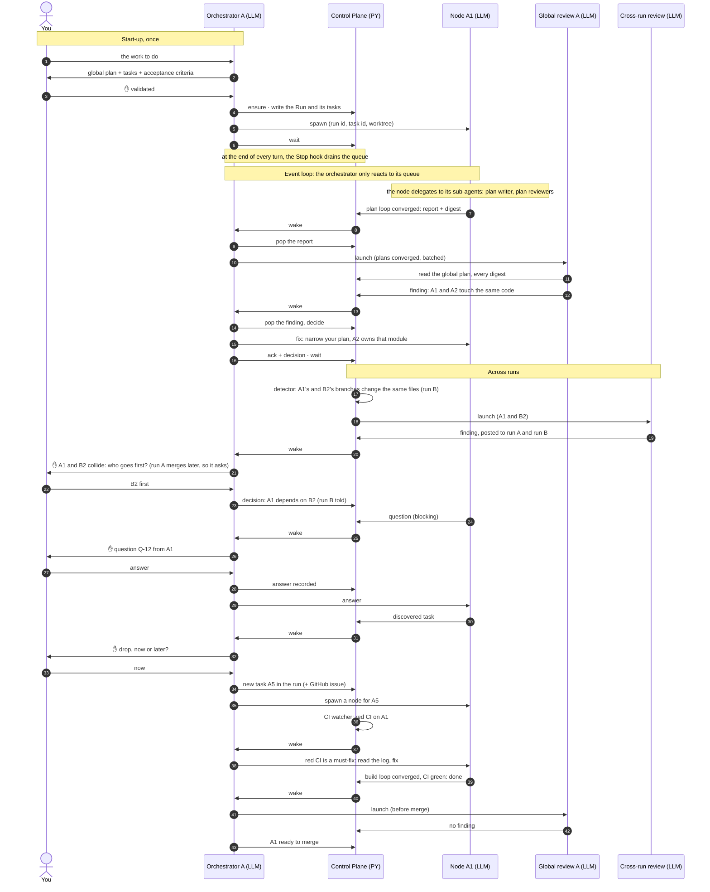
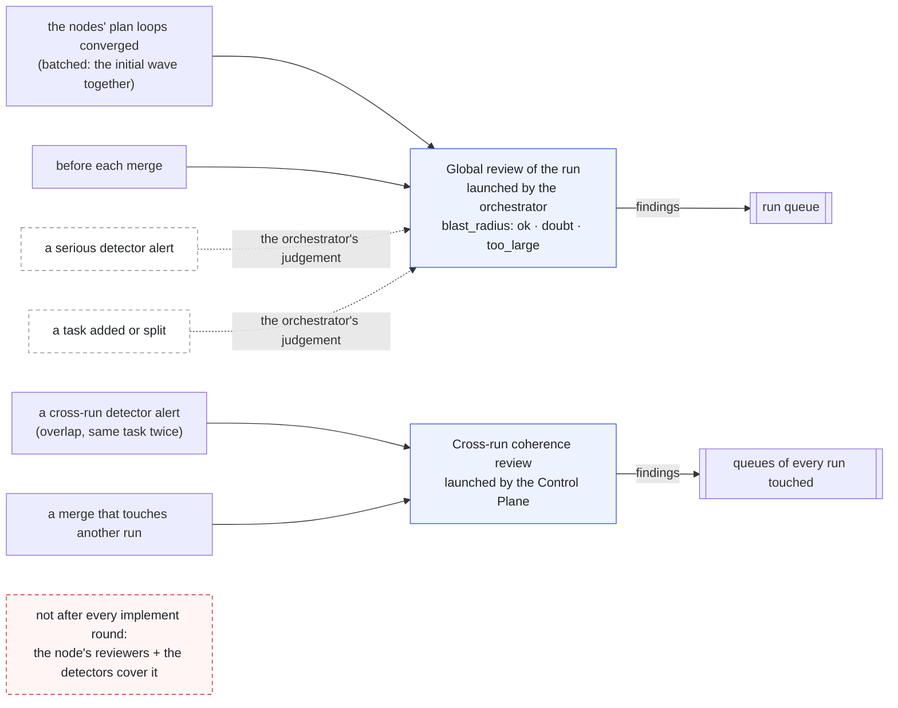
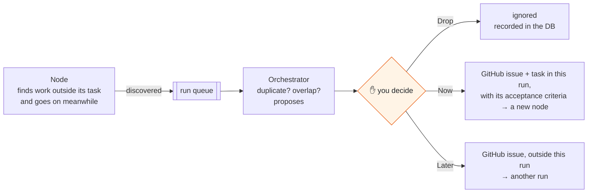
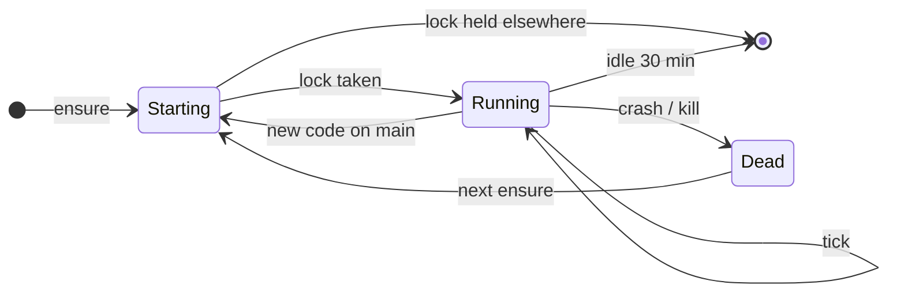

# Epic QS-369 — A second pipeline: orchestrators over a task tree, on a Control Plane

> **Status: redesign v3 (2026-10-02/03), written with the maintainer in one
> design session after the spike's go.** It supersedes the principles of
> redesign v2 (2026-09-28); the evidence and the spike results are kept as
> they were. Today's pipeline is **frozen** and stays authoritative
> (`docs/workflow/`) for every task that does not use the new one. This
> document keeps the **principles, the decisions and the target
> architecture**; the mechanisms are **requirements for the children** that
> build them. Every decision carries its provenance (see "Decisions —
> provenance"). The pipeline as built is documented at the end, by its own
> child, in `docs/workflow/orchestrator-pipeline.md`.
>
> **2026-10-06:** wave 3 is built — the Control Plane core (#399) and the
> item worktrees (#400); [`docs/workflow/control-plane.md`](../workflow/control-plane.md)
> is the reference for what exists. Where this document and the code differ,
> "What wave 3 built" under "Evidence" lists it, and the requirements of the
> children still to come were updated. Wave 4 is filed (#404–#407, and
> #375 rewritten, 2026-10-08).

| | |
|---|---|
| **Issue** | [#369](https://github.com/tmenguy/quiet-solar/issues/369) — stays **open** for the epic's lifetime (`scale:epic` is exempt from the stale bot) |
| **Classification** | `scale:epic` × `target:factory` — no `kind` of its own; children carry their own kinds (QS-321 § "The axes compose") |
| **Branch / worktree / PR** | none: redesign v3 was written on `main` directly, a one-off decision of the maintainer (2026-10-03); the rule "nothing tracked is written in the main checkout" binds the new pipeline's orchestrators, not this edit |
| **Live state** | issue #369: filed children as task-list lines, unfiled ones as `(not filed)` lines |
| **This document** | the durable rationale: goal, evidence, architecture, principles, decisions, requirements, decomposition |
| **Builds on** | [QS-321](QS-321.md) — the lane model; its wave-3 item "I. Loops" is what this epic delivers. #340 — the epic × factory lane ([lane file](../workflow/lanes/epic-factory.md)) |

---

## Goal

Build a **second pipeline next to today's**, which is frozen:

1. **The maintainer talks to one orchestrator per run** — a true session in
   the Claude GUI (one voice). Several runs, each with its own orchestrator,
   go on in parallel.
2. The orchestrator discusses the work with the maintainer and turns it into
   a **tree of tasks** with their acceptance criteria; after **one
   validation** of the plan, the tasks and their criteria, it runs them
   **autonomously**: one background session (a **node**) per task, each in
   its own worktree, in parallel where the dependencies allow.
3. Each node is a **mini-orchestrator**: its sub-agents write and review the
   plan, then implement and review the code. It runs its **plan loop**, then
   its **build loop** (implement ⇄ review, CI included) until convergence,
   and reports to the orchestrator at every round. Tasks discovered along the way come back to the
   maintainer: drop, now (in this run) or later (another run).
4. A **Control Plane** — Python, no LLM, one for all runs — holds the state,
   the message queues, the tools, the hooks, the watchers that keep
   everything coherent, and the board. The LLM sessions decide; everything that is not a
   judgement is code.
5. Tasks **merge on `main` without waiting for the maintainer**, under
   conditions checked by the Control Plane and two human gates.
6. Once the run is merged, **one global, illustrated review of the whole
   run** explains why, the solution and its impact; the maintainer's
   verdict on it unlocks `/release` for product code.

The maintainer steps in for the discussion, the plan validation, the
questions and exceptions, and the final review — never to carry fix plans or
files between sessions.

---

## Evidence

### Recorded 2026-09-24

- **Review does not converge.** Across the last 15 stories: 64 review-fix
  plans, about 4.3 rounds per story; QS-335 and QS-349 took 10 each. Findings
  per round stay flat (QS-335: 10, 10, 10, 6, 10, 6, 8, 6, 6, 1) instead of
  shrinking.
- **No stopping rule.** `qs-review-task` loops "until no must-fix/should-fix
  remains". The inexhaustible lenses dominate: blind-hunter ≈ 710 findings,
  edge-case-hunter ≈ 600, of ≈ 1,900 total.
- **Code review has no memory.** Plan review has finding states (open /
  resolved / rejected) and a delta-auditor; code review re-reviews the whole
  PR from scratch each round and can re-raise rejected findings.
- **Flip-flop between rounds.** Review raises X, implement fixes it, a later
  round asks to revert or change that fix, implement reverts it, then review
  raises X again. Nothing detects this.
- **Late rounds find things that belong elsewhere.** A refactor filed as
  should-fix in QS-349 round 9 belongs in the plan. A red CI `ruff format`
  check in the same round should have been caught at implement (fixed by
  #371). Implement also has no pre-PR self-check against the acceptance
  criteria; the acceptance-auditor has logged ≈ 260 findings.
- **The human is the relay.** Every fix round costs two new sessions, plus a
  fix-plan file committed to `docs/stories/`. Today a task takes 5+
  maintainer touchpoints: setup, plan finalize, "Ready to run the quality
  gate?" in implement, the review triage, the merge authorization.
- **The lanes haven't split for implement and review.** 5 of 6 lane files
  were byte-identical to `phase-protocols.md` (4 of 6 since #340).
- **Leftover path-based routing** and **template bloat** — both fixed by
  #372.
- **Bug fixes can grow silently.** Diagnose checks bug scope at plan time,
  but the diagnose template lets implement "extend the list with a reasoned
  progress note". Nothing checks scope at build time.

### Verified 2026-09-28

- **#340 (PR #377): CI stayed red across review rounds.** The test
  `test_leftover_dir_after_failed_remove_is_cleaned_on_retry`
  (`tests/qs/test_cleanup_worktree.py`, ≈ line 777 at head `0121c96b`; line
  748 since review-fix plan #06), added by review-fix plan #04, passed on
  macOS and failed on Linux CI. The PR Quality Gate was red on **4
  consecutive pushes** (`7f82edee`, `23bbc859`, `0121c96b`, `d7af5966`)
  while review rounds went on — review-fix plan #05 was written on a red
  head. Nothing looked at CI until `finish-task`, which could only refuse to
  merge; the maintainer had to carry the failure to an implement session by
  hand. It went green at `ad342ede` with review-fix plan #06. Local parity
  (#371) cannot catch this: macOS is not the Linux runner.
- **#340 took 6 review-fix plans:** one more story that did not converge.
- **Each phase checks only its own thing:** review did not own CI, and
  finish could only stop.
- **Too much text is always loaded.** Measured on `main` with `wc -l`: 22
  agent templates plus 2 shared partials (4,830 lines), and 3,396 lines of
  workflow docs.

### Mechanisms available (checked 2026-09-28)

- **Claude Code 2.1.281** (`claude --help`): `claude --bg` starts a
  background session; `claude agents` lists sessions (it also lists the
  maintainer's interactive sessions on this machine); `claude attach <id>`
  opens a background session in a terminal; `claude logs <id>`;
  `--bg --resume <id>` continues a session in the background under the same
  id, or starts a copy when it is already running (a short id, or a full id
  with flags, always forks a copy; see "Spike results (QS-382)"); `--agent`
  always wins over a pin.
- **Cross-session messaging** (Claude Code docs): `SendMessage` delivers a
  message to another local session between its tool calls, or starts a new
  turn when it is idle.
- **Claude desktop app** (Claude Code docs): `/resume` picks up a session
  started in the terminal; `/desktop` in the terminal moves a CLI session to
  the desktop app; several sessions run side by side as sidebar tabs. It has
  **no view of background sessions** (the agent view is terminal-only) and is
  **not** a Remote Control client (Remote Control reaches claude.ai/code and
  the mobile apps). It has **no agent picker**; it honours an `agent` key in
  `.claude/settings.local.json`, which today's launcher writes only into
  linked worktrees — the main checkout is refused by design (guard 2,
  [harness.md](../workflow/harness.md) → "GUI launch surface").
- **Hooks:** `SessionStart` fires on start and on resume and can inject
  context.
- **OpenCode — a known limitation:** `spawn_session.py` creates a session and
  sends it a message over the HTTP API, but only inside the server's own
  workspace; a new worktree is another workspace (`launchers/opencode.py`).
  Agents are discovered at server start.
- **Settled by the spike** (see "Spike results (QS-382)" below): a `--bg`
  session can be brought into the desktop app with `attach` + `/desktop`, not
  with `/resume`; `SendMessage` reaches a running `--bg` session and wakes a
  GUI session restarted by the app, addressed by session name; `--model` at
  spawn beats the frontmatter model.
- **How other harnesses store state** (survey): plans in markdown tracked in
  git; runtime state outside the tracked tree, mostly SQLite (vibe-kanban,
  Conductor, mcp_agent_mail) or a DB server (beads and Gas Town on Dolt).
  Tracked state files led to merge conflicts and lost updates; claims are
  leases with a TTL; crash recovery replays an append-only event log.

### Spike results (QS-382)

The spike ([#382](https://github.com/tmenguy/quiet-solar/issues/382)) ran the
orchestrator-over-nodes pattern once, for real, on 2026-09-30, with throwaway
prototypes (an orchestrator agent, a node agent, an event log, a state file,
a `SessionStart` hook and a CI watcher, all under a gitignored path). The run
log, event log, state and scripts are in the maintainer's archive
(`~/qs-spike-382-archive/`); event ids below are its `msg_id` prefixes.

- **Claude Code:** the terminal CLI was 2.1.281 and **auto-updated to 2.1.285
  during the P5 probe** (the control ran 2.1.281, the model run 2.1.285),
  before R1; both nodes ran 2.1.285. The desktop app runs its **own bundled
  CLI, 2.1.284**, so the GUI orchestrator and the `--bg` nodes ran different
  versions. Model: `claude-opus-5-5` everywhere except the 8d probe run
  (`claude-sonnet-5`).
- **Permission mode actually used:** the nodes ran in `auto`; node A was
  restarted once in `bypassPermissions` (row 4b). Orchestrator `09f50fac`
  ran in `auto` until **~16:43Z**, when the maintainer granted that session
  every permission: its own stop-and-respawn of node A had just been denied
  by its `auto` classifier ("Create Unsafe Agents", note `052fdbae`). The
  grant was session-level (no trace in `settings.local.json`). What ran after
  it: the removal step (row 4b), 3d, 5a and 6. The new orchestrator `a245a0bc`
  ran in `auto`. The operator session was granted every permission between
  ~15:45Z and 15:47Z.
- **Subject:** [#379](https://github.com/tmenguy/quiet-solar/issues/379)
  (slot A) and [#381](https://github.com/tmenguy/quiet-solar/issues/381)
  (slot B), both feature × product, both touching `charger.py`. #381 replaced
  **#352**, whose fix was already on `main` (PR #355), so no bug was left to
  diagnose. **Known gap:** the bug lane (diagnosis reviewers, a recorded red
  test) was not exercised; the mechanisms do not depend on the lane.
- **Outcome:** both deliverables merged —
  [PR #385](https://github.com/tmenguy/quiet-solar/pull/385) (3 review-fix
  rounds) and [PR #389](https://github.com/tmenguy/quiet-solar/pull/389)
  (7 rounds).

Outcomes use the story's vocabulary (`works` / `works with workaround` /
`fails` / `not tested — <why>`); rows 8a–8c are measurements (outcome
`measured`). T1–T4 are the maintainer's 2026-10-01 triage decisions — see
"Maintainer, 2026-10-01 (spike verdict)".

| # | mechanism | outcome | evidence | workaround tag |
|---|---|---|---|---|
| 1 | GUI orchestrator on the pinned main launches one `--bg` node per deliverable in its own worktree | works with workaround | Orchestrator `09f50fac` spawned node A `33dc98f1` (cwd `QS_379`) and node B `7922b87c` (cwd `QS_381`): `claude agents --json` `cwd` and the `start` events `80b174b0` / `c42f890a`. `git -C <main> status --porcelain` empty while both ran. **Main's `SessionStart` hook also ran inside both nodes** and claimed the orchestrator slot (`orch-start` `56c2a553`, `a6fab3cc`). Fix: the hook exits unless its `cwd` is main; the state was then repaired by the orchestrator on the maintainer's instruction | `one-time` |
| 2 | a node runs its own sub-agents and returns a compact result | works | Each node ran the 4 `qs-plan-*` reviewers in parallel: progress events `75ddfd27` (A, 14:15:59Z, "review round 1 running (4 reviewers)") and `e2ca067e` (B, 14:18:01Z); in the node transcripts (not archived) all 4 start in the same second. Each sent a compact result (12–21 lines, see 8c) | `none` |
| 3a | node → orchestrator | works with workaround | `SendMessage` **addresses a session by its name, not its id**: A's first send to `09f50fac` failed ("No agent named … is reachable"); `ListAgents` showed the GUI session under its desktop title. After the orchestrator recorded its name in the state, `b65158da` → `received 21156f9b` `via: sendmessage`. The desktop title changes per session, but recording it is part of the orchestrator's own start-up (row 5a did it unprompted); `one-time` in the spike, superseded by the run's own stable name (see "Requirements raised by the run") | `one-time` |
| 3b | orchestrator → idle node | works | `approval f9f3f126` → node `received 62953fc9`; `instruction 28164652` → `received c2a32b4d`, both `via: sendmessage`, ~15 s | `none` |
| 3c | orchestrator → node mid-turn | works | Sent while busy (`9ac10fb0`, 16:05:57Z, in the node's turn 16:05:28–16:06:21Z). In the node transcript it arrives at 16:06:06.693Z as a `queued_command` attachment, before two later tool calls (16:06:10Z, 16:06:15Z) and the turn's final message (16:06:20Z). Receiver side: `received beb20253` (msg_id `9ac10fb0`, `via: sendmessage`) at 16:06:16.9Z and `progress 80940de7` at 16:06:17.0Z, both inside that turn. A message to an idle node arrives instead as a turn-starting `<cross-session-message>` | `none` |
| 3d | a node's `SendMessage` wakes a GUI orchestrator restarted by the app | works | After the R5 engine stop, the app auto-restarted orchestrator `09f50fac` (`source: resume`, same id). Node A (`63c8c03f`, `bypassPermissions`) sent result `6b0978fe`, which started a turn at 16:47:32Z with no maintainer input → `received e6d4b960` `via: sendmessage` (16:47:52Z). The orchestrator was in `auto` plus the ~16:43Z full-permission grant | `none` |
| 4a | the core loop: an injected Linux-only CI defect is read from the log, fixed and pushed with no maintainer input | works | **Core loop:** injected commit `12c45251` (fixture name case) → red run `36740010767` (Tests shard 2/4, `FileNotFoundError`) → node `received 36a7b3ad` 15:56:31Z (logged `via: sendmessage`, actually the `--resume` prompt: `via` is self-reported by the node) → node read `gh run view --log-failed` → **allowed fix** `298823ef` (path corrected) → green run `36740718622`. **0 maintainer messages between red and the fix push** (15:55:07→15:58:02Z); his 3c probe `fc672aa5` at 15:59:32Z, after the push, was not remediation input. Node A's process had been reaped while idle, so `SendMessage` could not reach it; the orchestrator resumed it itself (see "Also observed") | `none`; resume `one-time` |
| 4b | the removal step (R8): the injected test is deleted, gated and pushed | works with workaround | **Removal step (R8):** the spike test's removal was **denied by the node's `auto` classifier** ("Irreversible Local Destruction"). The maintainer chose a `bypassPermissions` restart; the orchestrator's own stop-and-respawn was first denied by **its** `auto` classifier ("Create Unsafe Agents", note `052fdbae`), and the maintainer granted session `09f50fac` every permission at ~16:43Z, before the respawn. The new node `63c8c03f` then removed the test autonomously (`f09ed762`, 29 s) | `manual-per-round` |
| 5a | a killed orchestrator resumes in a **new** session from its state, with a `SessionStart` summary, and a node's next message reaches it | works | Kill = **archive** in the app (no auto-restart). New session `a245a0bc` (`auto`) got the hook summary (`orch-start 96f3d89b`, history `[09f50fac]`), rebuilt the run from the state alone, restarted the watcher and recorded its new name (its desktop title `Continue` — the maintainer's first word, "continue", hence not unique). It told node B (`auto`): `received 884938ae`, `msg_id: null`, so AC5's matching-id proof holds node→orchestrator but not for this send. Its message to node A (`bypassPermissions`) was **held for recipient approval** (note `5d89b5f9`) and expired undelivered at 16:54:26Z (note `789110c6`, delivery id `e6df1481`): an approval is needed only to reach a node escalated to `bypassPermissions` (observed held only from an `auto` session without the session-level grant, T2), which the orchestrator can detect from the state (`permission_mode` per node). Node B's next result `fd70e708` → `received 18f46d95` `via: sendmessage` | `none` |
| 5b | the new session acts on the events emitted during the kill | not tested — nothing was in flight at the kill: the run archived the session after R8's CI had gone green (`ci-green 9d1e1054` 16:50:11Z, last ack `351d9a8f` 16:50:40Z), instead of killing during pending CI as R9 planned | Inherited by **child 6** (start-up resumes or opens a run), which proves "events during absence" once for 5b and 6, and may ask the maintainer for a live try | — |
| 6 | closed mid-run and reopened: nodes kept working, nothing lost | works | The app has **no "close" for a session** (only delete or archive). The stand-in, an engine stop (`SIGTERM` 16:47:06.46Z to the session's own `claude` process), was **auto-restarted by the app in ~3.9 s** (hook summary `545bb2a5` at 16:47:10Z, `source: resume`, same id). Node A (the only active node; `ad5beb45`) worked through it; its event was acted on; the orchestrator noticed its watcher had died and restarted it. **Gap:** only a short close was testable, a long close was not; no node `result` or `question` was emitted during the ~4 s window — the only node event inside it was node A's acknowledgement `received 80400b0e` (16:47:09.5Z) of `ad5beb45` (sent 16:47:02Z, before the stop), *logged* while the engine was down and needing no action; its result `6b0978fe` (16:47:28Z) came after the restart; node B was idle. Inherited by child 6, as for 5b | `none` |
| 7 | a node session brought into the desktop app | works | `claude attach <id>` then `/desktop` moved probe `0eddf3a7` into the app (same session id, now interactive, app-bundled process). The app's `/resume` picker does **not** list `--bg` sessions. **Untested:** whether a node moved by `/desktop` is still reachable by its `-n` name, and whether it can return to the background | `none` |
| 8a | orchestrator context | measured | Session 1: 61,440 → peak 210,575 → end 210,575 tokens (177 messages, ~2 h 45). Session 2: 61,683 → 78,380 → 78,380 (16 messages). Nodes, for comparison: A 42,629 → 209,243; B 43,031 → 286,856 (plan and implement in one session) | — |
| 8b | total token cost | measured | Processed tokens, cache reads counted per call: orchestrator `09f50fac` 24,807,448; orchestrator `a245a0bc` 1,175,686; node `33dc98f1` 12,593,452 (+ sub-agents 1,379,127); node `63c8c03f` 769,489; node `7922b87c` 20,046,737 (+ sub-agents 2,580,014); **total 63,351,953**. Recorded cost: orchestrator 1 $9.45, node `33dc98f1` $8.86; the others' cost record is written only at exit and was not re-measured after cleanup. Copy `421a6582`: transcript not found; copy `bd49d0b0`: not measured | — |
| 8c | node result sizes | measured | 15 `result` payloads, 13 from nodes: 12–21 lines, 372–2,476 characters (~93–619 tokens, chars/4); the orchestrator's 2 acknowledgements: 4 lines, 143 characters | — |
| 8d | `--model` at spawn vs the frontmatter | works | **`--model` wins:** probe with frontmatter `claude-opus-5-5`: control → `claude-opus-5-5`; `--model claude-sonnet-5` → `claude-sonnet-5` on every message | `none` |

**Preflight evidence.**

- **P1:** `claude --version` 2.1.281 (floor 2.1.280); `--permission-mode`
  offers `auto` and `bypassPermissions`; both models are in
  `models.HARNESS_MODELS["claude"]`.
- **P2:** main clean and level with `origin/main` (74928ed8).
- **P3:** #379 and #381 open, `target:product`, one `kind:*`, not epics; no
  `QS-<N>` references, worktrees or branches.
- **P5:** `auto` let the nodes' event appends through with no prompt.
  `SendMessage` is available to a `--bg` session but **deferred** (loaded with
  ToolSearch). `claude agents --json` fields: `sessionId`, `id` (short),
  `name`, `cwd`, `kind`, `status` (`idle` / `busy`), `state` (`done`,
  `blocked`, `stopped` in the archive), `pid`. Transcripts:
  `~/.claude/projects/<cwd slug>/<sessionId>.jsonl`, sub-agents in
  `<sessionId>/subagents/`. `claude logs <id>` is a raw terminal replay.
- **P7:** a background task's exit wakes an idle GUI session (~5 s),
  confirmed in two separate desktop sessions.
- **P4, P6, P8, P9 ran too:** the kit dry-runs (`summary.py`, `watch.py` on
  PR #384); mechanism 7 (row 7); `measure.py` dry-run on the probe
  transcripts; the pin and the agent copy, with main still clean.

**Also observed.**

- **Permission mode the nodes needed:** `auto` for everything except deleting
  a tracked file, which needed `bypassPermissions`. **Cross-session messages
  from an `auto` session to a `bypassPermissions` session need the recipient
  user's approval** (note `5d89b5f9`) — observed held only from an `auto`
  session without the session-level grant. The reverse direction, bypass
  node → `09f50fac`, was delivered without approval (`55902e73`, `e6d4b960`,
  `351d9a8f`) — all three after the ~16:43Z grant, so the grant's effect is
  not separated. After that grant, `09f50fac` → the bypass node was not held
  either (`ad5beb45`→`80400b0e`, `233e0694`→`30c2543f`): the same grant that
  lets an orchestrator escalate a node (see "Design consequences") also
  removed the hold. See T2 under "What the go asks of the children".
- **`setup_task.py` in the new worktrees:** branch pushed at `origin/main`'s
  head; the `venv`, `config/*` and `custom_components/*` symlinks;
  `.mypy_cache` and `.testmondata` copied; both agent folders rendered; the
  pin plus `effortLevel`; three launch scripts (never run).
- **Main's `settings.local.json`:** Claude Code added **no** permission
  during the run; the only differences were the pin's own keys, plus an
  em-dash re-encoding and a dropped trailing newline from the pin-merge
  one-liner. The restore was `cmp`-identical.
- **The orchestrator agent on main** was copied by the maintainer at P9 and
  re-copied by the operator at 16:50Z (the `message_name` step).
- **Node agent copy:** the orchestrator `cp`'d it into both worktrees itself
  (23 agents in `.claude/agents`); no hand copy.
- **Catch-up after the first merge:** #389 hit a real conflict with #385
  (`charger-budgeting.md`, plus test-helper renames). #389's own frozen
  review session resolved it in merge `0fb00797`; CI came back green.
- **A node's process is reaped after about 1 h idle.** `SendMessage` cannot
  reach it. `--resume <short id>` starts a **copy** under a new id and name
  (`421a6582`) — and so does `--resume <full id>` **with**
  `--agent/--permission-mode/--add-dir` (copy `bd49d0b0`, note `01e9da5d`).
  Only a bare `claude --bg --resume <full id> "<msg>"` continues the session,
  which keeps its saved options and its name. Two copies were stopped.
- **The orchestrator refused instructions found in the event log** ("I only
  take instructions from you in this chat") and asked the maintainer: the log
  is data, not a command channel.
- **Relayed claims drift:** a node reported "`--impacted` and `--quick`
  pass" when its transcript shows only `--quick`; the orchestrator once told
  the maintainer a `received` event was missing when it was in the log.
- **Nodes are fast:** a node turn took 30 s to 6 min, shorter than a human
  round-trip, so mid-turn and close tests needed the orchestrator to queue a
  second message itself.
- **Fault injection needs a human grant:** under `auto`, an agent was refused
  twice the writing of a script that commits a defect onto another branch.
  In the run, the operator session wrote and ran `inject.sh` itself
  (15:50:53Z, 15:52:04Z) once the maintainer granted it every permission
  (between ~15:45Z and 15:47Z): maintainer-delegated, not a human commit.
- **The watcher rule drifted:** "one watcher at a time" had become 3 running
  watchers by 15:47Z.
- **`--impacted` errored on a brand-new test file** under xdist (4 errors);
  a serial testmon run, then the gate, passed.
- **How main's hook reached the nodes:** they were spawned from the
  orchestrator's Bash on main (`cd <worktree> && claude --bg … --add-dir
  <kit>`); the hook lived only in main's `settings.local.json` (see the
  drift diff), the worktrees' own settings had none. Whether it came through
  settings lookup or environment inheritance was not isolated.

**What was learned.**

- The messaging model is **by session name**. Every session needs a stable,
  known name (nodes: `-n`; the GUI orchestrator in the spike: its desktop
  title, which changes per session — hence the run's own stable name, see
  "Requirements raised by the run"), and the state must hold it.
- Hooks in main's `settings.local.json` **reached both `--bg` nodes spawned
  from main's Bash** (observed), including nodes in other worktrees; other
  start paths are unverified (for child 6), so a hook must route on its `cwd`.
- A node is not a durable process: it can be reaped, resumed or restarted.
  The orchestrator messages it **by name** and resumes it **by full session
  id**, so the state DB holds, per node, its name, its full session id and
  its short id (T3).
- The desktop app restarts a dead session engine by itself; only an archive
  is a real kill.
- One session from plan to push grows the node's context to ~290 k tokens,
  and surprised the maintainer (see "Requirements raised by the run").

**Requirements raised by the run (maintainer, 2026-09-30, completed
2026-10-01).** For the maintainer to place in children 5–13.

- **Several orchestrators in parallel — a very important requirement**
  (maintainer: without it there is no true task parallelism). **Not tested
  by the spike**, which ran one orchestrator; its prototype would break with
  two. Every new session on main claimed "the" orchestrator slot, there was
  one state and one event log, and nodes addressed "the" orchestrator.
  `harness_state.db` (child 5) solves concurrent writes, not the model. So:
  - a **run** is the unit: a run id that owns its deliverables, nodes,
    events and watched PRs, and records its orchestrator session and its
    unique, stable messaging name (not the desktop's generated title);
  - a run has **at most one live orchestrator** (a lease, with the takeover
    rule below); the unique messaging name belongs to the run, and a session
    taking over (assistant, PR #395 review; **confirmed by the maintainer,
    2026-10-02**) **archives** the old session before claiming the run name —
    an engine stop is undone by the app's ~4 s auto-restart (row 6), so a
    "stop" is not a takeover. The new session claims the run name only once
    the old one is gone from `claude agents --json` (an archived session
    leaves that list — RUNLOG l.374-375). No programmatic archive of a desktop
    session was shown in the spike (both archives were performed in the app
    by the maintainer — RUNLOG l.374 (actor implicit), l.430), so this is a
    **maintainer step unless child 5/6 find one**; while the archive is
    pending, the fencing token (child 5, "Requirements per child" → The
    Control Plane core) keeps a restarted old session from acting. Its scope
    was **settled by the maintainer on 2026-10-03: every action with an
    effect** — state-DB writes, node messages, merges and the main-checkout
    lock all check the token, so a superseded session can only read. A
    session that finds it no longer holds the token **ends itself**: it
    stops its event loop (no new `wait`; its `Stop` hook lets it stop
    instead of draining the queue), tells the maintainer it was superseded
    and asks to be archived, and after any app restart its resume summary
    says it is superseded and it stays idle. Nodes keep addressing the run
    name;
  - a new session on main **claims nothing by itself**: its start summary
    lists the open runs, and the session resumes one or starts a new one;
  - a node carries its run id and addresses its own run's orchestrator; an
    orchestrator wakes only on its own run's events and CI;
  - runs see each other's deliverables and the code they touch, so a run
    knows when another run's merge will make it catch up (as #381 did after
    #379, inside one run).
- **Node identity in the state DB — a hard requirement for child 5**
  (maintainer, 2026-10-01, T3): per node, its **name** (for `SendMessage`),
  its **full session id** (for resume) and its **short id**.
- **Plan discussion, two routes.** Both must work: direct (attach to the node)
  and relayed (through the orchestrator). Switching back from direct to the
  orchestrator must be near-automatic: asking the orchestrator about that
  deliverable's plan must just work. This was exercised live once: the
  orchestrator asked node B where the direct discussion stood.
- **A PyCharm launcher for a plan discussion:** it opens the node's worktree,
  the plan file and a terminal running `claude attach <sessionId>`. At least,
  print the worktree path, the plan path and the `attach` command.
  (`setup_task.py` already writes a PyCharm launcher per worktree.)
- **Tasks form a tree; the run keeps a work list** (maintainer, 2026-10-01).
  Any task (epic, bug or feature, whatever its kind) can have children; no
  after-the-fact umbrella epic. A discovered task gets the task it came from
  as its parent. Discovery happens **in a plan or mid-deliverable**: the
  agents may realise a task should be split into several sub-tasks, so the
  current deliverable shrinks and new sub-tasks (children of the task that
  shrinks) join the run with dependencies, each in its own worktree. What
  happens to code already on the shrinking deliverable's branch for the part
  that moves is an open point for child 6b. Since #400, **a work item is
  never a deliverable** (maintainer, 2026-10-06): a part that ships on its
  own becomes a new deliverable `QS_<M>`, never a promoted `QS_<N>_<k>`, so
  moving its code needs a mechanism nobody has built yet (a re-cut or a
  cherry-pick). The run keeps a **work list**: the
  subset of the tree under the run's **root tasks** (the tasks the
  orchestrator was asked to solve), stored in the state DB. Today's parent
  link is `### Parent epic` and only `scale:epic` issues are parents; the
  tree generalises that. #381's follow-ups were filed this way:
  [#386](https://github.com/tmenguy/quiet-solar/issues/386),
  [#387](https://github.com/tmenguy/quiet-solar/issues/387),
  [#388](https://github.com/tmenguy/quiet-solar/issues/388).
- **Discovered tasks: the maintainer decides** (T4). The orchestrator
  collects them and presents, for each, now (a new deliverable in the run,
  with a dependency when it shares code), later (a separate issue, outside
  the run) or drop. Autonomy may be revisited if it happens too often.
- **One session per phase or one per deliverable** is an open choice: the
  maintainer expected implement to start a new session.

**Design consequences** (assistant, agreed by the maintainer on 2026-10-01).
These follow from good design; they are not new requirements.

- **Hooks know their role.** With runs in the state database, a hook no
  longer claims "the orchestrator", so a node can no longer hijack it. But
  main's hooks still reach the nodes spawned from it, so a hook routes on
  its `cwd`: on main, the orchestrator's summary; in a deliverable worktree,
  that node's summary, looked up in the database by worktree path. (As
  built, #399 has no `SessionStart` hook: `cp.py session status` gives the
  summary, and the routing became registration — a node gets its hooks
  through `--settings` at spawn.)
  **Unverified, for child 6:** that the hook fires for a node resumed after
  being reaped, for a node started from a terminal inside its worktree, and
  after `/desktop`.
- **Nothing tracked is written in the main checkout**, not even an epic or a
  run plan. Several orchestrators share that folder, and it hosts the
  scripts every session runs and the seeds new worktrees copy
  (`.testmondata`, `.mypy_cache`); new worktrees branch from `origin/main`
  after a fetch. An orchestrator on main writes only the state database,
  GitHub (issues and PRs) and new worktrees. Plans and run-level documents
  (the global plan, the review guide) are written in a worktree of their own
  and landed from there, as `epic_doc.py land` already does. **The one
  exception** is fast-forwarding main after merges (`git pull --ff-only`,
  never an edit), which **child 7** owns (it mirrors what `finish-task` does
  on the main checkout after a merge); child 9 owns only the main pin (an
  untracked file). A main-checkout lock (assistant, PR #395 review;
  **confirmed by the maintainer, 2026-10-02**) in the state DB (child 5) covers
  **fetch, fast-forward and worktree setup for every new-pipeline writer**
  (not only other runs' worktree setup), so one run's automatic merge cannot
  fast-forward main while another run's `setup_task.py` runs from it; it has
  expiry tied to the holder's process liveness (child 5's liveness rule) and is
  **separate from the integration locks** (child 5). How a holder restarted
  by the app resumes safely, and the lock's relation to the run lease, were
  **settled by child 5** (lock holders are tool process groups; the
  main-checkout lock is fenced by the token); worktree-side fetch/push
  contention on the shared ref store (a node's catch-up with main) is an
  **open point for child 6b** — note that #400's `integrate-finish` gate
  already runs `git fetch origin main` from its scratch without the
  main-checkout lock. The **frozen pipeline's** `finish-task` / `setup-task` still write the
  main checkout without taking it — a **known unserialised writer, an open
  point for child 7** (the light freeze allows touching them later if needed).
- **The state database stays at the root of the main checkout** (gitignored),
  shared by every session, its path passed to each one. Every node must be
  allowed to reach it (the spike needed `--add-dir`). Worktree cleanup never
  touches it; a `git clean -fdx` on main would delete it.
- **An `auto`-mode orchestrator cannot escalate a node by itself:** its own
  classifier refuses it ("Create Unsafe Agents"). A human pre-authorises it,
  or the orchestrator runs permissive. For child 6, which owns the node
  sessions.

**What the go asks of the children** (assistant mapping, for the design of
each child when its turn comes):

- **Several orchestrators at once:** child 5 (a run as the unit, with its
  orchestrator, its messaging name and its single live owner), child 6
  (start-up resumes or opens a run; nodes address their own run's
  orchestrator), child 9 (the main pin serves several orchestrator sessions;
  nothing is claimed automatically), child 10 and later Codex (the same, in
  their GUIs).
- **Interactivity in plan and review:** child 6 (plan discussion, both
  routes, the orchestrator guiding the maintainer to a node or handling the
  discussion itself), child 7 (the same for review), child 9 (the GUI entry
  and the launcher with the worktree, the plan and `claude attach`). The
  "One voice" principle stays, with the direct route as an open door.
- **A state database complete enough for a visualizer:** child 5 (the
  schema keeps the node graph, each task's state and history, what is done
  and what remains), child 8 (the board reads it).
- **The task tree, discovered tasks and the work list:** child 5 (root tasks,
  the tree with parent links, the run's work list; each node's permission
  mode, T2; each node's name, full and short id, T3), child 6 (the loop
  collects discovered tasks, presents the decision, inserts "now" items with
  their dependencies, and creates a dependent deliverable's worktree via
  today's `setup_task.py`), child 12 (only when a split yields work items
  inside the same deliverable).
- **T1 — unproven halves go to a child** (maintainer, 2026-10-01):
  "events emitted while the orchestrator is away" (5b, 6) is proven by
  child 6, which may ask the maintainer for a live try.
- **T2 — the permission-mode hold is conditional, not a manual round**
  (maintainer, 2026-10-01): delivery works when orchestrator and node share a
  permission mode; a human approval is needed only to reach a node escalated
  to `bypassPermissions`, observed held only from an `auto` session without
  the session-level grant. The state DB records each node's permission mode,
  so a restarted orchestrator knows which nodes need the human step, or
  avoids it (child 5, child 6). Child 5 also records the orchestrator
  session's mode/grant; in the spike `permission_mode` was recorded for the
  escalated node only.

**Cleanup** (checked before this PR): all `ARTEFACTS.md` entries handled.
Every probe and node session stopped (`claude agents --json`: no
`qs-spike-*` left); the node-agent copies went with the worktrees; the six
launch scripts and the probe folder removed (the scratch dry-run copy was a
session-scoped scratchpad outside the repo, nothing to remove); main's
`settings.local.json` `cmp`-identical to its backup; the orchestrator agent
removed from main; `git -C <main> status --porcelain` empty. The kit (run
log, event log, state, scripts) was moved out of the repository to the
maintainer's archive; `QS_382/var/` was kept, as it holds only a PyCharm
`.idea/`.

**Go / no-go (maintainer, 2026-10-01),** verbatim:

> Go, provided the interactivity in plan and review we have seen during the
> spike is well implemented, and the fact that we can run multiple
> orchestrator [sic] at the same time, so I get , in the claude code GUI (and
> later codex or opencode GUI) access to those orchestrator [sic] directly
> and they will guide me directly on how to interact with the node if
> needed, or handle those discussion [sic] directly. At some point I want to
> be sure that the state database be complete enough so we could build a
> visualizer on so I can see what is happening in the system, have a vision
> of the node graph, the various tasks states, done stuff, and remaining
> stuffs, etc.  all of this will probably impact the various children coming
> after, be sure you take it into account in your design

### What wave 3 built (#399, #400 — checked 2026-10-06)

Read from the two stories, their review-fix plans (#399: 5; #400: 5,
converged at round 6) and the code on `main`. The reference for what exists is
[`docs/workflow/control-plane.md`](../workflow/control-plane.md) (with
[its diagrams](../workflow/control-plane-diagrams.md)); this section only
lists what the children still to come must know, and where the code differs
from this document.

**The Control Plane core (#399, PR #401, merged 2026-10-05).**
`scripts/qs/control_plane/` (27 modules) behind `scripts/qs/cp.py`, always
run as `<MAIN>/venv/bin/python <MAIN>/scripts/qs/cp.py`, one JSON object per
call. Schema v1: runs and their leases, the task tree (deliverables and work
items, dependencies, roots, the work list, criteria, history, PR and CI
fields), nodes (one row per generation), messages, questions, decisions,
digests, reports, integrations, locks and cap slots, `tool_calls` (the
idempotency keys), the daemon lease and `hook_events`. Its tools:
`worktree-create`, `worktree-cleanup`, `gate`, `spawn`, `resume`,
`issue-create`, `pr-create`, `push`, `merge`, each called as `cp.py tool
<name> --task --key --args-file --token`. CI's 100% coverage, ruff and
mypy cover it (about 918 tests). It differs from this document in these
points:

- **Queues:** one per **recipient** inside a run (`orchestrator`,
  `node:<task>`), with a `dead` state after 5 deliveries — not one per run.
- **`ensure`** is called by the `ensure` command, `run open`, `run claim`,
  `wait` (before it
  blocks and on a stale heartbeat), and by a write command only when the DB
  is missing or older. Reads (`snapshot` included) and the hooks never call
  it.
- **The daemon is a skeleton:** singleton `flock`, migration on start, lease
  (with the **schema version**, not a code version), heartbeat, idle exit.
  `daemon.run` takes `tick_hooks`, but the `daemon` command passes none and
  there is no registration point. It restarts only for a lower schema or a
  hung daemon; "restart on any new code" and the self-check are child 14's.
- **Locks:** `main-checkout` and `main-merge` are held by a tool's process
  group; `integration:<branch>` by a process or by a session
  (`lock acquire|release`). The `merge` tool holds `integration:<branch>` then
  `main-merge`, not `main-checkout`; `issue-create`, `pr-create` and `push`
  take no lock. Caps: 2 gates, 4 node sessions across all runs.
- **Hooks:** `Stop` (orchestrator) blocks while a message is visible and
  once when no `wait` runs; its loop guards write `hook_events` alerts,
  never messages (the `merge` tool writes one too, `merge_state_conflict`). `PreToolUse` denies direct DB access to every session, and
  `gh pr merge` and a superseded session's `SendMessage` to registered ones.
  `pre-push` is one common-dir shim (refuses `QS_<N>_<k>` refs everywhere;
  token and `stopped` checks in registered worktrees). No `SessionStart` hook
  (`session status` serves it). The orchestrator's hooks are not wired: that
  is child 9's main pin (`cp.py hooks-settings --role orchestrator`).
- **Spawn:** `claude --bg --agent … -n <run>-<task>-g<gen> [--model M]
  --permission-mode … --settings <node hooks> --add-dir <MAIN> "<prompt>"`.
  `--model` is passed only when the caller gives one; nothing reads
  `models.py`; no effort flag. A launch that must be retried on the same
  row is renamed `…-r<n>`; `waiters` records each running `wait`. `spawn` needs a task with a worktree and counts
  against the node cap: no tool launches a session that is not a task's node.
- **The merge policy** is a seam, `merge_policy.install(fn)`, refusing by
  default; a policy receives only the task row.
- **The export** (`cp.py export-summary`) writes
  `docs/stories/QS-<issue>.summary.md` into the deliverable's worktree,
  **before** the merge, so it lands with the PR (the main checkout is
  refused); its ledger part is the empty seam `export.LEDGER_SECTIONS`.
- **Backups** exist only before a migration (outside any checkout).
- **The ledger:** nothing is reserved. #375 appends `Migration(2, …)` to
  `migrations.MIGRATIONS` and fills `export.LEDGER_SECTIONS`; `reports`
  (phase, round, `converged|continuing|blocked`, free JSON fields) and
  `tasks.ci_state` / `ci_sha` exist.
- **Not built, by decision:** the `task_deps` cycle check (child 14's
  detector) and `run list` / `node list` (`snapshot` serves them), recorded
  in `docs/stories/QS-399.story.md`; a few DB-access gaps the `PreToolUse`
  hook does not see (control-plane.md, "Conventions").
- **Unverified:** that the hook's `session_id` equals
  `$CLAUDE_CODE_SESSION_ID`; that `--settings` hooks survive a bare
  `--resume` (child 6b).

**Item worktrees (#400, PR #402, merged 2026-10-05).**

- **Naming:** an item is `QS_<N>_<k>` in `<repo>-worktrees/QS_<N>_<k>`,
  with one integration scratch **per item**, `QS_<N>_<k>_integration`.
  #398 was fixed on its own first.
- **Item branches are never pushed** (`pre-push`, `create_pr.py` and
  `cleanup_worktree.py` refuse); integration moves only the local `QS_<N>`,
  which the deliverable's node pushes.
- **An item worktree is rendered unbound** (all templates, no task facts,
  no pin); the scratch renders nothing.
- **The tools:** `item-create` and `item-cleanup` (run token);
  `integrate-start | finish | drop` (run token, or the item's own node), each
  under the caller session's `integration:QS_<N>` lock. The "green gate" of
  `integrate-finish` is `quality_gate.py --impacted` on the scratch's head
  (up to about an hour, so run in the background); CI on `QS_<N>` stays
  authoritative. The move is an `update-ref` compare-and-swap, or a
  `merge --ff-only` in the worktree holding `QS_<N>`, which must then be
  clean. Each step is idempotent by content; only an `integrations` row
  `ok` means "integrated".
- **A work item is never a deliverable** (maintainer, 2026-10-06): a piece
  that ships on its own is a new deliverable `QS_<M>` with its own issue and
  PR. #399's `tasks.add`, `update_fields` and the deliverable-only tools
  enforce it.

---

## Architecture

The target architecture, from the 2026-10-02/03 design session. Two kinds of
things only:

- **LLM sessions decide:** an orchestrator per run, a node per task (a
  mini-orchestrator over its sub-agents), a global review per run, and a
  cross-run coherence review.
- **The Control Plane (CP)** — Python, no LLM, one for all runs — is the
  harness's dynamic part and its procedural memory: the state, the queues,
  the tools, the hooks, the watchers and the board backend. The LLM sessions reach it
  only through its commands.

The diagrams are Mermaid, the source of truth for their structure (see
"Diagrams" under "Principles and decisions"). The `%% @` comments of views 1
and 3 carry the layout of their pretty render, drawn by
`python scripts/qs/mermaid_svg.py render docs/epics/QS-369.md`.

### 1. The big picture

The same picture, as Mermaid (it renders anywhere, less pretty):

### 2. Inside the Control Plane

### 3. Inside a node: the plan loop, the contract, the build loop

The same picture, as Mermaid:

### 4. A run, message by message

### 5. When the reviews run

### 6. A node discovers a task that was not planned

### 7. The Control Plane's active loop (a singleton for all runs)

| transition | what happens |
|---|---|
| ensure | as built (#399): called by `run open` and `run claim` (an orchestrator's start-up), by every `wait` (before it blocks, and again when the heartbeat goes stale), and by a write command when the DB is missing or older — reads, `snapshot` and the hooks never call it; the `board` command (child 8) will; so does the explicit `cp.py ensure`; starts the loop only if none runs, fully detached from the caller's session |
| lock taken | an OS file lock next to the DB (freed by the OS if the process dies) plus a lease row in the DB (pid, heartbeat, schema version; the code version "new code on main" needs is child 14's) |
| lock held elsewhere | another loop already runs: the new one exits at once — a singleton |
| tick | every few seconds: read what changed in the DB, run the detectors for every run, check CI for every open PR (within the API budget), check liveness, wake a stalled orchestrator (watchdog), back the DB up, write the heartbeat, post alerts to the queues of the runs concerned, launch a cross-run review when its rules say so |
| new code on main | after a merge touches the CP's code, it restarts itself and runs its self-check; a failed self-check halts every automatic merge and alerts every run |
| crash / kill | the lock is freed; the next ensure — at the latest when a `wait` sees the stale heartbeat — restarts it |
| idle 30 min | no open run for 30 minutes: it exits; the `board` command can start it again to look at history |

---

## Principles and decisions

The spike's requirements ("Requirements raised by the run", "Design
consequences", "What the go asks of the children", above) are carried into
what follows; where they differ, this section wins.

### Two pipelines side by side

- **Today's pipeline is frozen — lightly** (maintainer: "the freeze is
  light, I will probably never work again on the previous way of working if
  the new one works; if you need to do stuff on those to help us, do it, but
  I doubt it"). It stays reachable (CLI `claude --agent qs-<phase>`, slash
  commands). Retiring it is a later decision.
- **The new pipeline** is built next to it, child by child.

### Runs and the task tree

- **A run is the unit** (spike, 2026-09-30): the work one orchestrator was
  asked to do. It owns its root tasks, their tree, its nodes, its queue and
  its events. **Several runs go on in parallel** — "a very important one,
  else we won't have the possibility of true task parallelism" (maintainer).
  A run has at most one live orchestrator (a lease; the takeover rule is in
  "Requirements raised by the run").
- **Tasks form a tree** (maintainer, 2026-10-01): any task — epic, bug or
  feature, whatever its kind — can have children; a discovered task gets the
  task it came from as its parent. The run's **work list** is the subset of
  the tree under its root tasks.
- **Not every task is a deliverable.** A **deliverable** is a task that ends
  in a PR: a GitHub issue that on its own brings something measurable and
  testable — something a release note would list (maintainer). It has its
  own worktree, branch and PR, and a lane (`kind` × `target`, hence its
  rigor profile). **Work items** are parts of one deliverable that run in
  parallel and land in the same PR, without stepping on each other,
  integrated very regularly (maintainer).

### The orchestrator: a GUI session and an event loop

- **A true session in the Claude GUI — nothing more** (maintainer,
  2026-09-28), on the pinned main checkout; a new session on main **claims
  nothing by itself**: its start summary lists the open runs, and it resumes
  one or starts a new one (spike).
- **Start-up, once:** it discusses the work with the maintainer, drafts the
  global plan, defines the tasks and **drafts each task's acceptance
  criteria**; the maintainer **validates the plan, the tasks and their
  criteria** (maintainer, 2026-10-03: no human ever validated the criteria
  otherwise, and merges are automatic). It writes the run, its tasks and
  their criteria to the Control Plane and spawns one node per ready task.
  The global plan lives in the Control Plane during the run and is exported
  to git with the run's final review.
- **Then it only reacts** (maintainer, 2026-10-02): "the orchestrator is a
  loop that waits on new messages, in a message queue in the DB, and pops
  them one by one" — in order of arrival (maintainer, 2026-10-03). It pops
  one message, handles it, acknowledges it, and goes on: a question
  (answered from the plan, or asked to the maintainer), a discovered task
  (asked to the maintainer), an alert, a finding or a red CI (acted on, or
  escalated), a dead or reaped node (resumed or respawned).
- **It never forgets to listen — three layers, all code** (the maintainer
  found a bare `wait` "light"; assistant design, accepted 2026-10-03):
  1. a **`Stop` hook**: at the end of every turn of the orchestrator, a CP
     script checks the run's queue; while messages are waiting, it blocks the
     end of the turn and tells the session to pop the next one, so the queue
     is drained deterministically; it also relaunches `wait` when none runs;
  2. **`wait` in the background**, to wake the session when it is idle and a
     message arrives (spike P7: a background task's exit wakes an idle GUI
     session in ~5 s); `wait` also watches the active loop's heartbeat and
     calls `ensure` when it is stale;
  3. a **watchdog** in the Control Plane's active loop: when a run's queue
     has waited too long and no `wait` runs (e.g. after the app restarted the
     session's engine), it wakes the orchestrator. A Python process cannot
     call `SendMessage` (a session
     tool, and the Agent SDK has no send either), but every Claude Code
     session binds a documented **inbox socket**
     (`CLAUDE_CODE_MESSAGING_SOCKET`, with `CLAUDE_CODE_MESSAGING_TOKEN`,
     exported to its hooks and Bash — present in a desktop-app session,
     checked 2026-10-06) where another process posts a message: a
     `SessionStart` hook (on start-up and on resume, so also after the app
     restarts the engine, when the session itself takes no turn) records the
     socket and token in the state, and the watchdog posts there (child 14; maintainer's question, assistant's
     design, 2026-10-06).

  A `Stop` hook that keeps a session going is documented by Claude Code but
  unverified in the desktop app with this use: child 6a proves it first.
- **When the maintainer is talking to it**, his message is handled first; the
  queue resumes after his turn (the `Stop` hook drains it then).
- **Closed, it pauses; reopened, it resumes** (maintainer, 2026-09-28): the
  nodes carry on until they need it; messages accumulate in the queue; on
  reopening, a `SessionStart` summary and the drain of the queue bring it
  back. The desktop app has no close for a session and restarts a stopped
  engine by itself; only an archive is a real kill (spike).
- **Its context:** it keeps nothing it can re-read; the Control Plane is the
  source of truth, read on demand. If it saturates, a fresh session resumes
  the run from the state (spike 5a).

### Nodes: mini-orchestrators with two loops

- **One node per task**: a `claude --bg` session in the task's worktree.
  Execution model: **a hybrid, closer to "B"** (maintainer, 2026-10-02) — the
  node runs its own loops, and the orchestrator steers between them through
  the reports.
- **A node is a mini-orchestrator** (maintainer, 2026-10-03): its main
  session **never writes the plan or the code itself**; it launches
  sub-agents — the plan writer, the plan reviewers, the implementer, the code
  reviewers — and keeps the coherence: it triages every finding with the
  plan and its own past decisions in context, which is the point. It only
  receives the sub-agents' compact results, so its context grows far slower
  than the spike's node, which wrote the plan and the code itself (~290 k
  tokens). Sub-agents start each round from a fresh context, with the plan,
  the digest and the findings to address. When the node's context passes a
  threshold, a fresh node session resumes the task from its digest, its plan
  and the ledger.
- **Two loops, one after the other** (maintainer, 2026-10-02; view 3): the
  **plan loop** until the plan converges; then the plan is **a contract**;
  then the **build loop** (implement ⇄ review, CI included) until
  convergence. Going back to the plan is an exception.
- **A report at the end of every round of both loops, and at every
  blocker** (maintainer, 2026-10-02), as **structured fields** stored in the
  Control Plane: phase and round, status (converged / continuing /
  blocked), a short summary, discovered tasks, questions.
  The message itself stays short.
- **Each node keeps a digest of its task**, replaced (never appended) and
  capped in size: the goal and the validated acceptance criteria, **why**
  (the use case, or the root cause — for the final review), the plan summary
  (approach, modules, interfaces, assumptions), what was done, major
  problems, decisions and rejected findings, open questions, discovered
  tasks. The reviews read the digests.

### The plan loop of a node

The plan loop turns the task into a contract (view 3). The acceptance
criteria are **given**: the maintainer validated them at the run's start-up;
the plan loop refines **how**. Each round:

1. **The plan writer** (a sub-agent) writes or revises the plan: **why** (the
   use case, or the root cause for a bug — the bug profile's diagnosis with
   its red-test spec); the approach, the modules touched and the interfaces
   changed; the assumptions.
2. **Plan review:** the lane's plan reviewers in parallel (sub-agents), with
   the finding states of today's `create-plan` (open / resolved / rejected),
   kept in #375's ledger, and the delta-auditor from round 2.
3. **Triage by the node**, by policy, as in the build loop: accepted findings
   go to the next revision; rejected ones keep their reason.
4. **Report** to the orchestrator.

It converges when no must-fix or in-scope should-fix finding is left (aim: 2
rounds; alert after about 5). Then **the plan is a contract**: the node
writes its digest, and the run's global review
reads it (batched with the other plans of the initial wave). **A finding
that would change the acceptance criteria or the scope goes to the
maintainer** through the orchestrator.

### Corrections from the orchestrator

The orchestrator can order a node to change something — after a global or
cross-run review finding, a detector alert, a red CI, or a decision of the
maintainer. It is **fully automatic**: the maintainer is involved only when
scope or acceptance criteria change (maintainer, 2026-10-03: "halfway, but
very automatic, without me looking too much"). View 3:

- **A correction is a `fix` message:** the finding's id in the ledger, its
  source, what to change and its **level** (code or plan). It is a settled
  decision: the node does not re-triage it, and a later finding of its own
  reviewers that would revert it is flagged with the decision's rationale and
  does not reopen it by itself (only a red CI reopens it, as for any settled
  decision).
- **It is applied at the end of the current round**, never in the middle of
  a step; the node acknowledges it at once.
- **In the plan loop:** the fix joins the next plan revision.
- **In the build loop, a code-level fix** (inside the contract) becomes a
  must-fix finding of the next build round.
- **In the build loop, a plan-level fix** (the approach, the modules, the
  interfaces): the node goes **back to the plan loop on the delta only**,
  has the delta reviewed, re-issues the contract (its digest), and resumes the build loop, adapting the code already written;
  the round counters go on.
- **Scope and acceptance criteria stay the maintainer's:** the orchestrator
  sends a fix that changes them only with his decision; it decides the "how"
  by itself.
- **`stop` is enforced by code, not by obedience:** the Control Plane marks
  the node `stopped`, and its tools refuse a stopped node's gate, push and PR
  (the push through the `pre-push` hook); the node is told why.
- **A node that disagrees** — the fix contradicts its tests, its plan or
  another settled decision — posts an objection; the orchestrator decides
  (asking the maintainer only for scope or criteria).
- **After applying it**, the node reports the commit that resolves the
  finding; the ledger marks it resolved.

### One voice, and an open door

- **One voice** (maintainer, "ok one voice", confirmed 2026-10-02: "keep it
  absolutely, if possible"). The maintainer only talks to the orchestrator;
  nodes, reviews and the Control Plane never address him directly.
- **A node's question is a message** in the run's queue, with an id and
  whether it blocks the node. The orchestrator answers it when the plan
  covers the case, and records the answer and its reason; otherwise it asks
  the maintainer in the chat, quoting the id, and goes back to its queue
  while he thinks. **A question is a row with a state** (open, asked,
  answered) in the Control Plane, recalled at every turn and filtered on the
  board; the queue stays in order of arrival (maintainer, 2026-10-03).
- **Across runs, one orchestrator asks:** when two runs must agree, the run
  whose task would merge later asks the maintainer; the other run receives
  the recorded decision in its queue.
- **The open door — attach** (maintainer, spike): the maintainer can attach
  a CLI session to a node (`claude attach <id>`, or a PyCharm launcher with
  the worktree, the plan and the `attach` command) and discuss with it
  directly. The node is then marked "taken over": the orchestrator stops
  answering it; on hand-back, the node posts a summary to the queue, so
  asking the orchestrator about that task "just works" (spike).

### The Control Plane

Named by the maintainer (2026-10-02): "more and more things will go through
it, the tools too". **Python, in `scripts/qs/`, tested in `tests/qs`; one
for all runs.** Reference: [`docs/workflow/control-plane.md`](../workflow/control-plane.md)
(child 5, #399). It holds:

- **the state** — `harness_state.db` (SQLite, our own; at the root of the
  main checkout, gitignored, shared by every session): runs, the task tree
  with each task's acceptance criteria, nodes (name, full and short session
  id, permission mode, liveness — spike T2/T3), questions and decisions,
  digests, leases and locks. Complete enough for a visualizer of
  the node graph, the task states, what is done and what remains (Go
  condition);
- **the run queues** — one per recipient inside a run (the orchestrator,
  each node; as built by #399), in order of arrival. A message is
  `queued`, then `in flight` once popped (with a visibility timeout: an
  in-flight message not acknowledged in time is queued again), then
  `acked` (`dead` after 5 deliveries). Delivery is at-least-once, so **every side effect is idempotent
  by construction**: each tool that acts (create an issue, spawn a node,
  merge) takes a key — the message id or the task id — recorded before the
  effect runs, and a replay finds it and does nothing;
- **the commands** — the only door for the LLM sessions: state, queue
  (post · pop · ack), wait, ensure;
- **the tools** — worktree creation and cleanup (`setup_task.py`), the
  quality gate, spawning and resuming a node, GitHub issues, PRs and merges.
  A tool runs in the caller's worktree, except those that touch the main
  checkout (merge, fast-forward, worktree setup), which always run there;
  every call is recorded (who, when, result) and runs under its limit (a cap
  on concurrent gates and node sessions, the main-checkout lock, the keyed
  `integration:<branch>` locks and the `main-merge` lock — see "What wave 3
  built");
- **the hooks**: the orchestrator's `Stop`
  hook (drain the queue), a `pre-push` hook (refuses a push from a
  superseded or stopped session: the fencing token), a `PreToolUse` hook
  (refuses direct access to `harness_state.db` and a direct `gh pr merge`);
  what no hook enforces is written down as a convention. As built, a node
  gets its hooks through `--settings` at spawn, `pre-push` is one shim in the
  repository's common git dir, and the orchestrator's hooks wait for child
  9's main pin;
- **the active loop** — one Python daemon for all runs, every few seconds:
  the **detectors**, the **CI watcher** (every open PR of every run, within a
  GitHub API budget: it polls fast only while a check is pending, and batches
  its queries), **liveness** (`claude agents --json`, behind a thin layer
  that tests can fake) and the **watchdog** that wakes a stalled
  orchestrator, the **pilot of the cross-run review**, the **backups** of the
  DB, and the **board backend** (built by child 8). It never decides; it posts alerts to the
  queues of the runs concerned. Its lifecycle is view 7: a singleton that
  nobody owns — `ensure` starts it only if none runs (OS file lock + lease
  row), and is called as view 7's table says; it detaches fully from the
  session that started it (maintainer: "probably launched by the
  orchestrators as a singleton").

**Only `main`'s code touches the live state** (assistant design, accepted
2026-10-03): every session runs the Control Plane's commands from the main
checkout's `scripts/qs/` (an absolute path given at spawn, like the DB
path); worktrees and tests use a temporary DB, and a path guard refuses the
live DB to any other copy of the code. Every command checks the DB's
`schema_version` against its own: "too new" refuses, "too old" waits for
the daemon's self-migration and then proceeds, every write re-checks, and the
hooks never wait; **only the daemon on `main`, with `main` checked out,
migrates**, under an exclusive migration lock (child 5 plan, 2026-10-03; as
built).

Two requirements of the maintainer (2026-10-03):

- **It restarts cleanly** when its own code changes on `main` while runs are
  in flight; the same for the quality gate and the CI. They are modified in
  a worktree and merged like the product — "no more, no less" — so this is
  verified by code and tests, never gated by the maintainer. After such a
  merge, the restarted daemon runs a **self-check**; if it fails, it halts
  every automatic merge and alerts every run (the fallback: the frozen
  pipeline and a manual revert).
- **It migrates its own schema by itself, safely** (versioned migrations, a
  backup before migrating, tested): a change to `harness_state.db`'s schema
  needs no maintainer — "it must just work".

**Durable versus runtime.** The DB holds runtime state, but what the final
review and the no-re-raise rule need must survive it: before each merge, the
task's summary — its digest, its decisions and its ledger — is exported to
git in `docs/stories/` (the per-deliverable summary the maintainer asked for
on 2026-09-28; written into the deliverable's worktree so it lands with the
PR, as built by #399); the daemon backs the DB up outside the checkout (a
`git clean -fdx` on main would delete it); a lost DB is restored from the
latest backup, and the active loop's next ticks re-sync CI and liveness
(child 14), what happened since the backup being lost; it can also be
**rebuilt** from git, the files in progress in the worktrees, GitHub and the
live sessions (child 18; maintainer, 2026-10-06).

**The CI's coverage gate covers the Control Plane too:** today's 100% gate
covers only `custom_components/quiet_solar/`; child 5 extends it to the
Control Plane's modules in `scripts/qs/`.

**Everything that is not a judgement is code** (maintainer, 2026-10-02:
"the CI watcher, the DB, the message queue: all of this is code, in
Python of course"). The LLM sessions decide; they reach the state and the
queues only through the commands.

### Messages: the Control Plane first, then a wake-up

A sender writes its message to the Control Plane; the receiver is woken up;
the message is never the only copy of the data (from the spike: a
`SendMessage` can be lost — a reaped node, row 4a; a message held for
approval, row 5a; an orchestrator closed). Towards the orchestrator, the
wake-ups are its `Stop` hook, its `wait`, and the watchdog's wake-up (see
"The orchestrator": a post to the session's inbox socket, child 14); towards a node, `SendMessage`, or a bare
`claude --bg --resume <full id> "<msg>"` when the node was reaped. The event
log is data, not a command channel (spike).

### Coherence: detectors, the global review, the cross-run review

A permanent "coherence checker" session was considered and **dropped**
(maintainer, 2026-10-02, after challenging it): woken at every message, it
would do the orchestrator's job twice, with the same growing context, a
double cost and a second judgement to arbitrate. Instead, three pieces:

- **Python detectors** ("it helps, and it's free" — maintainer), run by the
  active loop: two tasks touching the same code (computed from git: the files
  each active branch changes, and `git merge-tree` between them), a stalled
  node, rounds > 5, state anomalies (a task without
  a node, a violated dependency, a dependency cycle), the same task
  discovered twice. **Across runs too**: the state is shared, so they see
  every run. An overlap is information, not a lock: it raises an alert.
- **The global review of a run** (maintainer, 2026-10-02): an LLM session
  with a **fresh context**, launched for one review and stopped. It reads the
  global plan, every task digest, the decisions, the open alerts and the last
  review's findings with how they were settled (so the review does not raise them again),
  and posts findings to the queue, with a structured
  `blast_radius: ok | doubt | too_large` per task (the second human gate of
  the merge reads it). **Automatic triggers, the maintainer's two** (view 5):
  after the nodes' plan loops converge (batched: the initial wave is reviewed
  together) and before each merge. On top, the orchestrator may launch one
  on its judgement — a serious detector alert, a task added or split.
  Triggers that fall close together are coalesced, within a per-run budget.
- **The cross-run coherence review** (maintainer, 2026-10-02: "we will not
  avoid it"): the same kind of one-shot LLM session, piloted by the Control
  Plane on its trigger rules (a cross-run detector alert, a merge that
  touches another run); it reads the plans and digests of the runs concerned
  and posts its findings to **each run touched**. Each orchestrator decides
  for its own tasks; when two runs must agree, the maintainer decides — the
  only one above the runs (see "One voice"). Orchestrators never talk to each
  other.
- **No reservation of code areas** (maintainer, 2026-10-03: "drop it all; it
  will be handled at the merge, by whoever merges"): two tasks may touch the
  same code; the one that merges second catches up with `main` and resolves
  the conflicts before it can merge (see "Merge").

A permanent checker stays an option, only if real runs with several nodes
show the orchestrator losing coherence despite these pieces.

### Discovered tasks

A node finds work outside its task, in its plan or mid-build, and posts it;
**it does not wait for the answer** (unless the discovery shrinks its own
task). The orchestrator checks the run (duplicate? overlap?) and proposes;
**the maintainer decides** (T4): **drop** (recorded), **now** (a GitHub issue
and a task added to this run, with its dependencies and its acceptance
criteria — a new node), or **later** (a GitHub issue outside this run, for
another run). Autonomy may be revisited if it happens too often. What
happens to code already on a shrinking task's branch is an open point for
child 6b.

### The build loop of a node

1. **Implement:** the implementer sub-agent, TDD, local gate.
2. **Review:** the lane's reviewers in parallel (sub-agents), with no
   implementer context; round 1 on the full integrated diff, later rounds on
   the changes since the last reviewed commit, with the ledger as context —
   and **a later round raises no finding against lines it did not change**
   (except a red CI), so the loop converges before #375 lands.
3. **Triage by the node, by policy, recorded in the ledger.** The node
   classifies, not the reviewer; a should-fix is in scope when it touches only
   the modules the plan names and adds no public behaviour. must-fix is fixed
   automatically. **should-fix is fixed in every round** — in scope by
   definition — with flip-flops handled properly and a **strict scope
   check**: a "should-fix" that would expand the scope is out of scope and
   deferred (maintainer). nice-to-have is only recorded. Rejected findings
   keep their reason; one raised again is recognised and flagged with that
   reason, and stays closed unless the node reopens it (maintainer,
   2026-10-06: nothing refused by code).
4. **CI is the definition of done** (maintainer's brief): CI green on the PR,
   not the local gate. A red check is a must-fix finding, handled
   autonomously and watched during the loop.
5. **Converge. Aim for 2 rounds, no hard stop; after about 5 rounds without
   converging, alert the maintainer and ask** (maintainer: "after 5 for
   example"; the exact number is #375's to set).
6. **Deferred findings** go to the run's final review; the maintainer
   decides which ones become issues.

**Finding classes** (proposed by the assistant, accepted by the maintainer as
the starting point):

- **must-fix:** the deliverable is wrong without it — an acceptance criterion
  unmet, a bug or regression, a red CI check or failing test, a violated
  project rule.
- **should-fix:** a real weakness inside the deliverable's scope — e.g. an
  unhandled edge case in the changed code, a missing test for a changed path —
  fixable without adding behaviour or touching code outside the plan.
- **nice-to-have:** optional polish; recorded only.
- **out of scope:** refactors, new behaviour, code outside the plan —
  deferred to the final review, whatever the reviewer called it.

**Flip-flops.** "Proper flip-flop handling" (maintainer). The mechanism —
recorded 2026-09-24, not revisited, a proposal until #375 confirms it: a finding that would revert or rework a
change made to resolve an earlier finding, or that re-raises a fixed or
rejected one, is decided once with a recorded rationale and marked `settled`;
later contradictions are flagged to the node with the recorded rationale,
not refused (maintainer, 2026-10-06). **A red CI check or a
failing test reopens a settled decision** (maintainer: "ok"); it escalates
only if fixing CI would reverse the settled trade-off (assistant proposal).
The deterministic part — recognising and flagging — is code (#375).

**Focused reviewers** (recorded 2026-09-24, not revisited; a proposal): only the diff and
the plan's acceptance criteria, a relevance-to-this-task test, no refactor
suggestions outside the scope.

### Merge

Decided by the maintainer on 2026-10-03:

- **Merges happen without the maintainer's approval** — his first idea,
  kept. Dependent tasks start from the updated `main`.
- **Merge conditions, checked by the Control Plane** under the
  `integration:<branch>` lock, then `main-merge` (as built by #399; the
  conditions themselves are child 7's, behind `merge_policy`): the PR's head **contains the current `origin/main`** and **CI is
  green on that head**; the node's review converged; the run's global
  review "before merge" passed; the cross-run review passed when the task
  touches another run's code; no open escalation. The CP computes the merge
  order from the dependencies. A task behind `main` catches up first — the
  node merges `main`, resolves the conflicts and re-runs CI (the
  conflict-resolution delta does not count as a round): overlapping tasks
  are handled here, by whoever merges second.
- **Two human gates, and only two:** (a) the change touches a **migration or
  a configuration schema** — a path and pattern list that child 7 keeps
  (e.g. `config_flow.py`, the config entry's `VERSION` / `MINOR_VERSION`,
  `async_migrate_entry`, the config-entry keys in `const.py`);
  `harness_state.db`'s own schema is excluded (see "The Control Plane");
  (b) the global review flags the task's blast radius as `doubt` or
  `too_large`. Rejected: special gates for the Control Plane, the quality
  gate, the CI, or a cross-target change.
- **Merge method:** a merge commit (`gh pr merge --merge`, as today's
  `finish-task`). **Reverting** is a CP tool: every deliverable's merge SHA
  is recorded; before reverting, it lists the tasks merged later that depend
  on it.
- **After a merge**, the CP tool runs on the main checkout: fetch,
  fast-forward and render under the main-checkout lock; the testmon baseline
  is seeded into a temporary file and swapped in under the lock, so a
  worktree setup never copies a half-written one. The task's summary is
  exported to `docs/stories/` **before** the merge, into the deliverable's
  worktree, so it lands with the PR (as built by #399, `cp.py
  export-summary`; see "The Control Plane"). A merged deliverable
  **keeps its worktree, branch and state until the run's final review**, and
  cleanup happens then.

### The run's final review, and the release

- **Validation task by task, along the way, is allowed** — but the
  maintainer "REALLY" wants **one global review of the whole run**
  (2026-10-03), that re-explains for the whole run **why** (a feature: the
  use case to cover; a bug: a clear root-cause analysis), **the solution**,
  and **its impact**.
- **It is produced** by a one-shot LLM session with a fresh context, when the
  run's last task is merged. It reads the Control Plane and the exported
  summaries: digests, decisions, the findings ledger, PRs, CI.
- **It contains:** why (use cases with before / after; root-cause analyses
  with the symptom, the cause, why it was not caught, the red test); the
  solution (an architecture diagram of what changed, then each task); the
  impact (blast radius, risk, confidence and its basis, what was deferred,
  how to revert, interactions between tasks and with other runs); then a
  verdict per task and for the run.
- **Its form, first: readable diagrams** (maintainer, 2026-10-03) — a
  durable Markdown document in git, with Mermaid diagrams (and their SVG
  through `mermaid_svg.py` when Mermaid's layout is not readable enough).
  An interactive web page on the board backend, a preview on demand, and a
  video are later options of child 13.
- **Verdicts go through the orchestrator** (one voice): validated, or reopen
  the discussion — after which the maintainer decides what follows (a
  follow-up task through the same loop, a new task, a revert only if
  needed). "Run validated" triggers the cleanup.
- **The `/release` lock** (maintainer, 2026-10-03: on the run's final
  review, not on the reviews of individual tasks, and only for product
  code): `release.py` refuses while `main` holds product code merged by a
  run that is not validated yet. Nothing like it exists today; child 13 adds
  the refusal, before the dry run.

### Lanes become rigor profiles

A lane sets the rigor of one deliverable (maintainer's brief): plan template,
gates, reviewer set, definition of done, checkpoints — a plain profile file
the orchestrator and the nodes read on demand. Starting point, decided when
each profile's child is filed:

| profile | plan | gates | done means | reviewers |
|---|---|---|---|---|
| **feature × product** | spec with acceptance criteria | today's product gate | every acceptance criterion met and tested; CI green | today's four, focused |
| **bug × product** (copies the content of `diagnose-task` and `verify-task`) | diagnosis with a red-test spec | product gate, red test first | cause removed, regression pinned by a red test that failed for the diagnosed reason; CI green | regression-proof, code-level fix-minimalist, edge-case limited to the fix, CodeRabbit |
| **feature × factory** | spec with acceptance criteria | `tests/qs` always, harness-sync check, prompt cost (from #338) | criteria met; dogfood criterion written before merge; CI green | adds parity and prompt-cost lenses |
| **bug × factory** | diagnosis, plus the substitute oracle for prompt fixes (from #336) | as feature × factory, red test or oracle first | as bug × product, plus observe-after-merge for prompt fixes (from #336) | as bug × product, plus parity |
| **epic × product** (mode) | the decomposition into child tasks, each in its own lane; no build loop, no PR | the children are filed with their lanes | children filed, in the run's tree | the plan reviewers |
| **epic × factory** (mode) | the decomposition; no build loop, no PR | `epic_doc.py land` checks | document landed, children filed | the plan reviewers |

**Both epic rows are modes of the orchestrator's start-up, not node
profiles:** in the new pipeline an epic is a root task whose children the
discussion produces, so its target only says where the children land.
Today's epic × product lane has no flow of its own (it is decomposed by
hand, with no worktree; its lane file is still a copy of
`phase-protocols.md`); whether an epic × product run also writes a
`docs/epics/` document is child 11's (assistant proposal, to confirm).

**The bug profile fixes only the bug** (recorded 2026-09-24, not revisited;
a proposal until child 11):
the diagnosis sets the allowed scope, the red test fails for the diagnosed
reason, and a size tripwire stops the loop with three options — a minimal fix
plus a separate refactor, back to diagnosis, or accept the wider fix.

### GUI and entry

- **The main checkout is pinned to the orchestrator** (maintainer): a new GUI
  session on `quiet-solar` is an orchestrator; it lists the open runs and
  resumes one or starts a new one.
- **A small command** (working name `/setup-gui`) re-pins the orchestrator for
  the next session opened (maintainer).
- **The frozen pipeline** stays reachable from the CLI and its slash
  commands.

### Models

**`scripts/qs/models.py` stays the single policy source** (QS-358/QS-367):
five harness-agnostic classes (`build`, `deep`, `frontier`, `light`,
`fast`), one exact-model row per harness, a thinking effort per class, and
lane-dependent rows where a lane needs them. The new pipeline adds rows for
its own roles — the orchestrator, the node per lane, the global, cross-run
and final reviews; nothing hard-codes a model. A background session is
spawned with `--model` from the policy (the spike proved that `--model` at
spawn beats the agent's frontmatter, row 8d); a sub-agent takes its model
from its own frontmatter, as today; the GUI orchestrator takes its model and
effort from the pin. Because a node is a mini-orchestrator, today's mix
carries over: the node's session plans and triages, its sub-agents keep
their classes (the implementer `build`, the reviewers deliberately mixed).
**Which class each new role gets is child 6c's choice** (maintainer,
2026-10-03); measuring each session's tokens is a separate issue, once the
pipeline runs.

### Agent prompts: rendering

**Jinja stays as a build step, with no task facts** (maintainer): harness
frontmatter, model and effort from `models.py`, shared partials. The facts
travel in the launch prompt and the Control Plane; profiles are files read
on demand. The frozen pipeline keeps its rendering unchanged.

### Multi-harness

**Kept** (maintainer). Assistant proposal: target Claude Code and OpenCode
first, with the harness-specific parts behind the launcher layer; Codex stays
as it is for today's pipeline. OpenCode cannot yet create a session in
another workspace — child 10's first question; if no fallback works, the
multi-harness decision is revisited with the maintainer.

### Diagrams

**Mermaid is the source of truth for every diagram** (maintainer,
2026-10-02): it describes the structure of a graph without graphic detail,
and renders anywhere. When Mermaid's automatic layout cannot draw a picture
well, its layout hints go in `%% @` comments inside the same block (ignored
by Mermaid), and `scripts/qs/mermaid_svg.py` draws a laid-out SVG from that
block (commit `78119a41`, tested in `tests/qs/test_mermaid_svg.py`, which
also fails when a generated SVG is stale). The development flow described
from this epic on uses the same diagrams.

### Success measures (assistant proposal)

The Control Plane records rounds, escalations, reopened discussions and
merges per task, so the new pipeline can be compared with the evidence above
(about 4.3 rounds per story, 5+ touchpoints, red CI persisting across
rounds) after its first runs. Targets to beat: a median of at most 2.5
rounds per task, at most 2 maintainer touchpoints per task beyond the run's
start-up and final review, and no merge on a red or stale CI. Measuring each
session's tokens is a separate issue.

### Risks

1. **Token and session cost** of many parallel sessions.
2. **Parallel tasks stepping on each other**, within a run and across runs.
3. **Dead or duplicated nodes** (a lease expiring during a long gate run).
4. **Orchestration pausing** while the orchestrator session is closed.
5. **A bad automatic merge** — mitigated by the merge conditions (CI green
   on a head that contains the current `main`), the two human gates, the
   final review, the release lock and a revert when needed; a bad merge of
   the Control Plane itself is caught by its post-merge self-check.
6. **The orchestrator's context** growing with the discussion and the number
   of tasks — mitigated by reading the state on demand.
7. **The Control Plane as a single point of failure** — mitigated by the
   singleton restart (`ensure`, also called by `wait` on a stale heartbeat),
   the DB backups, and the export of each task's summary to git with its PR.
8. **A stalled event loop** — mitigated by the three layers of "The
   orchestrator" (the `Stop` hook, `wait`, the watchdog); the board shows
   "orchestrator not listening".
9. **Honour-system controls** — what no hook enforces (see "The Control
   Plane") is a convention an LLM session could break.

### Rejected alternatives

- **Script-driven orchestration** (a script chaining headless `claude -p`
  sessions): the core is continuous judgement, which needs an LLM.
- **A separate `qs-build-task` after the plan** (2026-09-24): it loses the
  intent the planning session holds, and keeps a hand-off. Redesign v3 keeps
  the intent in the node, a mini-orchestrator over both loops.
- **One interactive session per task, from setup to merge** (first redesign):
  its context grows with every round, it cannot parallelise, and under the
  one-level sub-agent limit it cannot give each part of the work its own
  implementer.
- **A "voice" GUI session in front of a background orchestrator:** it would
  only relay messages (maintainer, 2026-09-28).
- **beads for the state:** an external binary and Dolt database, touching
  agent files, with a memory feature that clashes with the no-auto-memory
  rule. Its ideas (ready / claim, hash ids, `supersedes` links) are borrowed.
- **State in tracked files:** merge conflicts and lost updates across
  branches.
- **A permanent coherence checker** woken at every message (2026-10-02): it
  doubles the orchestrator; see "Coherence".
- **A human approval before every merge** (2026-10-03): it breaks the
  autonomy; merges wait only on the two human gates.
- **Reserving code areas between tasks** (maintainer, 2026-10-03: "drop it
  all"): claims and leases on code areas, and the deadlocks they bring; overlap
  is handled at the merge.
- **An integration branch per run** (assistant, 2026-10-03): runs would
  integrate with each other only at the end, so cross-run conflicts would
  arrive late and in bulk; and CI runs only on PRs to `main`.

---

## Requirements per child

Problems each child must solve. The mechanism is the child's choice. A child
that changes the design amends this document in its own PR. Every child
runs on the frozen pipeline until the new one exists.

- **The Control Plane core (child 5)** — the state, the queues, the
  commands, the tools layer, the hooks. **Done** (#399, PR #401,
  2026-10-05); kept as it was planned — what was built differently is in
  "What wave 3 built" under "Evidence":
  - the **task-tree schema**: runs, root tasks, the tree with parent links
    and dependencies, the work list, deliverables and work items, each task's
    acceptance criteria, state and history, PR and CI — visualizer-complete
    (Go condition); a schema seam for #375's ledger tables; the digests;
    questions as rows with a state;
  - the **run queues**, in order of arrival: `queued` → `in flight` (with a
    visibility timeout) → `acked`; the `wait` command (blocks until the
    run's queue is not empty; calls `ensure` when the active loop's heartbeat
    is stale) and `ensure`;
  - the **daemon skeleton** (child 5 plan, 2026-10-03): the singleton lock,
    the lease row, migrate on start, the heartbeat, the idle exit and the
    `tick_hooks` child 14 builds on; `ensure` restarts a daemon whose schema
    version is lower;
  - **idempotency by construction**: every side-effect tool (issue, spawn,
    merge, push) takes a key — the message id or the task id — recorded
    before the effect, so a replayed message has no second effect; tests
    replay a popped message and assert one effect;
  - **node identity** (T3: name, full and short session id), each node's
    permission mode and the orchestrator session's mode/grant (T2); the
    take-over / hand-back state; the `stopped` state;
  - liveness from the process (`claude agents --json`, behind a thin layer
    that tests can fake), plus a **fencing token** so a superseded session
    cannot commit, push or post; the run as the unit with its single live
    orchestrator (lease) and the run-name takeover rule (spike). The token's
    scope is **every action with an effect** — state-DB writes, node
    messages, merges, the main-checkout lock — and a session refused for a
    stale token ends itself (no new `wait`, its `Stop` hook lets it stop, it
    asks the maintainer to archive it, and it stays idle after an app
    restart) (maintainer, 2026-10-03); tests assert that each of these
    actions is refused with a stale token;
  - the **locks**: the main-checkout lock (fetch, fast-forward and worktree
    setup for every new-pipeline writer; expiry tied to the holder's process
    liveness), the keyed **`integration:<branch>`** family and the global
    **`main-merge`** lock, taken in the order `integration:*` → `main-merge` →
    `main-checkout` (a gate slot is a leaf); held by a tool's process group,
    never by a session — except `integration:*`, which a session may also hold
    across commands for #400 (child 5 plan, 2026-10-03); the caps on
    concurrent node sessions and gate runs;
  - the **tools layer**: worktree creation and cleanup, the quality gate,
    spawn / resume, GitHub issues, PRs and merges, each recorded (who, when,
    result) and under the right lock or cap; the tools that touch the main
    checkout always run there;
  - the **hooks**: the orchestrator's `Stop` hook (drain the queue, relaunch
    `wait`), a `pre-push` hook installed in every worktree (fencing token,
    `stopped`), a `PreToolUse` hook (no direct access to `harness_state.db`,
    no direct `gh pr merge`); what no hook enforces is documented as a
    convention. Wiring (child 5 plan, 2026-10-03): nodes get theirs through
    `--settings` at spawn; the orchestrator's go into child 9's main pin,
    generated by `cp.py hooks-settings`; `pre-push` is one common-dir shim
    that routes on registration and always refuses `QS_<N>_<k>` refs;
  - **only `main`'s code touches the live state**: commands run from the main
    checkout's `scripts/qs/` (absolute path given at spawn); worktrees and
    tests use a temporary DB behind a path guard; every command checks
    `schema_version` — "too new" refuses, "too old" waits for the daemon's
    self-migration then proceeds, every write re-checks, the hooks never wait
    (child 5 plan, 2026-10-03);
  - **self-migration** of its own schema (versioned, backup first, run only
    by the daemon on `main` under an exclusive migration lock, tested) — no
    maintainer needed (2026-10-03); test seams (an injectable clock, a
    simulated second holder, fault-injection points) so the races are
    coverable without flakiness;
  - `harness_state.db` and its `-wal` / `-shm` files gitignored; the
    per-merge export (as built: before the merge) of each task's summary (digest, decisions, ledger) to
    `docs/stories/`, so the no-auto-memory rule of `CLAUDE.md` still holds;
  - **the CI's 100% coverage gate extended to the Control Plane's modules in
    `scripts/qs/`** (today it covers only `custom_components/quiet_solar/`),
    and ruff and mypy too (child 5 plan, 2026-10-03);
  - done: every command covered at 100% in `tests/qs`, including a
    concurrent-claim test, a concurrent pop test and an old-code-vs-new-schema
    refusal test.
- **The Control Plane's active loop (child 14):** it builds on #399's daemon
  skeleton (singleton `flock`, lease, migrate on start, heartbeat, idle exit,
  `daemon.run(…, tick_hooks=…)`, `daemon.beat`) and adds:
  - **a tick-hook registration point:** hooks registered through a module
    the CLI imports, so `cp.py daemon` runs them (`cli._daemon` passes none
    today); a hook is called with `(conn, clock)`, builds its own
    `ClaudeCli` / `ProcessProbe`, and returns within `STALE_AFTER_S` or calls
    `daemon.beat` (#399 already tests a long hook); child 15 registers its
    pilot on it;
  - **the alert kinds as constants** (a message `kind` is at most 32
    characters; the rest goes in the payload), with the `ROUNDS_ALERT`
    constant (5) and the fingerprint helper; child 15 imports the cross-run
    kinds, 6a extends the vocabulary;
  - the lifecycle (view 7): the **restart on any new code** — a code version
    of the Control Plane's files on the main checkout (the lease holds only
    the schema version), which moves today when the frozen `finish-task`
    pulls `main` and later through child 7's fast-forward — **restarting
    cleanly while runs are in flight** (2026-10-03); the quality gate and the
    CI run per call, so their new version applies at the next call; the
    **post-merge self-check** (its content is the plan's) whose failure halts
    every automatic merge and alerts every run: the halt lives in the DB (the
    daemon and `tool merge` are separate processes), is checked before the
    merge policy, so it works before child 7, and is cleared by the next
    passing self-check or by a maintainer command;
  - the **detectors**, in every run and across runs, each on #399's tables:
    overlap (the files each active branch changes, `git merge-tree` — local
    `QS_<N>_<k>` refs included); a stalled node (a `running` node with no
    report or message for longer than a threshold); too many rounds (the
    highest `reports.round` of a task and phase above `ROUNDS_ALERT`; #375
    may change its value); state anomalies (a task in `planning`,
    `contracted` or `building` with no live node; a violated dependency; a
    lock or a gate slot held past its holder's threshold — an
    `integrate-finish` holds one of the 2 gate slots for up to an hour; items
    or scratches left after their deliverable is `validated` or `dropped`);
    **dependency cycles** (`task_deps` checks only self-loops; a two-run
    fixture); the same task discovered twice (two open tasks whose
    normalised titles match);
  - **alerts:** a fingerprint (the message `dedupe_key`, through
    `messages.post_locked`) stops the same alert being raised twice and
    includes the occurrence (a sha, a round, a first-seen time), because
    `UNIQUE (run_id, dedupe_key)` is permanent and a condition that clears
    and recurs must be raised again; a **read path for alerts**: `snapshot`'s
    `alerts` key lists only `hook_events` alerts today and shows messages as
    queue counts, so the detector alerts join it (and its golden) or get a
    table, since a review must read them; `hook_events` alerts (the `Stop` hook's and the
    `merge` tool's) are read through a cursor kept in the DB and routed to
    their run (`run_id` in the detail, else the task's run);
  - the **CI watcher** for every open PR of every run (items have no PR and
    are skipped), within a GitHub API budget (fast polling only while a check
    is pending, batched queries, degrading rather than failing); it writes
    `tasks.ci_state` / `ci_sha` with the vocabulary `pending | green | red`
    (#375 and child 7 read it); a red check becomes a must-fix alert in the
    run's orchestrator queue (view 4);
  - **liveness** of the nodes (`nodes.refresh`) and of the orchestrators
    (their run leases, and `claude agents --json`, which lists interactive
    sessions too — maintainer, 2026-10-03); the **watchdog** wakes a stalled
    orchestrator (its queue waited too long and no `waiters` row is live)
    by posting to the session's **inbox socket** — the documented,
    LLM-free way for a process to message a running Claude Code session
    (`CLAUDE_CODE_MESSAGING_SOCKET` and `CLAUDE_CODE_MESSAGING_TOKEN`,
    exported to the session's hooks and Bash; the receiver's
    `crossSessionInbound` setting accepts, holds or refuses): a
    `SessionStart` hook — on start-up and on resume, since after an engine
    restart the session takes no turn of its own — records the socket and
    token through a Control Plane command (14's; the hook's wiring is child
    9's pin, proved by 6a); a refused connection marks the socket stale and
    goes to the fall-back; **the token is a secret**: a table of its own,
    never returned by `snapshot`, `task show`, the board or the export
    (tested), dropped on a restore until the hook records it again, and the
    backups written `0600` in a `0700` directory; the message format, and that a post wakes
    an idle desktop session, are verified first; the fall-backs, in order: a
    one-shot `--bg` messenger session sending `SendMessage` to the run's name
    (the spike's rows 3a and 3d proved that path; kept as an option should
    the socket prove too complex — maintainer, 2026-10-06) — launched from a
    scratch directory outside any checkout (on the pinned main checkout a
    bare `claude` boots as the orchestrator), with a bare prompt, the `fast`
    class's model through 6c's resolver, recorded in `tool_calls`,
    idempotent on the stalled message's id, a cap of 1 of its own, and an
    explicit, tested exception to "only a task's node is spawned" —, then
    "orchestrator not listening" recorded where `snapshot` shows it;
  - the **periodic backups** of the DB (#399 backs up only before a
    migration), made the way #399 makes its own: SQLite's online backup
    (`conn.backup`), a consistent copy while sessions keep writing, fsynced,
    into `QS_CP_BACKUP_DIR` (default `~/.local/state/quiet-solar/cp-backups/`,
    refused inside any checkout, so a `git clean -fdx` on main cannot delete
    it); a rotation (assistant proposal: every 15 minutes while a run is
    open, the last day's kept, then one a day for a week — the plan sets the
    numbers); and a **restore** from the latest backup; the next ticks re-sync
    CI and liveness; what happened since the backup is lost, and the restore
    says so;
  - a schema change: the cursor and the halt may live in `meta`; the alerts'
    occurrence state likely needs a table, so a migration, under the rule in
    #375's bullet.
  The board backend and the `board` command moved to child 8 (assistant,
  2026-10-06).
- **Item worktrees (child 12):** **done** (#400, PR #402, 2026-10-05);
  kept as it was planned. As built: one scratch per item, item branches never
  pushed, item worktrees rendered unbound, the abort is `integrate-drop`, the
  gate is `--impacted` (CI stays authoritative), the move a compare-and-swap
  or a `merge --ff-only` — see "What wave 3 built":
  - naming, creation and cleanup of item worktrees: today everything knows
    only `QS_<N>` — `worktree-setup.sh` (numeric issue only, `push -u origin`
    for every branch), `setup_task.py` (render and pin at worktree birth),
    `utils.get_worktree_dir`, `cleanup_worktree.py`, the lane check in
    `quality_gate.py`; the venv and cache seeding of a new worktree; whether
    item branches are pushed; tests in `tests/qs`, including regression
    tests that the frozen pipeline's `QS_<N>` path is unchanged;
  - depended on #398 (`utils.get_issue_from_branch` parsed `QS_369_1` as
    issue 3691), fixed on its own on 2026-10-03;
  - **integration inside a deliverable** (moved from child 6): serialised
    under the keyed `integration:QS_<N>` lock — session-held across start →
    conflict resolution → finish / abort, child 5's §8.4 — each merge in a
    scratch worktree, the deliverable branch moved only if the gate is green
    (a ref compare-and-swap), conflicts resolved there — as at the merge on
    `main`, nothing reserves code areas between work items. It stayed with
    #400, built after #399 (no child 12b; maintainer, 2026-10-03).
- **Loop engine (#375, child 3):** on the Control Plane, consumed by the new
  pipeline's nodes (6b) in **both** loops, plan and build; the frozen
  `review-task` and `create-plan` are not rewired:
  - **its place in the Control Plane:** its tables through a new migration
    (nothing is reserved in schema v1); every test that writes
    `PRAGMA user_version = 2` as "too new" or asserts version 1 is rebased on
    `current_schema_version()` (in `tests/qs/control_plane/`:
    `test_migrations.py`, `test_daemon.py`, `test_db.py`, `test_hooks.py`,
    `test_tools.py`, `test_wait.py`, `test_export_snapshot.py`); with child 14
    or 15 also migrating in the wave, each later one to merge renumbers its
    migration and these fixtures; its commands in `cli.COMMANDS` with
    everything `test_cli_wide.py` asks (a sample, the `READ` / `EXEMPT` sets,
    `NODE_OK` / `NODE_OWN` for node-token commands, and `counts()` over every
    table, not only schema v1's); its tables readable through `task show`
    and `snapshot` (`snapshot.KEYS` and its golden updated); the ledger
    exported through `export.LEDGER_SECTIONS`, registered from a module the
    CLI imports (`golden/summary.md` changes; a test keeps the empty case);
  - **the finding schema first:** identity (a fingerprint) and the code /
    judgement split; the `source` of each finding (a reviewer, the global or
    cross-run review, CI, the integration gate, a detector, the orchestrator,
    the maintainer; CodeRabbit as a source value, its ingestion being 6b's);
    the task it belongs to — deliverables and work items alike; a cross-run
    finding is one row per task touched; the round it came from and the
    commit that resolved it;
  - **who writes:** a node token for its own task, a run token for any task
    of its run; **the orchestrator opens the CI, gate and detector findings**
    it acts on, with its run token, then sends the `fix` carrying the
    finding's id ("Corrections from the orchestrator"); an item's node that
    runs `integrate-finish` itself opens its own `source: gate` finding; a CI
    finding is accepted only while `tasks.ci_state` is `red` on the current
    `ci_sha` (what #375 reads `ci_state` for); the review sessions' principal
    is child 15's, so the write path takes a writer that 15 extends;
  - **the states:** `open`, `resolved` (the word of the plan loop and of
    "Corrections"), `rejected` (with its reason; raised again, it is matched and flagged),
    `deferred` (to the run's final review), `settled`; what a nice-to-have
    becomes;
  - **flip-flops** (a proposal until #375 confirms it with the maintainer,
    see "The build loop of a node"), including the escalation when fixing CI
    would reverse a settled trade-off — in the spirit of the maintainer's
    2026-10-06 decision, a contradiction of a settled decision is flagged to
    the node with its rationale rather than refused by code;
  - **rounds:** what counts as a round and the convergence rule (converged
    when no must-fix or in-scope should-fix is open), computed from the
    ledger; child 14's detector raises "too many rounds" (above
    `ROUNDS_ALERT`, 5 — maintainer: "after 5 for example"; **no hard round
    budget**, "budget 3" was rejected on 2026-09-28); child 14 owns the
    constant, and if #375's rule wants another value, the second of the two
    to merge applies it;
  - **nothing refused by code to force convergence** (maintainer,
    2026-10-06): the diff-only rule of later rounds stays the reviewers'
    instruction, and the classification of should-fix (only the modules the
    plan names, no new public behaviour) the node's judgement; the ledger
    **records** them — per finding, whether it targets lines unchanged since
    the last reviewed commit, and the node's classification — with
    everything the per-run convergence analysis (child 17) needs: the rounds,
    the findings per round and their sources, the reopenings and the
    flip-flops;
  - **the structured `blast_radius`** (`ok | doubt | too_large` per task),
    stored with the reviewed head sha and the review it came from, with a
    reader; extending the merge policy, which receives only the task row
    today, is child 7's;
  - **the focused-reviewer contract:** what a reviewer receives (diff or
    delta, the criteria, the relevant ledger excerpt) and returns — written
    down in `docs/workflow/control-plane.md` with the commands' JSON —;
    reviewers write their findings and return only ids.
- **The orchestrator's loop and start-up (child 6a):**
  - the GUI session as an **event loop** over its run's queue, with its three
    layers (the `Stop` hook — proved first in the desktop app — `wait`, the
    watchdog); the maintainer's message first, the queue after;
  - start-up: the discussion, the global plan, the tasks and **their
    acceptance criteria**, the maintainer's validation, the spawn; the
    `SessionStart` summary; start-up lists the open runs and resumes one or
    opens a new one; the "events while away" proof inherited from the spike
    (T1);
  - **one voice**: questions with ids and states; across runs, the run that
    merges later asks; the **attach** route and the hand-back summary; a
    PyCharm launcher (worktree, plan, `claude attach`), or at least the paths
    and the command;
  - **discovered tasks**: collection, the drop / now / later decision, the
    inserted tasks with their dependencies and criteria;
  - the global review launched on its triggers (view 5) — after child 15;
  - on #399 and #400: the run's commands (`run open|claim|bind-name|set-mode|
    set-plan|close`, `wait`, `msg pop|ack`, `session status` for the
    `SessionStart` summary — no hook exists yet, `snapshot` to list the open
    runs — there is no `run list`); the message-kind vocabulary (kinds are
    free text in #399); the retry on a node-cap `BUSY`; **splitting a
    deliverable into work items needs a run token** (`task add --item-of`,
    `tool item-create`), so a node that finds a split asks the orchestrator,
    and a part that ships on its own is added as a new deliverable with a
    dependency. 6a cannot ship before child 9 wires the orchestrator's hooks;
  - its agent template, under 6c's `qs-orchestrator`; the orchestrator's
    permission mode and grant (`run set-mode`);
  - what the run needs back after a lost DB (child 18), persisted outside
    the DB in a format it defines: the global plan, the tasks and their
    criteria, the decisions, the open questions; and the `SessionStart` hook
    that records the inbox socket (child 14's command, child 9's wiring),
    proved in the desktop app.
- **The nodes (child 6b):**
  - the node as a **mini-orchestrator**: it never writes the plan or the code
    itself; its sub-agents (plan writer, plan reviewers, implementer, code
    reviewers); its rotation from the digest past a context threshold;
    resume of a reaped node by its full session id; an `auto` orchestrator
    cannot escalate a node by itself (spike);
  - the **plan loop** and its convergence; the **build loop** with the
    catch-up before merge (merge `main`, resolve, re-run CI);
  - the **report contract** as structured fields, and the **digest** (with
    its "why");
  - the **`fix` protocol** (code or plan level, applied at the end of a
    round, a plan-level fix sending the node back to its plan loop on the
    delta, objections, the resolving commit in the ledger) and the `stop`
    enforced by the Control Plane;
  - what happens to code already on a shrinking task's branch when a task is
    split (open point); the unverified hook cases (a resumed node, a node
    started from a terminal, after `/desktop`); worktree-side fetch / push
    contention on the shared ref store (open point);
  - the permission mode of the node and its sub-agents (the orchestrator's is
    6a's, the review sessions' 15's);
  - its agent templates — `qs-node` (6c's stem) and the node's sub-agents,
    with their policy rows in 6c's classes;
  - what a node needs back after a lost DB (child 18), persisted in its
    worktree in a format it defines: its plan, its digest, its node-to-task
    binding, its round;
  - CodeRabbit's PR review joins the build loop as `source: coderabbit`
    findings in #375's ledger (the node ingests it);
  - on #399 and #400: `report post` (the vocabulary of its `fields` is 6b's),
    `digest put`, `node hand-back`, rotation through `tool spawn` with
    `"replace": true` in its arguments;
    **integration inside a deliverable** is done by the item's own node (or
    the orchestrator) — a node token reaches `integrate-*` only for its own
    task — under its session's `integration:QS_<N>` lock, with
    `integrate-finish` run in the background (its gate can last about an
    hour, holding one of the 2 global gate slots — two integrations at once
    leave no gate for any node, an open point); while that lock is held,
    the deliverable's node commits nothing on
    `QS_<N>` and keeps its worktree clean (the `--ff-only` move happens
    there; the lock does not enforce it); the integrating node needs
    `--add-dir` for its `QS_<N>_<k>_integration` scratch, which `spawn` does
    not pass today (`--add-dir <MAIN>` only) and which does not exist at
    spawn time (open point).
- **Rendering and models (child 6c):** the frame the new pipeline's agents
  plug into; the prompts come with the children that write them (6a the
  orchestrator, 6b the node and its sub-agents, 15 the reviews, 13 the final
  review):
  - a new set in `render_agents.py` for the new pipeline's agents, next to
    `ORCHESTRATORS`, `LANE_AWARE` and `SUBAGENTS` — no task facts, not in
    `PHASE_TO_AGENT`; frozen agents are copied, never moved;
  - **the role names**, fixed now (assistant, 2026-10-06) so the children
    of waves 4–6 add their templates under known stems: `qs-orchestrator`
    (the name child 9's requirement uses), `qs-node`, `qs-global-review`,
    `qs-cross-run-review`, `qs-final-review`; 6b names the node's
    sub-agents;
  - **where they render:** wherever `render_all` runs — the main checkout
    (child 9 needs `qs-orchestrator` there), deliverable worktrees, item
    worktrees (#400 renders an item unbound, from its `QS_<N>` branch's
    templates), frozen-pipeline worktrees too (task-agnostic, never
    launched there) — and never in an integration scratch, which renders
    nothing;
  - the tests that pin today's sets change by design:
    `tests/qs/test_render_agents.py` (the 22-file assertions, the glob
    equal to `ORCHESTRATORS | SUBAGENTS`) and `tests/qs/test_models.py`
    (`len(STEMS) == 22`, `STEMS == ORCHESTRATORS | SUBAGENTS`, the
    discovered templates equal to `STEMS`, the flat rows equal to `STEMS`
    minus the planning stems): the frozen sets' counts stay, the new set's
    are asserted, and a new-set stem may have its policy row before its
    template;
  - the **models** (see "Models"): 6c writes the rows of the five roles and
    the rule for the rows 6b adds; children other than 6b add templates
    only. **Lane-dependent models apply only to sessions a Control Plane
    tool launches** (the node through `tool spawn`, the reviews through
    child 15's launcher): the new set renders with no task facts, so a
    sub-agent's row is lane-independent; `qs-node` becomes the first
    lane-dependent row outside the planning orchestrators (models.py's D1
    and its tests change). The spawn resolves the model from the policy
    when its caller gives none (a caller's `model` stays an explicit
    override): the lane is the task's `lane`, else derived from its `kind`
    and `target`, validated against `models.LANES`; an item uses its
    deliverable's (`nodes.deliverable_of`); the resolver is a field of the
    CLI's `Deps`, wired in `cli.py`, since the Control Plane imports only the
    standard library and itself; the **effort must travel too** (frontmatter
    `effort:` does not reach a main session, `launchers/claude.py`), merged
    as `effortLevel` into the spawn's own `--settings` JSON, never into
    `hooks_settings`, which also feeds child 9's pin; whether a resumed node
    keeps its model and effort (a bare `--resume` takes no flag) is
    unverified, like the hooks after a resume — 6b's check; child 15's
    launcher reuses the resolver (a cross-run review has no lane: the
    default class).
- **The global and cross-run reviews (child 15):**
  - the two review agents (fresh context, one-shot), templates under 6c's
    `qs-global-review` and `qs-cross-run-review` (their rows come from 6c);
    what they read (the global plan — `runs.global_plan`, digests,
    decisions, reports, child 14's alerts through its read path, #375's
    findings and their resolution — through `task show` and `snapshot`; a
    digest's body only through `task show`); their findings into #375's
    ledger (`source` global or cross-run, one row per task touched) and the
    queues; the structured `blast_radius` per task; and **each review's
    outcome per task with the head sha it reviewed**, so child 7 can require
    a review of the PR's current head;
  - **the review sessions' principal:** today a token is a run's or a node's
    (bound to its own task), and `msg post` stays inside the token's run, so a
    cross-run review can write nothing across runs — 15 decides how a review
    session writes (a review-scoped token minted at launch, or Control-Plane
    writes from its hand-back), and with which authority the daemon's pilot
    launches one, fenced and tested;
  - **a tool that launches a review session** (`tool spawn` needs a task
    with a worktree and counts against the node cap): where it runs, its
    permission mode (15's), the model through 6c's resolver, a cap of its
    own (assistant proposal), idempotent on a key, recorded — where the
    review sessions are recorded is its plan's (not `nodes`), a migration
    under the rule in #375's bullet if a table is needed; child 13 reuses it
    for the final review;
  - the **coalescing** of close triggers and a **per-run budget**, in that
    tool, keyed per run, so 6a's triggers inherit them; a cross-run review is
    charged to every run it touches, and its triggers coalesce on the sorted
    set of tasks touched;
  - the **pilot of the cross-run review** (moved from child 14, assistant
    2026-10-06): its trigger rules (child 14's cross-run alert kinds, a merge
    that touches another run), its scope and its budget, as a tick hook on
    child 14's registration point that never launches in-process: it starts
    the launcher as a separate, detached `cp.py tool …` process, which gets
    the CLI's `Deps` (6c's resolver) like any call and does not hold the tick
    (the spawn's identification waits up to 60 s, past the daemon's 30 s
    staleness);
  - built before child 6a wires the global review's triggers; its plan runs
    in parallel with wave 4, **its build after child 14 has merged** (one
    child is one PR, so 14's registration point, alert kinds and alert read
    path exist only then), and after #375's tables and 6c's role rows and
    resolver.
- **The merge (child 7):**
  - the **merge conditions** checked by the CP under `integration:<branch>`
    then `main-merge` (child 5 plan: the merge-policy seam refuses by default
    until child 7 installs these conditions; `merge` uses
    `--match-head-commit`) (the head contains the current `origin/main` and CI
    is green on it; the reviews; no escalation), the merge order from the
    dependencies; the **cleanup order**: a deliverable's work items are
    cleaned before its `QS_<N>` branch is deleted; the **two
    human gates**, with the path and pattern list of gate (a) and the
    `blast_radius` of gate (b), each tested; the revert tool and its list of
    dependent tasks;
  - the post-merge steps on the main checkout (fetch, `pull --ff-only`,
    `render_agents.py --work-dir` on main) under the main-checkout lock, and
    the testmon seed written to a temporary file then swapped in under the
    lock; the export of the task's summary to `docs/stories/`, **before** the
    merge (as built by #399), and how that commit relates to CI and the
    reviews — an open point; the
    frozen pipeline's `finish-task` / `setup-task` main-checkout writes stay
    an unserialised writer (open point);
  - the reviews' freshness: child 15 records each review's outcome per task
    with the head sha it reviewed, and #375 stores `blast_radius` the same
    way, so the conditions can require a review of the PR's current head;
  - on #399 and #400: `merge_policy.install(fn)` (a policy receives only the
    task row today — reading `blast_radius` or the ledger needs a connection,
    a signature change that is 7's), `tool merge` (`--match-head-commit`,
    records `merge_sha`), `export-summary` called **before** the merge (the
    exported summary then says "merge pending" — open point); the post-merge
    steps as a tool holding `main-checkout` (no
    command takes that lock by hand); **not built**: the revert tool and
    branch deletion (`worktree-cleanup` deletes no branch); the cleanup order
    is `item-cleanup` item by item (run token, `delete_branch`; integrated
    items delete cleanly while `QS_<N>` exists) before `QS_<N>` is deleted —
    otherwise each item is kept as `deliverable-missing`;
  - a new "merge authorisation" rule for the new pipeline in
    `project-rules.md`, next to "Commit authorization"; the frozen merge rules
    stay unchanged.
- **The run's final review (child 13):** the one-shot review session, its
  content (why, the solution, the impact, the verdicts), **readable diagrams
  first** in a durable Markdown document in git (Mermaid, and SVG through
  `mermaid_svg.py` when needed); the interactive web page, the preview on
  demand and a video as later options; incremental validation task by task;
  the verdicts through the orchestrator; the follow-up path after a reopened
  discussion; **the `/release` lock** — `release.py` refuses, before its dry
  run, while `main` holds product code merged by a run that is not
  validated; the run's close and cleanup (including `item-cleanup` for every
  item); built on the CP, testable with fixture data; the `integrations` rows
  `ok` (with their `merge_commit`) say which items landed in each
  deliverable, and `merged → validated` is a run-token transition (#399);
  the review session is launched through child 15's tool, its template under
  6c's `qs-final-review`.
- **Board web page (child 8):** the board backend and the `board` command
  (which calls `ensure`; moved from child 14, assistant 2026-10-06), on
  `snapshot`, and a local page it serves, read-only to start with: the node graph, the task states, what is
  done and what remains, PRs and CI, the open questions, "orchestrator not
  listening".
- **GUI entry (child 9):** pinning the main checkout needs a new writer —
  guard 2 refuses it (`launchers/claude.py`) and a test pins that refusal
  (`tests/qs/launchers/test_claude_launcher.py`); guard 1 needs
  `qs-orchestrator.md` rendered on main before pinning; rewrite harness.md's
  "main-checkout gap"; the `/setup-gui` command file; the frozen slash
  commands inside a pinned session; the trap that a bare `claude -p` on the
  main checkout then boots as the orchestrator; the main pin serves several
  orchestrator sessions and nothing is claimed automatically (Go
  condition); the pin carries the orchestrator's hooks, the output of
  `cp.py hooks-settings --role orchestrator` (#399), including the
  `SessionStart` hook that records the inbox socket (child 14). harness.md's stale "GUI self-isolation" trap (agent files have
  been gitignored since QS-357) is a docs fix of its own.
- **OpenCode port (child 10):** first a feasibility spike — session creation
  in another workspace (see "Multi-harness") — then, if it holds, agent
  discovery at server start, the wake-up message via `prompt_async`, several
  orchestrators at once reachable from its GUI (later Codex, the same).
- **Profiles (child 11):** #336's and #338's rules become the factory
  profiles, then those issues are rewritten or closed; the bug × product
  profile copies the content of `diagnose-task` and `verify-task`, the epic
  modes that of `qs-decompose-epic` (frozen agents unchanged); whether an
  epic mode still lands a `docs/epics/` document through `epic_doc.py land`;
  whether CI remediation counts toward the bug size tripwire; the 2026-09-24
  proposals it carries (the bug tripwire) confirmed with the maintainer.
- **The convergence analysis of a run (child 17)** (maintainer, 2026-10-06):
  after a run, an analysis of each loop that did not converge quickly — read
  from #375's ledger (rounds, findings per round and their sources,
  reopenings, flip-flops, findings on unchanged lines) and the reports — that
  says why and proposes improvements to the prompts, the profiles or the
  rules, for the maintainer to decide; it changes nothing by itself.
- **Rebuild of the DB (child 18)** (maintainer, 2026-10-06): when the DB is
  lost and no backup is usable — or a backup is too old — rebuild it from
  what survives: git (the `QS_<N>` / `QS_<N>_<k>` branches, the exported
  summaries, the run documents a run lands from its own worktree), the files
  in progress in the worktrees (plans, digests, whatever 6a and 6b write
  there), GitHub (issues with their parent links, PRs, CI) and the live
  sessions (`claude agents --json`, whose node names carry run, task and
  generation); what cannot be rebuilt — in-flight messages, open questions
  not written anywhere, the inbox-socket tokens until each session records
  them again — is listed and reported; **the live sessions survive it**: the
  rebuilt DB carries a new generation the sessions re-claim (the
  orchestrator through `run claim`, the nodes through a resume message with
  their new token) instead of ending themselves on a stale token, tested
  with a live node; a rebuilt run is checked by the maintainer before it
  resumes; built after 6a and 6b have merged, which persist outside the DB
  what the rebuild reads (see their bullets).
- **Diagrams as first-class files (child 19)** (maintainer, 2026-10-06: "always
  up to date"): `epic_doc.py land` renders the epic's Mermaid blocks that
  carry an `@out` hint (`mermaid_svg.py render`) and lands the document
  **with** the SVGs its own hints declare (`docs/epics/img/QS-<N>-*.svg`),
  still refusing any other path; `qs-decompose-epic` may write those SVGs
  (its "only file you write" rule and the OpenCode `edit` permission
  follow); the pre-commit `--impacted` gate catches a stale SVG next to a
  changed Markdown file, as CI's `test_every_svg_in_docs_is_up_to_date`
  already does over `docs/`; and, as its first use, view 1's queue label
  ("one per recipient in a run") and both epic diagrams checked against what
  wave 3 built — in its own PR, as a child that amends this document.
- **The pipeline as built (child 16):** written last, from what was really
  built (maintainer, 2026-10-03): `docs/workflow/orchestrator-pipeline.md`,
  with its Mermaid diagrams (and their SVG through `mermaid_svg.py`), linked
  from `overview.md` and `CLAUDE.md`; this epic document then points to it
  for the architecture.

---

## Decisions — provenance

### Recorded 2026-09-24 — not the maintainer's own decisions

Written by the assistant in an earlier session and passed on as "decisions
already in the doc"; the maintainer never reviewed them one by one (stated
2026-09-28). Items not revisited remain proposals: autonomy until the end of a
deliverable's loop; refactors and scope growth deferred; flip-flops settled
once; focused reviewers; bug-only fixes with a tripwire; convergence enforced
by code. **Rejected by the maintainer as too strict (2026-09-28):** the
should-fix rule and "round budget 3, after round 1 the bar rises".

### From the maintainer's re-entry brief, 2026-09-27/28

Kept: CI green on the PR is the definition of done, and a red check is a
must-fix finding handled autonomously; lanes become rigor profiles and the
epic is a mode; less text always loaded; a spike comes first. Superseded by
the second redesign: one interactive session per task, the lane question plus
two approvals.

### Maintainer, 2026-09-28 (this session)

- Multi-harness support is kept.
- The #369 issue body is rewritten so nothing stale remains; the rule that
  `epic_doc.py sync-issue` is its only writer is removed by a standalone task
  (not a child of this epic): [#383](https://github.com/tmenguy/quiet-solar/issues/383).
- Two pipelines side by side; today's is frozen, lightly.
- One common start; the discussion decides the graph.
- A GitHub issue is a deliverable; parallel work items of one deliverable
  land in the same PR, without stepping on each other, integrated very
  regularly.
- The runtime state is our own SQLite database, `harness_state.db`, one
  machine for now; each deliverable leaves a summary in `docs/stories/`.
- One review of the global plan and the deliverable plans before launching
  (working position: "maybe"); questions from refinement come back to the
  orchestrator.
- Merges automatic, for now, on condition that coming back and reverting is
  easy; one very well-made, very fluid review guide, gone through once
  everything is merged, with a verdict per deliverable — validated or a
  reopened discussion, after which the maintainer decides what follows;
  worktrees kept and cleaned only at the final stage.
- The orchestrator is a true session in the Claude GUI, and that's all; it
  picks up from the database when reopened.
- The main checkout pinned to the orchestrator, with a re-pin command.
- Jinja as a build step, with no task facts.
- should-fix in scope fixed in every round, with proper flip-flop handling
  and a strict scope check; aim for 2 rounds, no hard stop, alert and ask
  after about 5; the finding classes as the starting point; a red CI check
  reopens a `settled` decision.
- One voice; the board is a web page.
- The spike is cut to the mechanisms, with no thresholds; the maintainer
  judges its results. It runs on **#352** (a bug) and **#379** (a feature),
  two real product deliverables in parallel.
- This document is restructured into principles and decisions plus
  requirements per child.

### Maintainer, 2026-09-29

- The spike's slot B is **#381** (feature × product, `charger.py`), not
  **#352**: #352 is still open but its fix is on `main` (PR #355), so there
  is no bug to diagnose. Cost accepted: the bug lane is not exercised. Closing
  #352 is the maintainer's own housekeeping.

### Maintainer, 2026-09-30 (during the spike run)

- Plan discussion must support both routes, direct (attach) and relayed, with
  a near-automatic switch back to the orchestrator; a PyCharm launcher for it,
  or at least the paths and the `attach` command.
- Work items form a tree (any kind can be a parent); the run's list is a
  subset, not necessarily a whole subtree; children found along the way are
  filed outside the run unless
  marked "now"; no after-the-fact umbrella epic. Completed on 2026-10-01:
  discovery happens in a plan or mid-deliverable; the run keeps a work list
  under its root tasks, stored in the state DB.
- Follow-ups found in a plan are filed as separate issues (#386, #387, #388
  from #381).
- Expected a new session for implement, not the planning session continuing.
- **Several orchestrators must be able to run in parallel**, one per run of
  tasks — "a very important one, else we won't have the possibility of true
  task parallelism".
- The run state is the epic's SQLite `harness_state.db`; the spike's
  `state.json` and `events.jsonl` were only throwaway stand-ins.

### Maintainer, 2026-10-01 (spike verdict)

- **Go**, on three conditions: the plan and review interactivity seen in the
  spike is well implemented; several orchestrators can run at the same time,
  each reachable directly from the Claude Code GUI (later Codex and
  OpenCode), guiding the maintainer to a node or handling the discussion
  itself; the state database is complete enough for a visualizer of the node
  graph, the task states, what is done and what remains. The children are
  designed to take this into account (verbatim in "Spike results (QS-382)").
- Agreed as design consequences, not requirements: hooks route on their
  role; nothing tracked is written in the main checkout; the state database
  stays at the main checkout's root. Added at PR #395 triage (assistant,
  accepted by the maintainer): the post-merge fast-forward of main is
  child 7's single exception; an `auto`-mode orchestrator cannot escalate a
  node by itself. Confirmed by the maintainer on 2026-10-02 (assistant
  proposals from PR #395 review rounds 2–4): the run-name takeover rule; the
  main-checkout lock and its scope. Their open points (restarted-holder
  resume, relation to the run lease, worktree-side ref-store contention) stay
  with children 5 and 6 (the first two settled by child 5's plan, 2026-10-03;
  the third is 6b's); the fencing-token scope was settled on 2026-10-03
  (see "Maintainer, 2026-10-03 (filing wave 3)").
- **The untested halves are accepted in the Go** (triage of PR #395): nothing
  was in flight at the R9 kill (5b), and a long close could not be tested
  (6). **T1:** child 6 inherits the proof and may ask the maintainer for a
  live try.
- **T2:** the permission-mode hold is conditional, not a manual round; the
  state DB records each node's permission mode. **T3:** the state DB stores
  each node's name, full session id and short id — a hard requirement for
  child 5. **T4:** the orchestrator collects discovered tasks and the
  maintainer decides now / later / drop; autonomy may be revisited if it
  happens too often.

### Assistant choices

- Accepted in bulk ("fix all"): the spike runs on Claude Code only; the lane
  profiles are one group, split when filed.
- Delegated by the maintainer ("do the best you think"): the item-worktree
  tooling and the review guide are children of their own.

---

### Maintainer, 2026-10-02 (design session, redesign v3)

- **The 369 as written was too static.** The orchestrator must keep the
  flexibility to spawn tasks, split them as needed and detect when two tasks
  step on each other; not every task is a deliverable.
- **Execution model:** a hybrid, closer to "B" (the orchestrator plans with
  the maintainer, then one background node per task runs its own phases).
- **The plan is a contract:** plan loop, then build loop; going back to the
  plan is an exception.
- **The orchestrator is an event loop** over a message queue in the DB,
  popping one message at a time.
- **One voice is kept "absolutely, if possible"**, with the attach route as
  the workaround.
- **Tasks discovered by nodes come back to the maintainer:** drop, now (in
  this run) or later (another run).
- **The coherence checker was challenged and dropped** in favour of Python
  detectors ("it helps, and it's free") plus a one-shot global review whose
  context is every task's plan and digest, launched after each plan loop and
  before merging; and a cross-run coherence review ("we will not avoid it").
- **The CI watcher, the DB, the message queue: all of this is code, in
  Python.** One active, unique process for all runs, launched by the
  orchestrators as a singleton.
- **The Control Plane** (his name): one module for the state, the queues, the
  CI watcher, the detectors, liveness, the board backend, the pilot of the
  cross-run review — and the tools, the quality gate included.
- **Mermaid is the source of truth for the diagrams**; the laid-out SVG is
  generated from it (`scripts/qs/mermaid_svg.py`, with a test).

### Maintainer, 2026-10-03

- **Merges without his approval** (his first idea, kept), under the Control
  Plane's merge conditions.
- **Two human gates only:** a migration or configuration schema; the global
  review's doubts about the blast radius or the task's size. No special gate
  for the Control Plane, the quality gate or the CI ("no more, no less than
  the product"): they must restart cleanly instead. No gate for a
  cross-target change. A change to `harness_state.db`'s own schema needs no
  maintainer: "it must just work".
- **`/release` is locked on the run's final review**, only for runs that
  merged product code, as today.
- **The run's final review:** validation along the way is fine, but one
  global review of the whole run is required — summary, diagrams, maybe
  interactive pages, why not a video — explaining why (use case or
  root-cause analysis), the solution and its impact.
- **Process:** redesign v3 is written on `main` directly; the stale `QS_369`
  worktree was discarded. The pipeline as built is documented at the end by
  its own child, from what was really built.

---

### Maintainer, 2026-10-03 (triage of the plan review)

- **The acceptance criteria are drafted by the orchestrator and validated by
  the maintainer at the run's start-up**, with the plan and the tasks; a
  node's plan loop refines only "how"; changing a criterion is a scope
  change.
- **A node is a mini-orchestrator** (his preference, after challenge): its
  sub-agents plan, review and implement; its session keeps the coherence.
- **Corrections from the orchestrator:** halfway between the two proposals,
  "but very automatic, without me looking too much".
- **No reservation of code areas:** "drop it all; it will be handled at the
  merge, by whoever merges".
- **The global review's automatic triggers are his two** (after the plan
  loops, before each merge); the others are the orchestrator's judgement.
- **The final review: readable diagrams first**; the rest is postponed to
  child 13.
- **The queue is in order of arrival.**
- **Models:** the epic keeps the principle; the classes are child 6c's;
  token measurement is a separate issue.
- **`wait` alone is "light"**: the three-layer design (`Stop` hook, `wait`,
  watchdog) answers it.
- **The plan review's technical findings and the decomposition changes are
  accepted** (split child 6, reviews before the orchestrator, OpenCode
  feasibility first, #398 filed on its own).

### Maintainer, 2026-10-03 (filing wave 3)

- **The fencing token covers every action with an effect** (option A of the
  assistant): state-DB writes, node messages, merges and the main-checkout
  lock. A superseded session can only read. This settles the open point
  that blocked filing child 5.
- **A session that finds it no longer holds the token ends itself** (his
  addition): it stops its event loop, says it was superseded and asks to be
  archived, and stays idle after an app restart. Archiving it stays a
  maintainer step, since the spike found no way to archive a desktop
  session from a program.

### Maintainer, 2026-10-03 (child 5 plan)

Recorded from the child-5 plan (#399, `docs/stories/QS-399.story.md` §17),
maintainer-authorised.

1. **The daemon skeleton is in child 5:** singleton lock, lease row, migrate
   on start, heartbeat, idle exit, `tick_hooks`. `ensure` restarts a daemon
   whose schema version is lower. Child 14 builds on it: detectors, CI
   watcher, watchdog, backups, restart on any new code, self-check, alerting
   on `hook_events`.
2. **Hook wiring:** nodes get theirs through `--settings` at spawn; the
   orchestrator's go into child 9's main pin, generated by `hooks-settings`;
   `pre-push` is a common-dir shim that routes on registration and always
   refuses `QS_<N>_<k>` refs. **6a cannot ship before the orchestrator's
   hooks are wired.** 6b inherits "`--settings` after a bare resume"
   (unverified).
3. **Child 5's open points, settled:** lock holders are tool process groups,
   never sessions, except the session-held `integration:*` locks; the
   main-checkout lock is fenced by the token, not owned by the run lease.
4. **The token is passed explicitly** with `--token`. `QS_CP_TOKEN` is for
   git only, injected by the tools. `claude agents --json` lists interactive
   sessions too (verified 2026-10-03), so it is the liveness source for
   orchestrators as well.
5. **The integration lock becomes a keyed family**, `integration:<branch>`,
   plus a global `main-merge`. The order is `integration:*` → `main-merge` →
   `main-checkout`, and a gate slot is a leaf (this amends the singular
   "integration lock" of the child-7 and child-12 bullets). `integration:*`
   locks can also be **session-held** across commands for #400 — the one
   exception to "sessions never hold locks". The **cleanup order** (items
   before `QS_<N>`) is in the child-7 bullet. Integration inside a
   deliverable stays with **#400**, which waits for #399 (no 12b).
6. **The merge-policy seam refuses by default** until child 7. `merge` uses
   `--match-head-commit`.
7. **ruff and mypy cover the Control Plane in CI**, beyond the coverage the
   issue asked for.
8. **`PreToolUse` fences `SendMessage`** for registered sessions. The
   DB-access denial applies to every session it runs in.
9. **Schema mismatch:** "too new" → refuse; "too old" → wait for the
   daemon's self-migration, then proceed; every write re-checks the version;
   the hooks never wait; **only the daemon on `main`, with `main` checked
   out, migrates.**
10. **The fencing window on external effects** is a documented limit
    (`docs/workflow/control-plane.md`, "Conventions").

### Maintainer, 2026-10-06 (#400)

- **A work item is never a deliverable** (recorded in
  `docs/stories/QS-400.story.md`, "Implementation notes (as built)"): a
  deliverable is its own issue `M`, branch `QS_<M>` and PR; `QS_<N>_<k>`
  names only a work item that lands in `QS_<N>`'s PR. #399's task commands
  and tools enforce it.

### Maintainer, 2026-10-06 (wave 4 review)

- **No strict convergence rules** (verbatim, translated from French): "I
  didn't want anything that strict: 2 loops was a loose goal … I had already
  judged them too strict back then, and they still are: I'd rather let the
  convergence happen and have, for later, an analysis of each run to
  understand why it didn't converge quickly and propose improvements." So
  #375 records and refuses nothing to force convergence (the alert after
  about 5 rounds stays), and **child 17** analyses each run's convergence.
- **The DB must also be rebuildable from git and the files in progress**
  (his words, translated: "I want the rebuild of the DB from git and the
  current files too"), not only restored from a backup: **child 18**.
- **The diagrams are first-class files** ("I want a fix as soon as
  possible: the graph files are first-class citizens now, I want them always
  up to date"): **child 19**, filed now, first in wave 4.
- On the watchdog's wake-up, he asked why not the Python Agent SDK: it has no
  send to another session, but the sessions' documented inbox socket is an
  LLM-free path (choice 13).
- He accepts the order of wave 4 (child 15 built after child 14), "as long
  as you guide me on the order of things to do".
- **Nodes hosted by the Python Agent SDK** (a process holding each node in a
  `ClaudeSDKClient`, talking to it directly) were discussed as an
  alternative to `claude --bg` nodes: **set aside for now** (maintainer). It
  cannot host the GUI orchestrator anyway, and it would lose the `claude
  attach` route and rework #399's spawn and liveness.

### Assistant choices, 2026-10-06 (filing wave 4)

Made while folding wave 3 into this document and filing wave 4, with the
maintainer's mandate to prepare the filing alone and converge the reviews;
each is open to his veto at FINALIZE. The as-built facts themselves are in
"What wave 3 built".

1. **#375 lives on the Control Plane** (its tables through a migration, its
   commands in `cp.py`) and is consumed by the new nodes in both loops; the
   frozen `review-task` and `create-plan` are not rewired. This answers its
   old questions on where it is wired first, where the ledger lives, and the
   plan review. Its old "round budget = 3" goes: the maintainer rejected it
   on 2026-09-28.
2. **Findings carry a `source`; the orchestrator opens the CI, gate and
   detector findings it acts on** (run token), then sends the `fix` with the
   finding's id, as "Corrections from the orchestrator" describes; an item's
   node that integrates itself opens its own gate finding; a CI finding is
   accepted only while `tasks.ci_state` is `red` on the current `ci_sha`; the
   review sessions' principal is child 15's. No writer without a token.
3. **One raiser for "too many rounds":** child 14's detector, the highest
   `reports.round` of a task and phase above `ROUNDS_ALERT` (5), a constant
   child 14 owns; if #375's rule wants another value, the second to merge
   applies it.
4. **`blast_radius` and each review's outcome are stored with the head sha
   they reviewed** (#375 and child 15), so child 7 can require a review of
   the PR's current head; extending the merge policy is 7's.
5. **The pilot of the cross-run review moves from child 14 to child 15**: it
   needs 15's review-session launcher and principal, and keeping it in 14
   would make a 14 → 15 → 14 seam; it stays a tick hook of the daemon.
6. **The board backend and the `board` command move from child 14 to child
   8**: nothing in wave 4 reads them, and child 14 is the largest of the
   wave.
7. **Child 14's lifecycle:** the restart trigger is a code version of the
   Control Plane's files on the main checkout; the self-check's halt lives
   in the DB, is checked before the merge policy, and is cleared by a
   passing self-check or a maintainer command.
8. **Child 6c builds the frame, not the prompts:** the agent set, the five
   role names (`qs-orchestrator`, `qs-node`, `qs-global-review`,
   `qs-cross-run-review`, `qs-final-review`), their model rows, the render
   everywhere `render_all` runs except a scratch, and the spawn's model and
   effort from the policy. Lane-dependent models apply only to sessions a
   Control Plane tool launches; the lane comes from the task, else its kind
   and target.
9. **`tasks.ci_state`'s vocabulary is `pending | green | red`** (child 14
   writes it; #375 and child 7 read it).
10. **Alert fingerprints include the occurrence**, so a condition that clears
    and recurs is raised again; the detector alerts get a read path (the
    reviews need it); #400's leftovers (scratches, items, long-held locks and
    gate slots) are state anomalies of child 14.
11. **Child 15 gets a cap of its own for review sessions**; its launcher does
    the coalescing and the per-run budget, and a cross-run review is charged
    to every run it touches.
12. **Child 15 is built after child 14 has merged**: one child is one PR, so
    14's registration point, alert kinds and alert read path exist only
    then; 15's plan runs in parallel. Its pilot never launches in-process: it
    starts the launcher as a separate `cp.py` process.
13. **The watchdog wakes the orchestrator through the session's inbox
    socket** (`CLAUDE_CODE_MESSAGING_SOCKET`), which a `SessionStart` hook
    records on start-up and resume, its token kept as a secret; the Agent SDK offers no send of its own (it drives the
    sessions it spawns, and `SendMessage` is a tool the model calls). Fall-backs:
    a one-shot `--bg` messenger session (the spike's rows 3a, 3d; kept as an
    option at the maintainer's request), launched outside any checkout under
    its own cap of 1, then "orchestrator not listening".
14. **Restore in child 14, rebuild in child 18:** child 14 backs the DB up
    and restores the latest backup; the rebuild from git, the worktrees'
    files, GitHub and the live sessions (the maintainer's requirement) is
    child 18, in wave 6, after 6a and 6b, which persist what it rebuilds
    from; live sessions re-claim a rebuilt DB instead of ending themselves.
15. **Order inside wave 4:** child 19 first (small, it unblocks the
    diagrams); #375, child 14 and child 6c in parallel; child
    15's plan in parallel, its build after 14 has merged and after #375's
    tables and 6c's rows and resolver. Several migrations in one wave: each
    later one to merge renumbers its migration and the version-pinned
    fixtures.
16. *(Withdrawn by the maintainer, 2026-10-06: no rule is enforced by code
    to force convergence — see "Maintainer, 2026-10-06 (wave 4 review)".)*
17. **CodeRabbit** joins the new build loop as a `source` of #375's ledger,
    ingested by the node (6b).

## Decomposition

All children are `target:factory` and run on the frozen pipeline until the
new one exists. Children are filed when their turn comes, so they do not sit
idle and go stale. Redesign v3 renamed child 5 (the state database becomes
the Control Plane core), split child 6 into 6a–6c, reshaped children 7, 12
and 13, and added children 14, 15 and 16.

| # | child | kind | wave | issue |
|---|---|---|---|---|
| 1 | Make `--impacted` match what CI checks (ruff check, ruff format, mypy) | bug | 1 | [#371](https://github.com/tmenguy/quiet-solar/issues/371) |
| 2 | Extract the handoff plumbing into a macro or script; route by lane instead of path lists | feature | 1 | [#372](https://github.com/tmenguy/quiet-solar/issues/372) |
| 3 | The loop engine on the Control Plane: finding ledger, convergence rules, flip-flop detection with `settled` decisions, focused-reviewer contract, red CI as a ledger finding | feature | 4 | [#375](https://github.com/tmenguy/quiet-solar/issues/375) |
| 4 | Spike: prove the mechanisms an orchestrator over parallel sessions needs | feature | 2 | [#382](https://github.com/tmenguy/quiet-solar/issues/382) |
| 5 | The Control Plane core: `harness_state.db`, the run queues, the commands, the tools layer, the hooks, self-migration | feature | 3 | [#399](https://github.com/tmenguy/quiet-solar/issues/399) |
| 6a | The orchestrator's loop and start-up on Claude Code: the event loop and its hooks, the acceptance criteria, one voice, discovered tasks | feature | 5 | not filed |
| 6b | The nodes: mini-orchestrators, the plan and build loops, reports, digests, the `fix` protocol | feature | 5 | not filed |
| 6c | Rendering and models for the new pipeline's agents | feature | 4 | [#405](https://github.com/tmenguy/quiet-solar/issues/405) |
| 7 | The merge: conditions, the two human gates, order, revert, post-merge steps | feature | 6 | not filed |
| 8 | The board: its backend, the `board` command and the web page | feature | 5 | not filed |
| 9 | GUI entry: the main checkout pinned to the orchestrator, and `/setup-gui` | feature | 5 | not filed |
| 10 | The new pipeline on OpenCode (a feasibility spike first) | feature | 7 | not filed |
| 11 | The rigor profiles (group, split when filed): bug × product, feature × factory, bug × factory, epic modes | feature | 7 | not filed |
| 12 | Item worktrees: naming, creation and cleanup of work-item worktrees and branches; integration inside a deliverable | feature | 3 | [#400](https://github.com/tmenguy/quiet-solar/issues/400) |
| 13 | The run's final review, and the `/release` lock | feature | 6 | not filed |
| 14 | The Control Plane's active loop: tick hooks, restart and self-check, detectors, CI watcher, liveness and watchdog, backups | feature | 4 | [#406](https://github.com/tmenguy/quiet-solar/issues/406) |
| 15 | The global and cross-run reviews: agents, the review-session tool, the cross-run pilot, `blast_radius` | feature | 4 | [#407](https://github.com/tmenguy/quiet-solar/issues/407) |
| 16 | Document the orchestrator pipeline as built (`docs/workflow/orchestrator-pipeline.md`) | feature | 8 | not filed |
| 17 | The convergence analysis of each run: why a loop did not converge quickly, and proposed improvements | feature | 7 | not filed |
| 18 | Rebuild the Control Plane's DB from git, the worktrees' files, GitHub and the live sessions | feature | 6 | not filed |
| 19 | Diagrams as first-class files: `epic_doc.py land` carries an epic's generated SVGs, and every SVG stays up to date | feature | 4 | [#404](https://github.com/tmenguy/quiet-solar/issues/404) |

**Done:** #371, #372 and #382 (go, 2026-10-01); #399 (child 5, PR #401) and
#400 (child 12, PR #402), both merged 2026-10-05 (wave 3; see "What wave 3
built"). Outside the decomposition: `scripts/qs/mermaid_svg.py`
(2026-10-02/03) and the bug #398 it surfaced (fixed 2026-10-03).
**Wave 4 (filed 2026-10-08):** #404 (child 19, the diagrams, first), #405
(child 6c), #406 (child 14) and #407 (child 15); #375's body rewritten on #399's schema. Inside the wave: #375, 14 and 6c in parallel,
15's build after child 14 has merged (one child is one PR), #375's tables and
6c's role rows and resolver; its plan runs in parallel (see "Assistant
choices, 2026-10-06").

**Order:** the Control Plane core and the item worktrees; then #375 (on the
Control Plane's schema), the active loop, the reviews (before the
orchestrator wires their triggers) and the rendering and models; then the
orchestrator's loop, the nodes, the board and the GUI entry; then the merge
and the run's final review; then OpenCode (its feasibility spike first) and
the profiles; last, the documentation of the pipeline as built. #375 was
filed before the redesigns; its body was rewritten on 2026-10-06.

### Child scopes

- **4 — the spike.** On Claude Code, on two real product deliverables run in
  parallel: **#352** (a bug × product) and **#379** (a feature × product),
  each with its own worktree created by today's `setup_task.py`. It proves
  the mechanisms, not the design:

  | # | mechanism |
  |---|---|
  | 1 | an orchestrator GUI session on the (hand-pinned) main checkout launches one `claude --bg --agent` node session per deliverable, each in its own worktree; no tracked change on the main checkout (`git status` clean) |
  | 2 | a node session runs its own sub-agents and returns a compact result |
  | 3 | messages both ways, including orchestrator → node while the node is running, and whether a node's `SendMessage` wakes a reopened GUI orchestrator |
  | 4 | a CI failure injected by the spike — a real Linux-only defect in one deliverable's code, whose fix is a code change — is read from the log, fixed and pushed with no maintainer input |
  | 5 | the orchestrator, killed, resumes from its state (with a `SessionStart` hook injecting the summary) |
  | 6 | the orchestrator session closed mid-run and reopened: the nodes kept working until they needed it, and it picks up with nothing lost |
  | 7 | whether a node session can be brought into the desktop app (`/resume`, `/desktop` from `claude attach`) — recorded |
  | 8 | measured, no threshold: the orchestrator's context over the run, the total token cost, the size of node results; whether `--model` at spawn beats the frontmatter |

  Also observed: #352 and #379 both touch `charger.py`, so the second one
  catches up with `main` after the first merges.

  2026-09-30: the spike ran on **#379 and #381** instead of #352, whose fix
  was already on `main` (PR #355); results in "Spike results (QS-382)" under
  "Evidence".

  **No threshold is set in advance: the maintainer judges go / no-go on the
  results.** A workaround that brings back a session hand-off, a relay of
  files by the maintainer, or a manual step per round is reported as such.

  How it runs (assistant proposal): everything the spike builds is
  throwaway. Its prototype agent files are copied by hand into each
  worktree's `.claude/agents/` (gitignored, never pruned by `render_all`) and
  into the main checkout's; the main checkout's pin is written by hand; the
  prototype state store sits under a gitignored path; all of these are listed
  and removed after the run. The orchestrator opens each deliverable's PR as a
  draft so CI runs (CI runs only on PRs to `main`). After the run, both PRs go
  through the frozen `review-task` → `finish-task`, and the maintainer merges
  them. The spike's own PR is docs only (`--quick tests/qs` as the
  supplement) and records the results in this document.
- **3, 5–16** (6 split into 6a–6c): see "Requirements per child"; each is filed with its own
  acceptance criteria when its turn comes.

### Relation to the QS-321 lane issues

- **#337** (feature × product): closed, superseded by children 6a and 6b.
- **#336** (bug × factory) and **#338** (feature × factory): not built on the
  frozen pipeline unless the work here needs them; their rules become the
  factory profiles (child 11), and the issues are rewritten or closed then.
- **#340** (epic × factory): closed (PR #377); its decomposition is the top
  of the task graph, its agent the content of the epic mode (child 11).

---

---

## Adversarial review record

- **2026-09-24 version:** no review round recorded.
- **2026-09-28 first redesign, rounds 1–2:** 4 then 5 reviewers. Round 1's
  findings were folded in; round 2 was triaged but never approved by the
  maintainer, who reopened the design.
- **Redesign v2, round 1** — `qs-plan-critic`, `qs-plan-concrete-planner`,
  `qs-plan-dev-proxy`, `qs-plan-scope-guardian`; 48 findings, 5 critical. The
  maintainer chose to restructure (mechanisms became "Requirements per
  child") and to cut the spike. `rejected`: D2, P12, S12.
- **Redesign v2, round 2** — the same four (the critic on Fable) plus
  `qs-plan-delta-auditor`; the delta-auditor confirmed every round-1
  resolution. 43 findings, 3 critical: C1 (a GUI orchestrator vs a run that
  must survive a closed window — the maintainer decided: a true GUI session
  whose orchestration pauses when closed and resumes from the database), S1
  (the merge condition misstated as the maintainer's reason — reworded as his
  condition), P6 (the spike not runnable as written — the spike now runs on
  two deliverables with today's worktrees, and says where its prototype
  agents go). All other findings `resolved` as requirements, attributions or
  wording; `rejected`: S9 (cut the spike further — the maintainer had
  approved its mechanisms; the open point, its subject, was settled: #352 and
  #379).
- **Redesign v3 (2026-10-02/03):** written with the maintainer in one design
  session (the challenges and decisions are in "Decisions — provenance").
  **Round 1** — `qs-plan-critic`, `qs-plan-concrete-planner`,
  `qs-plan-dev-proxy`, `qs-plan-scope-guardian` (2026-10-03), about 70
  findings with much overlap, triaged with the maintainer: no human validated
  the acceptance criteria (resolved: validated at start-up); one node
  session for both loops (resolved: the node is a mini-orchestrator); the
  bare `wait` (resolved: three layers); idempotency, schema skew, the merge
  on a stale base, the `/release` lock, the Control Plane's coverage in CI,
  durability, enforcement by hooks, the gates made checkable, the API budget,
  the self-check after a Control Plane merge (resolved as requirements);
  code-area claims, the extra review triggers, queue priorities, the final
  review's form, the model classes (resolved by the maintainer's choices);
  child 6 split; #398 filed.
- **Re-entry 2026-10-06 (wave 3 folded in, wave 4 prepared)** — run by the
  assistant alone, on the maintainer's mandate ("work alone, run the reviews
  needed, converge them yourself"). The as-built facts were read from #399's
  and #400's stories, their review-fix plans and the code by two read-only
  audits, then spot-checked in the code. The four issue bodies (#375's
  rewrite, 6c, 14, 15) were reviewed with the document.
  **Round 1** — `qs-plan-critic`, `qs-plan-concrete-planner`,
  `qs-plan-dev-proxy`, `qs-plan-scope-guardian`: about 80 findings, 6
  critical, much overlap, all triaged by the assistant. `resolved`: the
  owners of the seams between parallel children (the rounds alert, red CI
  into the ledger, the review sessions' principal, the alert kinds, the role
  names — "Assistant choices, 2026-10-06" 2, 3, 8, 12, and child 14's
  alert kinds); 6c's render targets
  (main and frozen worktrees included, never a scratch) and the tests that
  pin today's sets; the version-pinned migration fixtures and the CLI test
  sets; the ledger readable in `task show` / `snapshot`; a tick hook that
  never blocks; alert fingerprints with the occurrence; the halt's place and
  how it clears; the restart trigger; the watchdog's fallback; the `source`
  of a finding; the export before the merge (and its leftovers "per-merge
  export"); the doc-maintenance line and one "Done when" test per scope item
  in each body; the unflagged design additions now listed as assistant
  choices (#400's leftovers folded into "state anomalies"); the board backend
  moved to child 8; a dozen wording and identifier fixes (`"replace": true`,
  the `ensure` command, the merge tool's `hook_events` alert, the pointer to
  the "not built" list, `resolved` instead of `fixed`, past tense for child
  12). `rejected`: splitting child 14 into three (kept as one child, its
  registration point first, the board backend moved out); making
  "`render_all` refuses a template with no row" an assistant choice (it is
  today's code); re-labelling view 1's "one per run" queue (the label lives
  in a generated SVG that `epic_doc.py land` cannot land with this document
  — left to child 16, which redraws the diagrams; "What wave 3 built" states
  the fact); filling the issue numbers before review (done at FINALIZE, as
  the lane says).
  **Round 2** — the same four plus `qs-plan-delta-auditor` (on the diff
  from round 1 and its triage): the delta-auditor confirmed all 26 accepted
  round-1 resolutions; about 50 new findings, none critical, triaged by the
  assistant. `resolved`: one child is one PR, so the tick-hook and alert
  seams are fixed in this document (choice 12); the DB-loss recovery bounded
  to a restore from backup (choice 14); the watchdog's fallback made a veto
  point (choice 13); the red-CI hand-off made a `fix` with a ledger id (the
  orchestrator opens the finding, choice 2); the reviews' freshness at the
  merge (choice 4); the detectors defined on #399's tables; the alerts' read
  path; the lane's source and lane-independent sub-agent rows; the effort
  that must travel with the spawn; the resolver's seam; the full list of
  version-pinned fixtures; the review principal covering the daemon's pilot;
  the cross-run budget and coalescing key; orchestrator liveness from
  `claude agents --json`; testable Done-when lines (diff-only rule, CI
  finding, halt with an accept-all policy, CLI-registered hook, run-lease
  liveness); CodeRabbit reduced to a `source` value; wording (`-r<n>` is a
  relaunch of the same row; the child 5 bullet's export; 6a owns the
  orchestrator's permission mode). `rejected`: none.
  **Round 3** (convergence check, critical and major only) — the same five:
  the delta-auditor confirmed all 15 round-2 resolutions; the dev-proxy
  found every child ready to plan; 8 major findings, triaged by the
  assistant and `resolved`: child 15's build made explicitly serial after
  child 14 (one child is one PR) and the seams turned back into
  requirements on 14 rather than module names (choice 12); the diff-only
  refusal scoped to lane reviewers' findings (choice 16); the pilot
  launching through a separate `cp.py` process, so it never blocks the
  tick and gets 6c's resolver; `snapshot`'s existing `alerts` key; the
  backups trimmed to backup and restore; CodeRabbit's ingestion given to
  6b (choice 17); the enforcement rules added to the veto list (choices 2,
  10, 16). `rejected`: none. The document is considered converged.
  **Maintainer feedback, then round 5** (2026-10-06) — the maintainer
  withdrew choice 16 (no convergence rule refused by code), asked for the
  DB rebuild (child 18), first-class diagrams (child 19), the watchdog's
  wake-up without an LLM (the inbox socket; the `--bg` messenger kept as an
  option), and set the Agent SDK aside. Round 5 — `qs-plan-delta-auditor`
  and `qs-plan-critic` on that delta: the delta-auditor confirmed every
  item; the critic found 1 critical and 5 major, all `resolved`: the
  remaining "refused" wordings made "flagged" (build loop, flip-flops,
  corrections, #375's guiding principle); the socket recorded by a
  `SessionStart` hook on start-up and resume, a refused connection treated
  as stale; the token kept as a secret (own table, never exported,
  dropped on restore, backups `0600`); the messenger launched outside any
  checkout, under its own cap, as a tested exception; the rebuild's live
  sessions re-claiming a new generation; child 18 moved to wave 6, after 6a
  and 6b, which persist what it reads.
  **Round 6** — `qs-plan-delta-auditor`: every round-5 resolution
  confirmed; one leftover "never re-raised" wording (the states of #375)
  made "matched and flagged". Converged.

## Doc maintenance

Redesign v3 changes `docs/epics/QS-369.md` and adds its generated
`docs/epics/img/QS-369-big-picture.svg` and `docs/epics/img/QS-369-node.svg`. After any edit of the Mermaid
diagrams, re-run `python scripts/qs/mermaid_svg.py render docs/epics/QS-369.md`;
`tests/qs/test_mermaid_svg.py` fails on a stale SVG, and
`tests/qs/test_epic_doc.py` parses this document, so
`python scripts/qs/quality_gate.py --quick tests/qs` runs before committing.
The workflow docs change with the children that build the new pipeline, and
child 16 writes `docs/workflow/orchestrator-pipeline.md` from what was built;
the frozen pipeline's docs stay as they are. The #369 issue body is rewritten
to match (`epic_doc.py sync-issue --rewrite-from -`).

Re-entry 2026-10-06: only `docs/epics/QS-369.md` changes (no Mermaid block
with an SVG was edited, so `mermaid_svg.py` has nothing to re-render; view
2 has no SVG). View 1's queue label still reads "one per run": fixing it
means re-rendering `docs/epics/img/QS-369-big-picture.svg`, which
`epic_doc.py land` refuses as out of scope today, so child 19 — filed
first in wave 4, at the maintainer's request — makes `land` carry an
epic's SVGs and fixes this label in its own PR. No
`docs/agents/` document is touched (`check_doc_drift.py` runs at land).
`python scripts/qs/quality_gate.py --quick tests/qs` passes.
