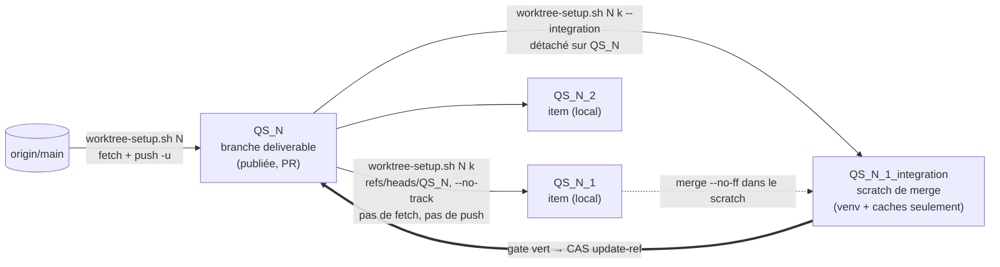
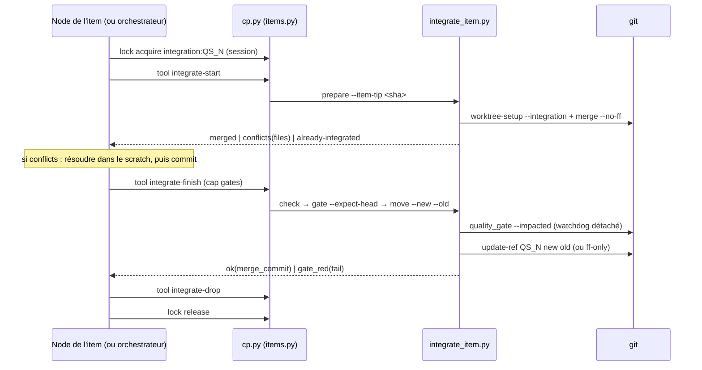
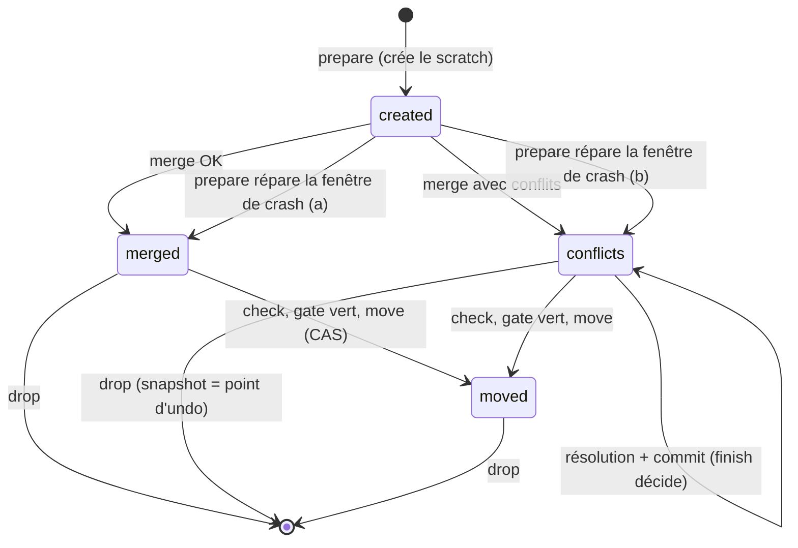

# QS-400 — Review package (PR #402)

**En une phrase :** un *deliverable* `QS_<N>` (une issue → une PR) peut
maintenant être découpé en *work items* `QS_<N>_<k>`. Chacun a son worktree
et sa branche **locale**, puis il est intégré dans `QS_<N>` par un merge
testé, sous verrou et sans push.

Détail : [QS-400.story.md](QS-400.story.md) (§1–§9 et « Implementation
notes ») · fix plans : [#01](QS-400.story_review_fix_%2301.md),
[#02](QS-400.story_review_fix_%2302.md), [#03](QS-400.story_review_fix_%2303.md),
[#04](QS-400.story_review_fix_%2304.md).

---

## 1. Topologie



- **Les items ne sont jamais poussés** : pas d'upstream, `create_pr.py` les
  refuse, et le shim `pre-push` de #399 refuse `QS_<d>_<d>` partout.
- **Un scratch par item** : un scratch périmé de l'item *j* ne bloque
  jamais l'item *k*.

**Qui découpe ?** Pas #400 : il ne fournit que la mécanique. La décision
revient à l'orchestrateur (child 6a/6b), qui planifie avec toi ; un besoin
de découpage peut aussi apparaître en cours de deliverable. Un item naît par
`cp.py task add --item-of`, qui exige un run token (donc l'orchestrateur).

**Un item n'est jamais un deliverable** (décision du 2026-10-06). Un morceau
livrable seul devient un nouveau deliverable : issue `M`, branche `QS_M`, sa
propre PR. `QS_N_k` ne désigne qu'un work item qui atterrit dans la PR de
`QS_N`. C'est imposé à la source dans #399 (`task add` / `task set`) et
vérifié par le guard des outils de #400.

## 2. Le flux d'intégration (Control Plane)



- Les outils `integrate-*` exigent que **la session appelante** détienne
  le verrou `integration:QS_N`. Le probe le vérifie avant toute attente ou
  tout effet, sinon `POLICY_REFUSED`.
- `integrations` (DB) reçoit :
  - une ligne `conflict` / `noop` par start répondu ;
  - une ligne `gate_red` par finish rouge ;
  - **une seule** ligne `ok` par (item, `merge_commit`), dédupliquée dans
    la même transaction.

## 3. États du scratch (`integrate_item.py`)



- **L'état est un indice ; git décide.** Toute incohérence donne
  `stale-scratch`, et le remède est toujours `drop` puis `start`.
- **Chaque sous-commande est idempotente sur le contenu**, d'où la règle
  des clés : la même clé uniquement si l'appel n'a reçu aucune réponse,
  sinon une nouvelle clé (toujours sûre).

## 4. Qui fait quoi

| Fichier | Rôle | Couverture |
|---|---|---|
| `scripts/qs/utils.py` | grammaire `QS_<N>[_<k>]`, chemins item / scratch, `positive_int` | tests unitaires |
| `scripts/worktree-setup.sh` | modes `item` et `integration` ; mode `task` **inchangé** (test de régression en git réel) | git réel, bash 3.2 |
| `scripts/qs/setup_task.py --item` | gardes de déclaration, rendu non lié (sans faits de tâche), **pas de pin ni de launcher** | fakes |
| `scripts/qs/cleanup_worktree.py --item` | nouveau `_cleanup_item` ; le chemin tâche n'est pas touché | git réel |
| `scripts/qs/quality_gate.py` | le lane check mappe `QS_N_k` → N | unitaires |
| `scripts/qs/create_pr.py` | refuse une branche d'item avant tout push ou appel `gh` | fakes |
| `scripts/qs/integrate_item.py` | `prepare` / `check` / `gate` / `move` / `drop`, plus un flock par item | ~80 tests en git réel (hors règle de couverture CI) |
| `scripts/qs/control_plane/items.py` | 5 `ToolSpec` : `item-create`, `item-cleanup`, `integrate-start`, `integrate-finish`, `integrate-drop` | **100 %**, ruff, mypy |
| `docs/workflow/control-plane.md` | les 5 outils, le flux, la règle des clés, les dépendances 6b/6c | — |

## 5. Garanties (ce qui ne peut pas arriver)

- **Le nettoyage d'un item ne supprime jamais du travail non intégré**
  sans `--discard-unintegrated` explicite. « Intégré » veut dire que
  `QS_N..<tip>` compte 0 commit. `--force` ne supprime jamais de branche.
- **Le nettoyage refuse un `--work-dir` qui n'appartient pas à l'item**
  (le worktree `QS_N`, le main checkout, une autre branche), même avec
  `--force`.
- **`QS_N` ne bouge que par compare-and-swap**, sur le commit exact qui a
  passé le gate : `--expect-head` est vérifié avant et après le gate, puis
  `move --new == HEAD`. Deux items en course : un gagne, l'autre reçoit
  `deliverable-moved`.
- **Un gate ne peut pas être interrompu par un drop.** Le watchdog détaché
  hérite du flock, tue le groupe de processus du gate à son échéance
  (3300 s), et seulement alors libère le verrou.
- **Chaque suppression rapporte son point d'undo** :
  - `deleted_tip` (branche supprimée) ;
  - `detached_head` (worktree détaché supprimé avec `--force`) ;
  - `dropped_head` et `discarded_snapshot` (scratch supprimé ; le snapshot
    est un commit sur un index temporaire et inclut les fichiers non
    mergés et non suivis).

## 6. ⚠️ Points d'attention

1. **Écart avec l'AC 12** : `item-cleanup` lance `cleanup` **avant**
   `drop_scratch`. Avec l'ordre inverse du plan, un cleanup refusé
   (`action_required`) détruisait déjà le scratch. Les deux étapes sont
   indépendantes. C'est documenté dans la story et dans
   `control-plane.md`.
2. **Les points d'undo ne sont pas ancrés par une ref** (rejet de deux
   reviewers, comme au round 9 du plan). Le SHA n'existe que dans la
   sortie JSON. git le garde environ 2 semaines (`gc.pruneExpire`), puis il
   peut disparaître.
3. **Le gate hérite du fd du verrou** (choix du plan : couvre un watchdog
   tué par SIGKILL). Un descendant du gate qui se *daemonise* garderait le
   verrou, et l'item serait alors `scratch-busy` jusqu'à sa mort.
   `--impacted` ne lance aucun daemon aujourd'hui.
4. **`integrate_item.py` est hors de la règle de couverture CI** (comme
   `setup_task.py`). Sa seule preuve est sa suite git réelle (~80 tests,
   courses `--ff-only` comprises, provoquées par un hook `post-merge`).
   **C'est le fichier à relire en priorité** : 4 rounds de review ont
   surtout durci `drop` (scratch verrouillé, `.git` cassé ou étranger,
   index corrompu, HEAD orphelin, chemins relatifs, noms non UTF-8).
5. **Dépendances laissées à 6b/6c**, que le verrou n'impose pas :
   - autoriser le répertoire `QS_N_k_integration` à la session (par
     exemple `--add-dir`) ;
   - lancer `integrate-finish` en arrière-plan (le gate peut dépasser les
     10 min du Bash) ;
   - ne pas committer sur `QS_N` tant que `integration:QS_N` est tenu.
6. **Ajouts au plan.**
   - `check` en phase `created` répond `stale-scratch` (rejouer
     `prepare`).
   - `drop` supprime un répertoire orphelin non enregistré
     (`not_a_worktree`), sauf s'il contient un `.git` : c'est alors un
     refus (`git worktree repair`).
   - `drop` supprime aussi un scratch dont le `.git` est **prouvé**
     étranger ou absent (`git_unreadable`). Dans le doute, c'est toujours
     `drop-failed`, sans rien supprimer.
   - Le delete de branche du cleanup est un **CAS** (`update-ref -d <ref>
     <tip prouvé>`).
7. **Hors scope** (comme prévu) : *quand* intégrer et le jugement sur les
   conflits (6b), les agents des items (6c), le merge dans `main`
   (child 7). Aucune vérification de recouvrement (footprints retirés de
   #369).

## 7. Statut

- **Gates locaux** : `--impacted` (lignes changées du Control Plane à
  100 %), `--quick tests/qs` (2 815+ tests) et `--quick
  tests/test_quality_gate.py` sont tous verts.
- **CI** (gate complet, 100 %) : verte sur chaque push vérifié. Le statut
  de la tête est sur la PR.

| Round | Reviewers | Must-fix | Résultat |
|---|---|---|---|
| 1 | blind, edge-case, acceptance, CodeRabbit | 0 | fix #01 : 14 corrections, 11 rejets justifiés |
| 2 | les 4, sur le delta | 1 (scratch verrouillé : boucle `prepare`/`drop`) | fix #02 : 10 corrections |
| 3 | blind, edge-case, acceptance | 1 (worktree en chemins relatifs supprimé sans snapshot) | fix #03 : 10 corrections |
| 4 | blind, edge-case | **0 (convergence)** | fix #04 : 5 retouches |
| — | (maintainer) | — | un item n'est jamais un deliverable : #399 `tasks.add` / `update_fields` + guard #400 |
| 5 | blind, edge-case, acceptance | 1 (`issue-create` pouvait poser une issue sur un item) | fix #05 : les outils réservés aux deliverables refusent un item |
| 6 | blind, edge-case, acceptance | **0 (convergence)** | retouches (tests plus stricts, remise à NULL autorisée) |

Merge autorisé par le maintainer le 2026-10-06, après convergence (round 6).

## 8. Essayer à la main

```bash
python scripts/qs/setup_task.py 400 --item 1 --harness claude-code
```

```bash
python scripts/qs/integrate_item.py prepare --issue 400 --item 1 --item-tip "$(git rev-parse QS_400_1)"
```

```bash
python scripts/qs/cleanup_worktree.py --issue 400 --item 1 --work-dir ../quiet-solar-worktrees/QS_400_1 --delete-branch --dry-run
```
