# The Control Plane — schema, APIs and sequence diagrams

Companion to [`control-plane.md`](control-plane.md), which is the
normative reference: every table, flag, exit code and constant is defined
there. This page is the visual overview for reviewing
[PR #401](https://github.com/tmenguy/quiet-solar/pull/401) (QS-399, child 5
of epic #369). Diagrams are Mermaid.

---

## 1. Context: who talks to the Control Plane

The Control Plane is plain Python with no LLM: one SQLite file, one CLI,
three hooks and a background daemon. Every LLM session runs it as a
subprocess: the orchestrator (one per run) and its nodes (one
`claude --bg` session per task). No session ever talks to another session
directly; they only talk through the DB, using queues, reports, questions
and tokens.

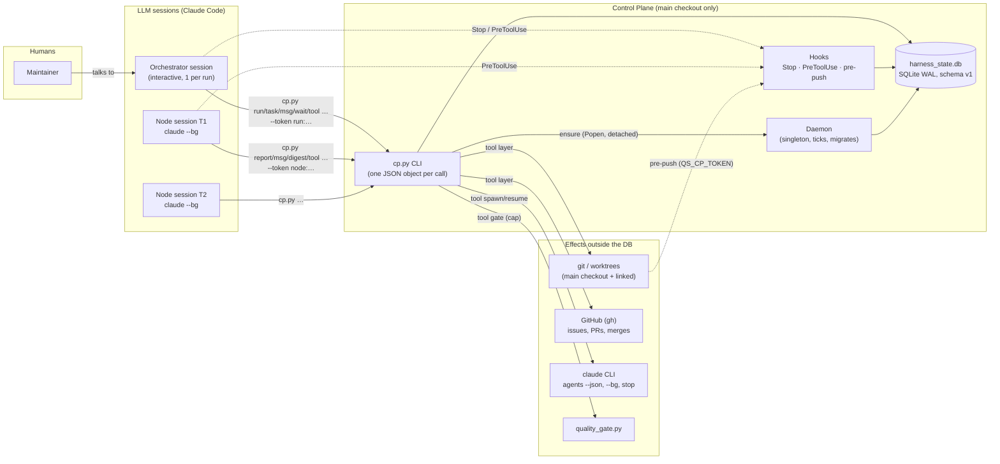

The design rests on these invariants:

- **One copy of the code touches the live DB.** Only
  `<MAIN>/scripts/qs/cp.py` may open `<MAIN>/harness_state.db`; any other
  copy gets `PATH_GUARD` (exit 7). Only the daemon, running on `main`,
  migrates it, after a backup.
- **Fencing tokens.** `run:R<n>.<epoch>.<nonce>` / `node:N<n>.<gen>.<nonce>`
  is passed on every effectful command. A superseded token gets
  `STALE_TOKEN` (exit 3) together with self-end instructions.
- **Idempotent tools.** A tool call is keyed by `(tool, key)`: replaying
  the key never repeats an effect.
- **Liveness is tri-state.** A probe answers alive, dead or *unknown*, and
  unknown never frees a holder.

---

## 2. Package architecture

`scripts/qs/control_plane/` has 42 modules (~9.9k lines) behind
`scripts/qs/cp.py`, the active loop (#406) included. Arrows point from a module to the modules it imports;
the infrastructure layer is imported by almost everything.

```mermaid
flowchart TB
    cp["cp.py (entry shim)"] --> cli

    subgraph L4["Entry layer"]
        cli["cli.py<br/>COMMANDS table, arg parsing, exit codes"]
        hooks["hooks.py<br/>Stop · PreToolUse · pre-push · installer · settings"]
    end

    subgraph L3["Effects layer"]
        tools["tools.py<br/>run_recorded · ToolSpec API · 8 built-in tools"]
        wait["wait.py"]
        daemon["daemon.py<br/>run loop · ensure · stop path"]
        export["export.py"]
        snapshot["snapshot.py"]
        merge_policy["merge_policy.py (seam)"]
    end

    subgraph L3b["Active loop (#406): the daemon's tick hooks"]
        activeloop["activeloop.py<br/>Seams · register_builtin"]
        ticks["ticks.py<br/>registry · Throttle"]
        selfcheck["selfcheck.py<br/>code_version · selfcheck hooks"]
        detectors["detectors.py<br/>overlap · stalls · rounds · anomalies · cycles · duplicates"]
        hookroute["hookroute.py<br/>hook_events cursor"]
        ciwatch["ciwatch.py<br/>GitHub · CiWatcher"]
        watchdog["watchdog.py<br/>liveness · wake-up ladder"]
        restore["restore.py<br/>backup hook · restore"]
        alerts["alerts.py<br/>kinds · occurrence engine"]
    end

    subgraph L2["Domain layer"]
        runs["runs.py<br/>leases, takeover"]
        tasks["tasks.py<br/>tree, transitions"]
        nodes["nodes.py<br/>generations, transitions"]
        messages["messages.py<br/>queues"]
        questions["questions.py"]
        reports["reports.py"]
        decisions["decisions.py"]
        locks["locks.py<br/>locks, caps, session locks"]
        tokens["tokens.py<br/>require / fencing"]
    end

    subgraph L1["Infrastructure layer"]
        db["db.py<br/>connect, write/read txns, file_lock, schema check"]
        migrations["migrations.py + schema_v1.py + schema_v2.py"]
        codever["codever.py (leaf)<br/>code version"]
        mergegate["mergegate.py (leaf)<br/>merge gate"]
        backups["backups.py (leaf)<br/>write_copy · rotate"]
        paths["paths.py<br/>path guard, main checkout"]
        liveness["liveness.py<br/>ProcessProbe, ClaudeCli"]
        runner["runner.py (Runner seam)"]
        clock["clock.py (Clock seam)"]
        errors["errors.py (CpError → exit code)"]
        faults["faults.py (test faults)"]
        procsetup["procsetup.py (setpgid, signals)"]
    end

    cli --> tools & wait & daemon & export & snapshot & hooks
    cli --> activeloop & restore & codever & mergegate & alerts
    activeloop --> ticks
    activeloop -.->|"lazy: register_builtin()"| selfcheck & detectors & hookroute & ciwatch & watchdog & restore
    selfcheck & detectors & hookroute & ciwatch & watchdog & restore --> activeloop & alerts
    selfcheck --> codever & mergegate
    restore --> daemon & backups
    tools --> mergegate & codever
    migrations --> backups
    snapshot --> alerts
    alerts --> messages
    cli --> runs & tasks & nodes & messages & questions & reports & decisions & locks
    hooks --> runs & tasks & messages & tokens & wait & liveness
    tools --> locks & nodes & tasks & tokens & hooks & merge_policy & liveness & runner
    wait --> daemon & messages & tokens
    daemon --> migrations & liveness & procsetup
    snapshot --> daemon & tasks
    export --> tasks
    locks --> nodes & tokens & liveness
    nodes --> messages & tasks & tokens
    questions --> messages & tasks & tokens
    reports --> messages & tasks & tokens
    decisions --> tasks & tokens
    messages --> runs & tokens
    tasks --> runs & tokens
    runs --> tokens & liveness
    L2 --> db
    db --> migrations & paths
```

**Seams.** Every external dependency goes through an injectable seam:
`Clock`, `Runner`, `ProcessProbe`, `ClaudeCli`, `ProcessSetup`, `Popen`,
`faults`, `merge_policy`, `export.LEDGER_SECTIONS`, the daemon's
`tick_hooks`, and the active loop's `Seams` (with a `GitHub` for the CI
watcher). The tests run with no real `claude`, `gh`, `git push`, signals,
subprocess or socket under the daemon (a guard test bans them).

---

## 3. Data model (`harness_state.db`, schema v2)

There are 25 tables (`alerts` is v2's, #406); the schema version is `PRAGMA user_version`.
Text ids are `R<n>` (run), `T<n>` (task), `N<n>` (node) and `Q<n>`
(question).

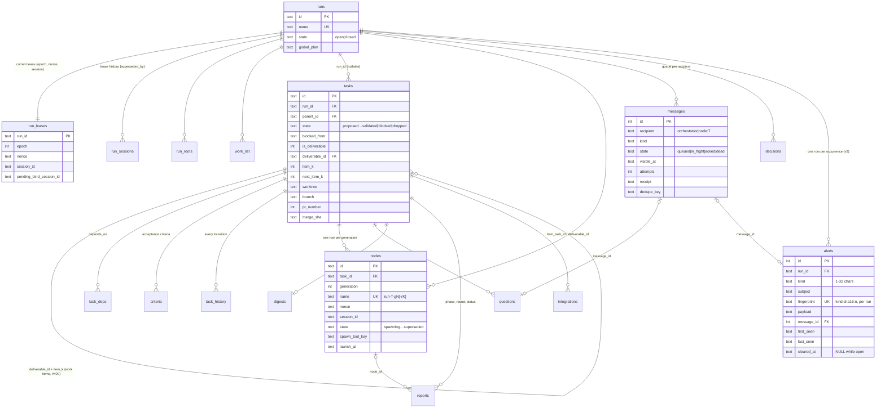

The coordination tables have no foreign keys. They are keyed by name,
key or singleton id, and their holders are checked for liveness rather
than referenced:

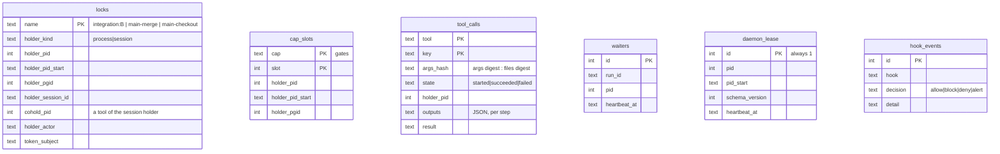

### State machines

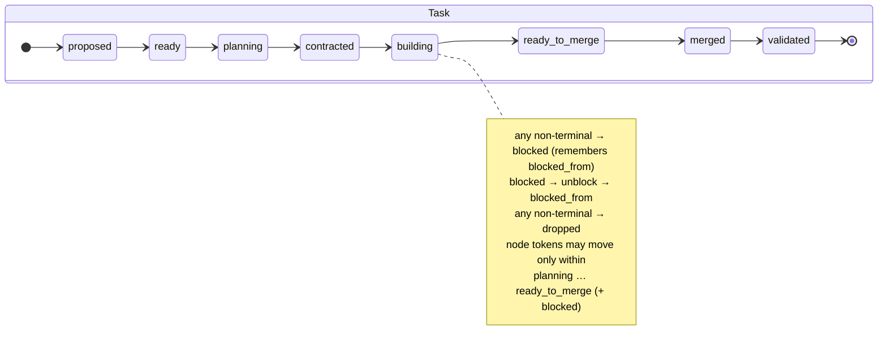

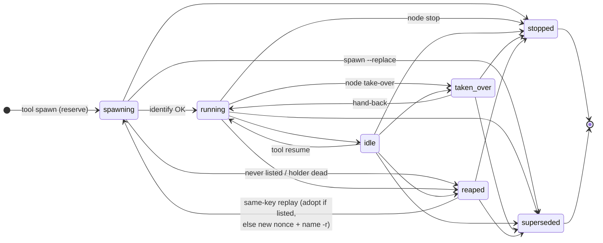

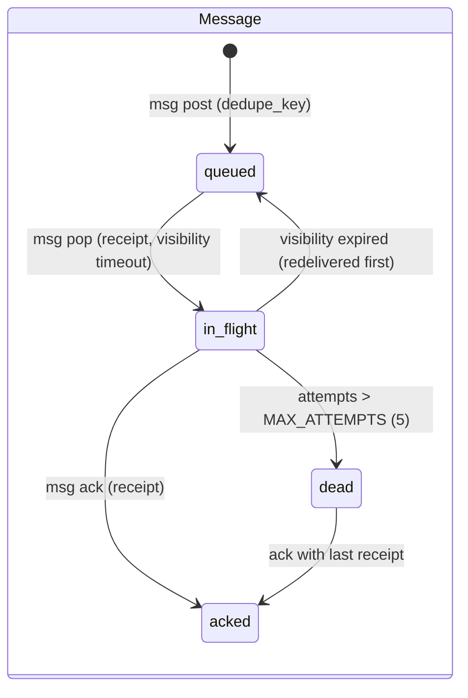

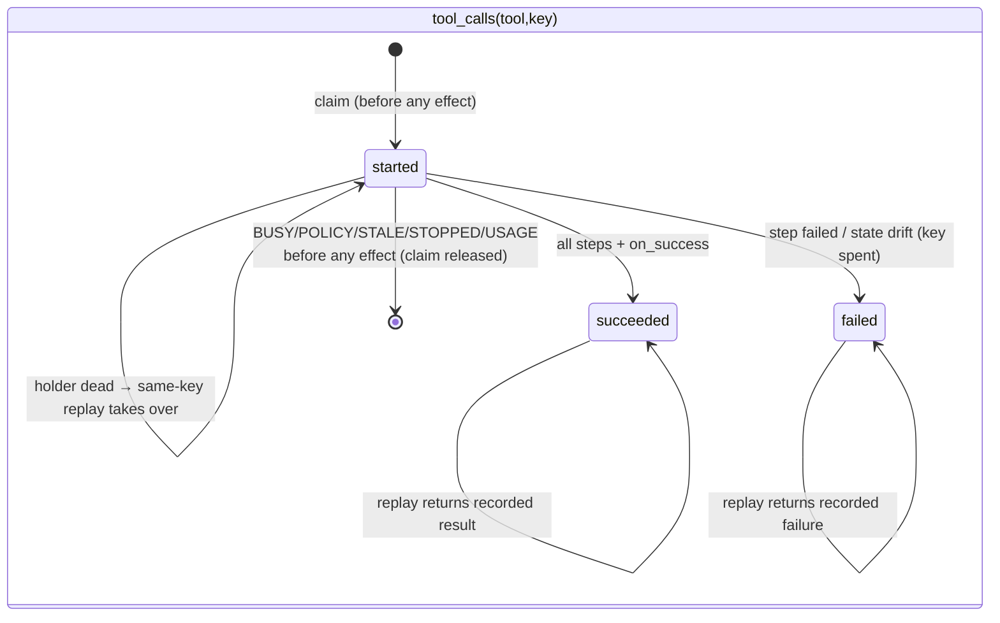

---

## 4. API surface

### 4.1 CLI: `<MAIN>/venv/bin/python <MAIN>/scripts/qs/cp.py <command> …`

Every command prints exactly one JSON object: `{"ok": true, …}` or
`{"ok": false, "error": CODE, "detail": …}`.

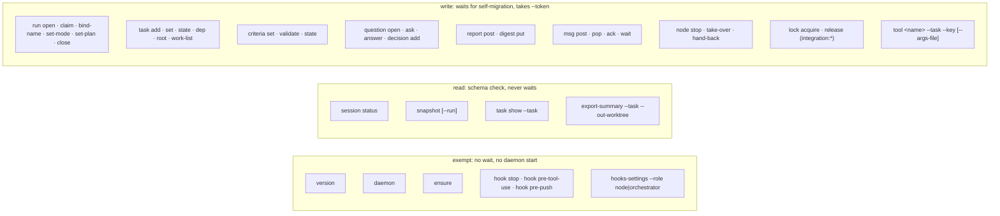

| exit | codes | meaning |
|---|---|---|
| 0 | | ok |
| 1 | `INTERNAL`, `TOOL_FAILED` | unexpected error, or a tool step failed (recorded) |
| 2 | `USAGE` | bad args, no session id, bad key, bad or non-UTF-8 file |
| 3 | `STALE_TOKEN` | the token is superseded: **end yourself** (payload has instructions) |
| 4 | `STOPPED` | the caller's node is stopped |
| 5 | `SCHEMA_TOO_NEW`, `SCHEMA_PENDING` | code/DB version mismatch (`restart_wait`) |
| 6 | `BUSY` | lock, cap, in-flight call, node cap, unknown liveness: retry |
| 7 | `PATH_GUARD` | this copy of the code may not open this DB |
| 8 | `NOT_FOUND`, `CONFLICT`, `INVALID_STATE` | bad id, mismatch (incl. `claim_taken_over`, cross-run), forbidden transition |
| 9 | `POLICY_REFUSED` | merge policy, foreign hook, write into main, … |

### 4.2 Who may call what (token kinds)

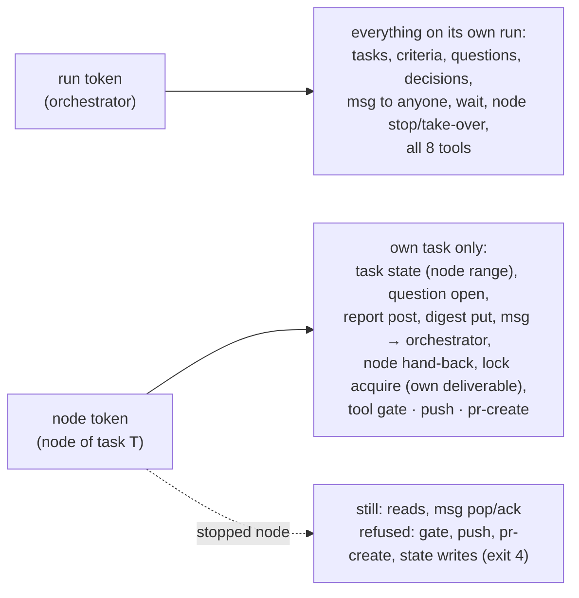

### 4.3 Tools (`tool <name>`)

| tool | token | runs in | locks / cap | probe (what makes a replay safe) |
|---|---|---|---|---|
| `worktree-create` | run | `<MAIN>` | `main-checkout` | `setup_task.py` is idempotent |
| `worktree-cleanup` | run | `<MAIN>` | `main-checkout` | dir absent + unregistered; refuses main / non-linked; shared path only clears the column |
| `gate` | run / node | worktree | `gates` slot | safe to re-run |
| `spawn` | run | worktree | node cap | node row by `spawn_tool_key` + listing by name; adopt or rotate on relaunch |
| `resume` | run | worktree | node cap | node row + listing by name and `startedAt` |
| `issue-create` | run | `<MAIN>` | | `<!-- qs-cp-key -->` marker: recent listing, then search |
| `pr-create` | run / node | worktree | | marker in the branch's PR bodies |
| `push` | run / node | worktree | | `git ls-remote` == `HEAD` |
| `merge` | run | `<MAIN>` | `integration:<b>`, `main-merge` | `gh pr view` == `MERGED`; refused by the default `merge_policy` |

`LOCK_ORDER`: `integration:*` (lexical) → `main-merge` → `main-checkout`
→ gate slot.

### 4.4 Python API frozen for later children (#400, child 7, child 14)

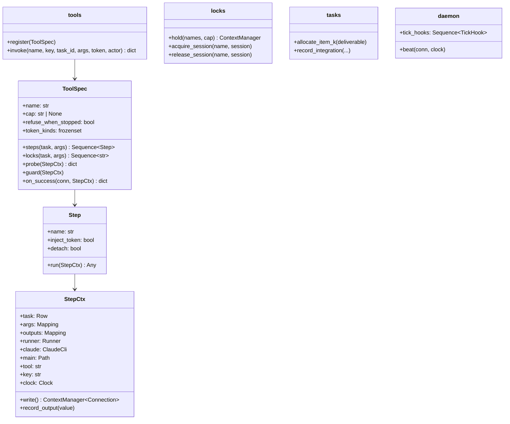

---

## 5. Sequence diagrams

### 5.1 Opening a run and the orchestrator's event loop

The orchestrator never polls. It runs `wait` in the background, and the
**Stop hook** keeps the session from going idle while messages are queued
or while nothing is waiting.

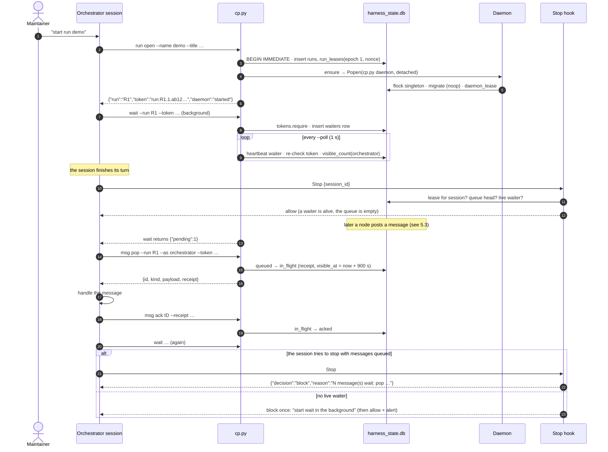

### 5.2 Spawning a node (`tool spawn`): an idempotent, recorded tool

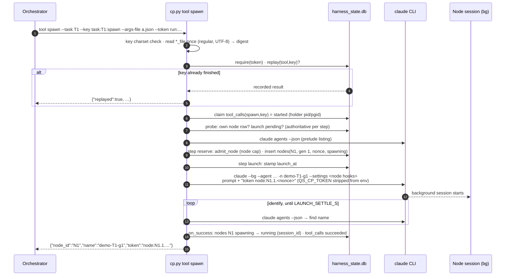

### 5.3 A node working: reports, questions, the gate, push and PR

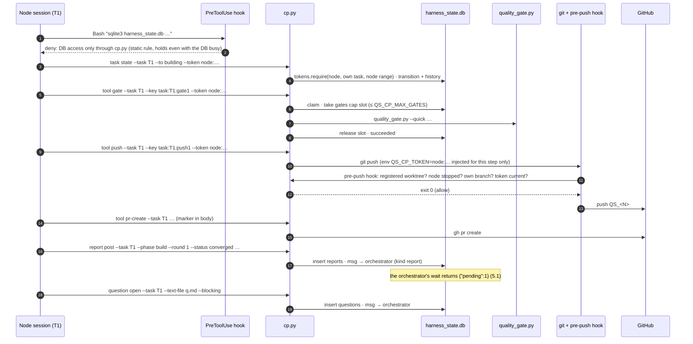

### 5.4 Crash and replay: why a tool never repeats an effect

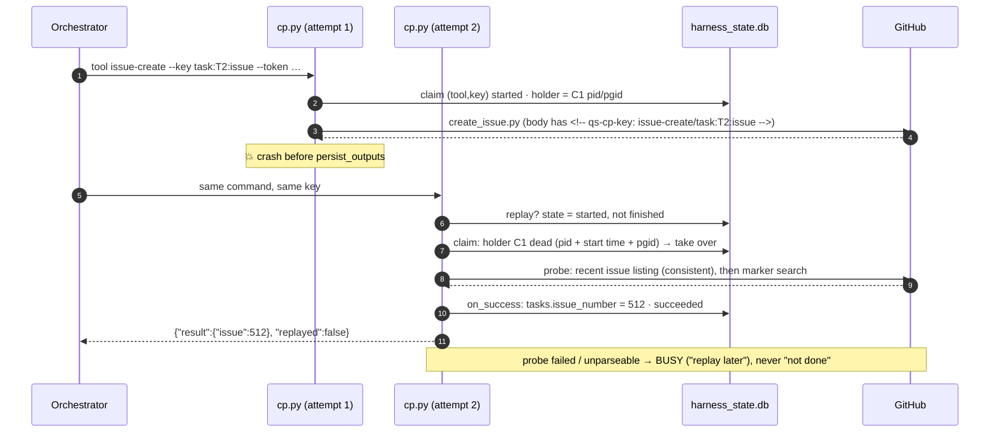

### 5.5 Run takeover and fencing (a superseded session ends itself)

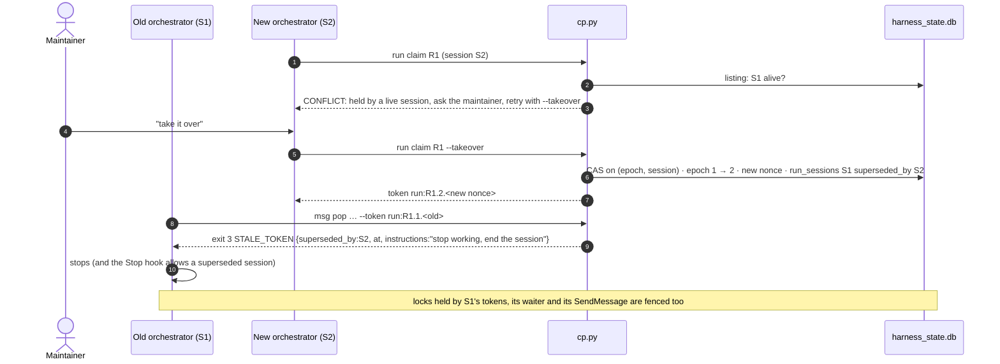

### 5.6 Self-migration: new schema code lands on `main`

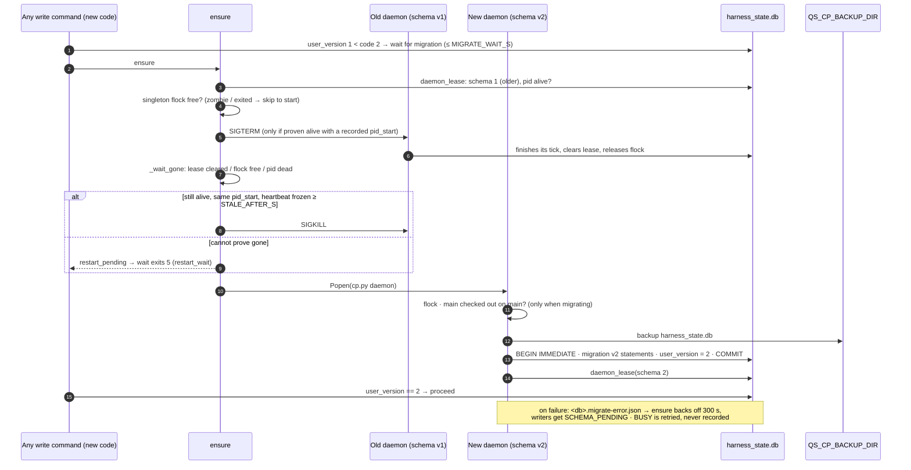

`ensure` can answer with any of these statuses:

| status | when | what `wait` does |
|---|---|---|
| `already_running` | the lease is fresh, at this schema or newer | keeps polling |
| `started` | there is no live daemon, so a new one is started | keeps polling |
| `restarted` | an older daemon was stopped, or found dead, and replaced | keeps polling |
| `restart_pending` | an older daemon cannot be proven gone | exit 5, `restart_wait` |
| `stale_alive` | a stale daemon of this schema is alive and won't stop | exit 5, `restart_wait` |
| `newer_running` | a stale daemon of a newer schema is not proven dead; nothing is started | commands get `SCHEMA_TOO_NEW` |
| `migrate_failed` | a migration error was recorded less than 300 s ago | `SCHEMA_PENDING` |

The daemon writes its heartbeat before and after every tick hook. A tick
hook must return within `STALE_AFTER_S` (30 s) or call `daemon.beat`
itself. A daemon that does so is never sent SIGKILL.

### 5.7 Merging (`tool merge`) under locks and the merge policy

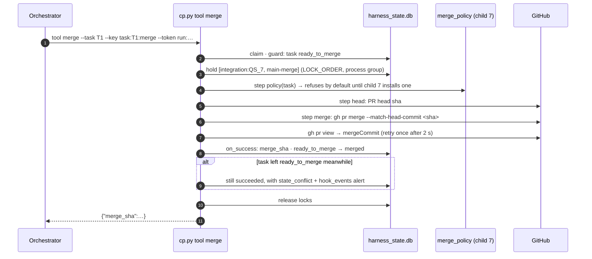

### 5.8 Session-held integration lock (contract with #400)

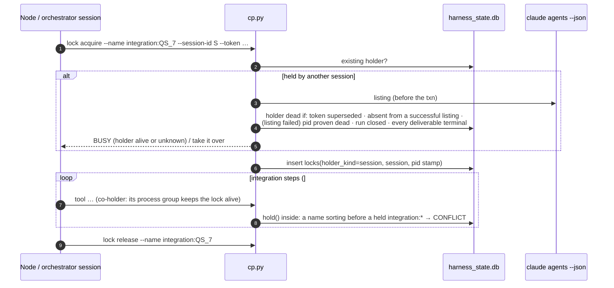

---

## 6. Review history (PR #401)

| round | must-fix | should-fix | outcome |
|---|---|---|---|
| 1 | 3 | 15 | fix plan #01: 24 fixes (text-id ordering, PreToolUse fail-open, spawn `--replace` at cap, tri-state liveness, replay before steps, …) |
| 2 | 0 | 9 | fix plan #02: 21 fixes (listing-then-search probe, relaunch nonce/name rotation, restart path, files read once, run scoping, …) |
| 3 | 0 | 4 | fix plan #03: 11 fixes (UTF-8 before `launch_at`, daemon stop path with the flock as authority, `edit_dep` scoping, …) |
| 4 | 0 | 1 (story text) | fix plan #04: final polish (superseded-launch stop scoped by worktree cwd, SIGKILL only on a heartbeat ≥ `STALE_AFTER_S` old, `newer_running`) |
| 5 | 0 | 1 (story text) | converged on code: 918 tests, 100% coverage; fix plan #05 = story wording only |

Accepted limits, recorded in `control-plane.md` "Conventions":
- `--no-verify` bypasses the pre-push hook.
- `run claim --session-id` trusts its caller.
- The DB-access hook guards against accidents; it is not a sandbox.
- `gh pr merge` run through a wrapper is not caught.
- External effects have a fencing window.
- A launch can come up late (the launch-settle limit).
- `--settings` hooks after a bare resume are unverified.
